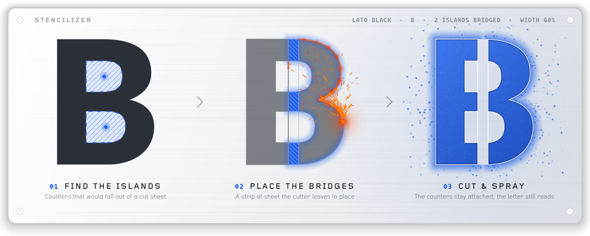
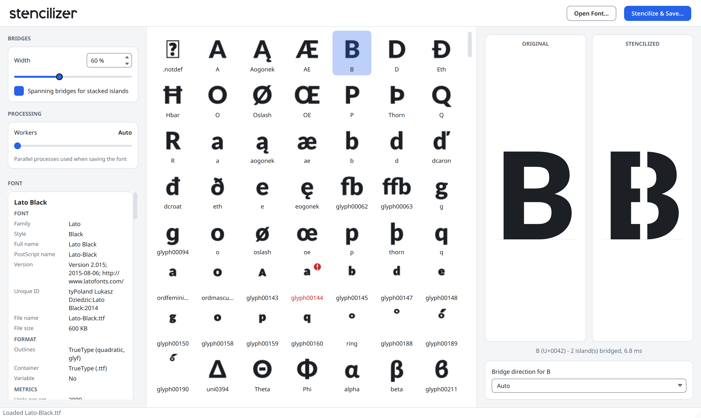

<h1 align="center">
  <picture>
    <source media="(prefers-color-scheme: dark)" srcset="doc/images/stencilizer-logo-dark.svg">
    
  </picture>
</h1>

<p align="center">
  Convert TrueType and OpenType fonts into stencil fonts by adding bridges to enclosed contours.
</p>

<p align="center">
  <picture>
    <source media="(prefers-color-scheme: dark)" srcset="doc/images/stencil-hero-dark.png">
    
  </picture>
</p>

## Overview

Stencilizer is a Python command-line tool and desktop app that transforms regular fonts into stencil fonts by detecting "islands" (enclosed contours) in glyphs and adding bridges to connect them. This is essential for creating fonts suitable for stencil cutting, where disconnected parts would fall out.

Characters like **O**, **A**, **B**, **D**, **P**, **R**, **Q**, **4**, **6**, **8**, **9**, **@** and others often have enclosed contours that need bridges to remain connected during cutting.

## Features

- **Automatic Island Detection**: Identifies enclosed contours using contour hierarchy analysis
- **Smart Bridge Placement**: Places bridges optimally based on contour geometry
- **Parallel Processing**: Uses every CPU core for fast processing of large fonts
- **Flexible Configuration**: Control bridge width and parallel workers
- **Font Coexistence**: Output fonts get a "Stenciled" suffix in their internal name table, allowing installation alongside the original font
- **Multiple Output Modes**:
  - Full processing (default)
  - Dry-run analysis
  - Island listing
- **Rich CLI Output**: Console output with progress tracking
- **Detailed Logging**: Optional file logging for debugging and analysis
- **Format Support**: Works with TTF and OTF fonts with TrueType, CFF or CFF2 outlines, including variable fonts (see [Font Format Support](#font-format-support))
- **Desktop App**: Preview every bridged glyph before saving, tune the bridges live, and inspect the font's metadata (see [Desktop App](#desktop-app))

## Desktop App

<picture>
  <source media="(prefers-color-scheme: dark)" srcset="doc/images/stencilizer-gui-dark.png">
  
</picture>

*Lato Black open in the desktop app, with a live preview of the bridges added to B.*

The desktop app ships in the release archives; from source it needs the `gui` extra (see
[Installation](#installation)).

```bash
# Launch the window, optionally opening a font straight away
stencilizer-gui [font]
```

Open a TTF or OTF font with "Open Font…" or the command-line argument. If reading the outlines
and finding the islands takes more than half a second, an animated stencil cutter fills the glyph
area until the font is ready. The window then lists the glyphs that need bridges as thumbnails.
Selecting one shows it before and after stenciling, side by side at one shared scale, recomputed as
you change the bridge width (30-110 %) or the spanning-bridges toggle in the sidebar. The worker
slider below them sets the number of processes used for the save; its left end is "Auto".

The FONT card at the bottom of the sidebar lists everything the font says about itself: names and
version, outline format and container, vertical metrics, glyph, island and composite counts,
OpenType features and scripts, its tables, copyright, designer, license and embedding rights, and
creation and modification dates. The text is selectable for copying.

"Stencilize & Save…" writes the full font and shows its progress in the status bar. It refuses to
overwrite the input font, and refuses a source file that changed on disk since it was opened. A
variable font adds one slider per axis to the sidebar; the preview shows the glyph at the slider
location, and composite glyphs preview at the default location. The window uses a light or a dark
theme and follows the system setting, switching when the system does.

The grid also lists composite glyphs (accented letters such as `Aacute`) that draw an island
glyph: they inherit their bridges from the base glyph. The direction picker sets Auto, Vertical
or Horizontal for the selected glyph (an `O` loses its top and bottom strokes under Vertical, its
left and right strokes under Horizontal); a composite follows its base glyph's direction and its
picker is disabled. Choices apply to the preview and the saved font for the session, and are not
written to a file. Glyphs where no bridge can be placed are marked red in the grid and the
preview says "no bridge could be placed".

## Installation

### Download

Prebuilt, unsigned executables for Linux (x86-64) and macOS (Apple silicon) are attached to each [GitHub release](https://github.com/cosmix/stencilizer/releases). Each archive contains the `stencilizer` command-line tool and the desktop GUI. Verify the download against `SHA256SUMS` from the same release.

- **Linux**: extract with `tar xzf`. The CLI needs glibc 2.35 or newer; the GUI bundles the X11/xcb libraries it uses but is built on Ubuntu 26.04 and needs glibc 2.43 or newer (for example Ubuntu 26.04 or Fedora 44). The GUI also needs the system OpenGL/EGL libraries and an X11 or XWayland session (`libegl1 libgl1` on Debian and Ubuntu).
- **macOS**: requires macOS 13 or newer on Apple silicon. The builds are not signed or notarized. After unzipping, clear the quarantine flag:

```bash
xattr -dr com.apple.quarantine Stencilizer.app stencilizer
```

  macOS 15 and newer no longer offer right-click then Open for unsigned apps. Instead, try to open the app once, then choose Open Anyway in System Settings, Privacy & Security.

### From source

```bash
git clone https://github.com/cosmix/stencilizer.git
cd stencilizer
uv pip install -e .
```

### Graphical interface (optional)

The desktop GUI needs PySide6, which ships in the optional `gui` extra:

```bash
uv pip install -e ".[gui]"
```

## Quick Start

```bash
git clone https://github.com/cosmix/stencilizer.git
cd stencilizer
uv pip install -e .
stencilizer Roboto-Regular.ttf
```

This creates `Roboto-Regular-stenciled.ttf` in the same directory.

Example output:

```text
Stencilizer v1.0.0
────────────────────────────────────────────

▸ Loading font
  Roboto-Regular.ttf (TrueType)
  897 glyphs · 2,048 UPM

▸ Analyzing glyphs
  42 glyphs with islands

▸ Processing
  8 workers (auto) · Ctrl+C to cancel
  ━━━━━━━━━━━━━━━━━━━━━━━━━━━━━━━━━━━━━━━━ 100% 0:00:02

Complete with unbridged islands in 2.1s
  Roboto-Regular-stenciled.ttf (156 KB)
  42 glyphs · 38 bridges · 0 errors
  4 islands remained unbridged
  45.2ms avg (12.1–98.3ms range)
```

The bridge count records islands actually connected. Islands that the geometry cannot bridge are
reported separately, including with `--quiet`. If a glyph worker or font write fails, the command
exits with an error and does not publish a partial output file.

## Usage

### Basic Usage

```bash
# Convert with default settings
stencilizer input.ttf

# Specify output path
stencilizer input.ttf -o output.ttf

# Adjust bridge width (30-110% of a reference stroke of 10% of font UPM)
stencilizer input.ttf --bridge-width 70
```

### Variable Fonts

Variable fonts (an `fvar` table, with `glyf`/`gvar` or `CFF2` outlines) are stenciled as variable
fonts: the output keeps every axis, and the bridges follow the design at every location. A glyph
whose variation data cannot be bridged consistently everywhere is left unchanged and counted among
the unbridged islands. Pin a variable font to a static instance first with `--instance`:

```bash
# Stencilize the Bold, Condensed instance as a static font
stencilizer input.ttf --instance wght=700,wdth=75

# Axes you omit stay at their default
stencilizer input.ttf --instance wght=700
```

`--instance` takes comma-separated `tag=value` pairs inside the axis ranges and requires a
variable font. For a CFF2 font the static instance has CFF outlines.

### Analysis Modes

```bash
# List all glyphs with islands
stencilizer input.ttf --list-islands

# Dry run (analyze without modifying)
stencilizer input.ttf --dry-run

# Verbose output
stencilizer input.ttf --verbose

# Quiet mode
stencilizer input.ttf --quiet
```

### Performance Options

```bash
# Control parallel workers
stencilizer input.ttf --workers 4

# Use all available cores (default)
stencilizer input.ttf
```

### Logging

```bash
# Enable file logging
stencilizer input.ttf --log-file stencilizer.log

# Set log level
stencilizer input.ttf --log-level DEBUG
```

## Configuration

Configuration is controlled via CLI options (see the usage examples above).

If you are using Stencilizer as a library, create a `StencilizerSettings` instance and set
values directly before passing it to the processor:

```python
from stencilizer.config import StencilizerSettings

settings = StencilizerSettings()
settings.bridge.width_percent = 70.0
settings.processing.max_workers = 4
```

## How It Works

### 1. Glyph Analysis

Stencilizer analyzes each glyph to identify its contour hierarchy:

- **Outer contours**: Main glyph shapes (counter-clockwise winding)
- **Inner contours**: Enclosed areas (clockwise winding)
- **Islands**: Inner contours that are fully enclosed and need bridges

### 2. Bridge Placement

For each island, the algorithm:

1. Analyzes stroke geometry between inner and outer contours
2. Determines optimal bridge orientation (vertical or horizontal)
3. Calculates bridge width as a percentage of a reference stroke of 10% of the font's UPM
4. Places bridges to connect the island to the outer contour

### 3. Glyph Transformation

Bridges are added by cutting notches into both the island and outer contour, creating connection points while preserving the overall glyph structure.

### 4. Parallel Processing

Glyphs are processed in parallel using Python's ProcessPoolExecutor, enabling efficient utilization of multi-core systems.

## Examples

### Convert with custom bridge settings

```bash
stencilizer Roboto-Regular.ttf \
  --bridge-width 80 \
  -o Roboto-Stencil.ttf
```

### Analyze before processing

```bash
# Check which glyphs have islands
stencilizer Roboto-Regular.ttf --list-islands

# See what would be done
stencilizer Roboto-Regular.ttf --dry-run
```

Dry-run output:

```text
▸ Loading font
  Roboto-Regular.ttf (TrueType)
  897 glyphs · 2,048 UPM

▸ Analyzing (dry run)

Analysis

  Glyphs with islands   42
  Total islands         67
  Estimated bridges     67
  Bridge width          60% of a reference stroke of 10% of font UPM

✓ Dry run complete – no changes made
```

### Process with detailed logging

```bash
stencilizer Roboto-Regular.ttf \
  --log-file processing.log \
  --log-level DEBUG \
  --verbose
```

## Requirements

- Python 3.11 or higher
- fonttools >= 4.65.0
- pydantic >= 2.13.5
- rich >= 15.0.0
- structlog >= 26.1.0
- typer >= 0.27.2

## Development

### Setup

```bash
# Clone repository
git clone https://github.com/cosmix/stencilizer.git
cd stencilizer

# Install with development dependencies
uv pip install -e ".[dev]"
```

### Running Tests

```bash
# Run all tests
pytest

# Run with coverage
pytest --cov=stencilizer --cov-report=html

# Run specific test modules
pytest tests/unit/test_analyzer.py
```

### Code Quality

```bash
# Type checking
mypy src/stencilizer tests

# Linting and formatting
ruff check src tests
ruff format src tests
```

## Releasing

1. Bump `__version__` in `src/stencilizer/__init__.py` (the single version source; `pyproject.toml` reads it and `uv.lock` does not record it), commit, and push `main`.
2. Tag and push the tag:

```bash
git tag vX.Y.Z && git push origin vX.Y.Z
```

The release workflow refuses tags whose commit is not on `origin/main` or whose version does not match `__version__`, and checks that `uv.lock` is current. Otherwise it runs the checks, builds the Linux and macOS executables, and publishes a GitHub release with the archives and `SHA256SUMS`. Tags containing `-` or a PEP 440 pre-release suffix (`a`, `b`, `rc`, for example `v1.0.0rc1`) are marked as pre-releases.

- Push `main` before the tag. A tag on a commit not yet on `origin/main` fails the verify job; push `main`, then re-run the workflow.
- To re-release a version, delete the existing GitHub release and its tag first.
- Push tags one at a time: GitHub does not trigger workflows when more than three tags are pushed at once.

To build locally, run `uv sync --locked --no-dev --group build --extra gui` and then `packaging/build.sh`; `packaging/build.sh --smoke` tests the result (the GUI check needs a display; use `xvfb-run -a` on a headless Linux host, or set `QT_QPA_PLATFORM=offscreen`).

## Troubleshooting

### Font not loading

Ensure your font file is a valid TTF or OTF file and not corrupted. See [Font Format Support](#font-format-support) for details on supported formats.

### No islands found

Some fonts may not have enclosed contours. Use `--list-islands` to check which glyphs have islands.

### Bridge width too wide/narrow

Adjust the `--bridge-width` parameter (range: 30-110% of a reference stroke of 10% of the font's UPM). Default is 60%.

### Processing errors

Enable detailed logging to diagnose issues:

```bash
stencilizer input.ttf --log-file debug.log --log-level DEBUG
```

## Font Format Support

Stencilizer supports the following font formats:

| Format                          | Extension     | Outline Type              | Status             |
| ------------------------------- | ------------- | ------------------------- | ------------------ |
| TrueType                        | `.ttf`        | TrueType (`glyf` table)   | ✅ Fully supported |
| OpenType with TrueType outlines | `.otf`        | TrueType (`glyf` table)   | ✅ Fully supported |
| OpenType with CFF outlines      | `.otf`        | PostScript (`CFF` table)  | ✅ Fully supported |
| OpenType with CFF2 outlines     | `.otf`        | PostScript (`CFF2` table) | ✅ Fully supported |
| Variable TrueType fonts         | `.ttf`        | `glyf` + `gvar` tables    | ✅ Fully supported |
| Variable fonts with CFF2        | `.otf`        | `CFF2` table              | ✅ Fully supported |
| Variable fonts, CFF outlines    | `.otf`        | `CFF` table               | ❌ Fails at save   |

### How to identify your font's format

Most `.ttf` files use TrueType outlines and will work. For `.otf` files, the situation is more nuanced:

- **OTF with TrueType outlines**: Some foundries package TrueType outlines in an OpenType container. These are fully supported.
- **OTF with CFF outlines**: Traditional PostScript-based OpenType fonts. These are fully supported.
- **OTF with CFF2 outlines**: Modern variable OpenType fonts use CFF2. These are fully supported, static or variable.
- **Variable fonts**: Any font with an `fvar` table. Glyphs with islands are bridged in every master and the output stays variable.

If you're unsure about your font's format, try processing it—Stencilizer will report an error if the format is unsupported.

## Future Work

- Variable fonts with `CFF` outlines (an `fvar` table without `CFF2`)
- `avar2` axis mappings in the GUI preview

## License

MIT License - see the [LICENSE](LICENSE) file for details.
