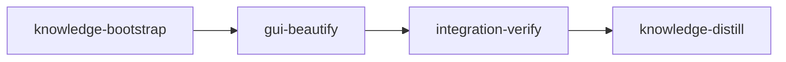

# Plan: GUI beautification

## Overview

The desktop GUI (`stencilizer-gui`) works but renders with Qt's default widgets in one flat row:
full-width Open and Save buttons stacked in the left column, a number box for the worker count, and
no visual hierarchy. This plan moves the file actions into a top bar with compact buttons, turns the
left column into a settings sidebar of cards, replaces the worker spin box with a slider, adds an
empty state and status-bar progress, and themes the whole window with a light and a dark palette
that follow the operating system's setting.

## Goals

- Header bar: app title, loaded font name and details, compact "Open Font…" (secondary) and
  "Stencilize & Save…" (primary) buttons at their natural width on the right.
- Sidebar: BRIDGES and PROCESSING cards; the worker count becomes a slider (0 = Auto) with a value
  label.
- Centre: an empty-state message until a font loads, then the glyph grid with even cells.
- Right: Original and Stencilized previews as cards, the direction picker in a card.
- Status bar: messages on the left, save progress as a permanent widget on the right.
- Theme: Fusion style, palette and stylesheet from one token set per scheme; light and dark follow
  the system at launch and on change; every text/background pair meets WCAG contrast (7:1 body,
  4.5:1 secondary and button text).
- Non-goals: no change to processing, sessions, saving, the CLI, or `DirectionPicker`; no new
  dependencies, fonts or icon assets.

## Decisions (asked and answered)

| Question | Answer |
| --- | --- |
| Layout | Header bar with file actions; sidebar holds settings only; progress in the status bar |
| Theme | Follow the system light/dark setting, live |
| Implementers | Codex for routine units (`implementers: ["codex", "claude"]`); visual design on a fable-tier Claude worker; window tests on sonnet |

The codex plugin (`codex@openai-codex`) and CLI (`~/.local/bin/codex`) are installed.

## Baseline at HEAD (c888109, measured 2026-09-25)

| Command | Result |
| --- | --- |
| `uv run pytest --no-cov -q -p no:cacheprovider` | 319 passed, 42 warnings, 225 s |
| `uv run pytest --no-cov -q -p no:cacheprovider tests/gui` | 144 passed, 151 s |
| `uv run ruff check src tests` / `uv run ruff format --check src tests` / `uv run mypy` | clean / 102 files formatted / no issues in 102 files |
| offscreen launch smoke (see acceptance) | exit 124, stderr clean |
| `loom knowledge check --strict --baseline doc/loom/knowledge/check-baseline.txt` | clean; `loom knowledge sync` changed nothing |

The full suite takes 225 s against the 300 s acceptance cap; this plan adds about 20 GUI tests
(net of the four it moves) at roughly one second each. Integration-verify records the measured
time.

Criteria dry-runs: the stale-reference check (`! rg -q -e workers_spin -e "controls\.(...)"`) exits
1 at HEAD and 0 on a fixture tree holding only the new names; the README check exits 1 at HEAD, 0 on
a README whose "Graphical Interface" section names slider, dark and status bar, and 1 when those
words sit only in a later section; the launch check exits 0 at HEAD and 1 when stderr holds
`Could not parse application stylesheet` (the exact Qt warning, confirmed together with
`Unknown property <name>` by a probe that set a broken stylesheet offscreen).

## Execution Diagram



## Stages

### 1. Knowledge Bootstrap

The tier-1 files and `architecture/gui.md` already describe this codebase (the previous plan's
distill stage wrote them two days ago), so this is a short sonnet audit of the GUI sections the
plan touches, plus two concerns found while planning: the full suite's runtime against the 300 s
acceptance cap, and glyph names rendered as rich text in `DirectionPicker`, which this plan leaves
untouched. Acceptance: the knowledge check passes against the committed baseline.

### 2. gui-beautify (standard)

The only implementation stage. Splitting it fails the Stage Necessity Test: no later stage needs a
merged checkpoint (Q1, Q3), the waves below keep every file single-owner (Q2), and the reading is
the 1,500-line GUI package plus briefs, well under 500,000 tokens (Q4).

Every worker brief lives in `doc/plans/briefs/gui-beautify/gui-beautify/`. `_shared.md` pins the
target widget tree, the styling-hook table (object names and `role` properties the theme targets),
the public surface after the stage, and the repository rules. The YAML description carries the
worker table and the surface the contract session needs.

Waves:

| Wave | Workers | Lane |
| --- | --- | --- |
| 0 | Foundation: orchestrator runs the baseline GUI tests (creates `.venv` for codex) | orchestrator |
| 1 | U1 header + tests, U2 sidebar + tests, U3 grid + tests, U4 comparison cards | codex terra (U1-U3), luna (U4) |
| 2 | U5 main window, T1 window tests | codex terra, sonnet |
| 3 | D1 theme, app wiring, theme tests, screenshot-driven visual pass | fable (Claude) |

Risk checklist walk (`references/v2-contracts.md` Section 2):

| Area | Applies | Contract |
| --- | --- | --- |
| Untrusted input | Font file names reach header labels | `header-shows-font-name-as-plain-text` |
| Filesystem paths | No: open/save paths unchanged | none |
| Process I/O | No | none |
| Configuration propagation | Worker slider value reaches the controller | `workers-slider-reaches-controller` |
| Lifecycle | System scheme switches while running; thumbnails rasterized once | `theme-follows-system-scheme-changes`, `grid-thumbnails-rerender-on-palette-change` |
| Reachability | Theme applied by the real `main`; header mounted above the sidebar | `main-applies-theme-before-showing-window`, `action-buttons-stay-compact-in-top-bar`, plus `reachable` and `wiring` |
| External data | No | none |
| Purpose of the stage | Legible theme; compact action buttons | `theme-colors-are-legible`, `action-buttons-stay-compact-in-top-bar` |

Expected integrity events: moving the file actions out of `ControlPanel` changes existing assertion
lines in `tests/gui/test_controls.py`, `tests/gui/test_main_window.py` and
`tests/gui/test_main_window_directions.py` (each moved assertion reappears against `HeaderBar` or
`MainWindow`, but in another file or with a new attribute). The stage files ONE
`loom stage dispute-integrity` naming every `TI-edit-*` event, with the workers' moved-assertion
lists as the reason.

Sandbox note: `.coverage` is left out of `allow_write`. The GUI conventions record that an existing
`.coverage` gets bind-mounted in a stage sandbox and coverage.py then fails with EBUSY; loom's
contract runner calls `uv run pytest '<file>::<test>' -q`, which runs with the repo's `--cov`
addopts. The worktree root is writable without the entry.

### 3. Integration Verification

Full suite, lint, types, the offscreen launch smoke with the stylesheet-warning check, three
parallel reviews (Qt behaviour, visual and accessibility from screenshots, test migration), and a
functional pass: screenshots in both schemes, empty state, save progress, a composite's disabled
picker, and a real save of Roboto reloaded with zero errors.

### 4. Knowledge Distillation

Curates the stage memories: the GUI package table and layout in `architecture/gui.md`, the
styling-hook convention, the theme's live scheme follow, the grid's palette re-render; updates the
README "Graphical Interface" section.

---

<!-- loom METADATA -->

```yaml
loom:
  version: 2
  ratchet_files:
    - doc/loom/knowledge/check-baseline.txt
  sandbox:
    enabled: true
    auto_allow: true
    filesystem:
      deny_read: ["~/.ssh/**", "~/.aws/**", "~/.config/gcloud/**", "~/.gnupg/**"]
      allow_write:
        - "src/**"
        - "tests/**"
        - "README.md"
        - ".venv/**"
        - ".mypy_cache/**"
        - ".ruff_cache/**"
        - ".pytest_cache/**"
        - "htmlcov/**"
        - "stencilizer_*.log"
    network:
      allowed_domains: ["pypi.org", "files.pythonhosted.org"]
      allow_local_binding: false
      allow_unix_sockets: []
  stages:
    - id: knowledge-bootstrap
      name: "Bootstrap Knowledge Base"
      stage_type: knowledge
      model: "sonnet"
      description: |
        The knowledge base already describes this codebase (loom knowledge check is clean and
        loom knowledge sync changed nothing at c888109); this stage audits the sections the plan
        touches and records two concerns found while planning. Model override to sonnet: a short
        audit plus two concern entries needs no opus.
        Use parallel subagents and skills to maximize performance. SINGLE-AGENT here: the audit
        covers two sections, so do not spawn subagents.
        1. Run loom knowledge sync from the repository root.
        2. Audit doc/loom/knowledge/architecture/gui.md ("GUI package layout") and
           doc/loom/knowledge/conventions.md ("Qt and GUI code", "GUI tests") against
           src/stencilizer/gui/ and tests/gui/. Correct any claim the tree contradicts with
           loom knowledge replace-section <file> "<heading>" "<body>", naming the wrong claim.
        3. Add to concerns.md with loom knowledge update concerns "<entry>":
           (a) "## Full test suite near the acceptance time cap": uv run pytest --no-cov -q
           -p no:cacheprovider ran 319 tests in 225 s at c888109 (tests/gui alone 144 in 151 s),
           against loom's 300 s limit per acceptance command; pytest-xdist is not installed.
           (b) "## Glyph names rendered as rich text in the direction picker":
           DirectionPicker.source_label (src/stencilizer/gui/direction_picker.py) shows glyph
           names from the font with QLabel's default Qt.TextFormat.AutoText, so a name holding
           markup renders as rich text; the gui-beautify plan sets PlainText on the header labels
           and the preview info label only.
        Use the loom knowledge CLI, NOT Write/Edit. NEVER Claude Code auto-memory. Run every
        loom knowledge command from the repository root.
      dependencies: []
      acceptance:
        - "loom knowledge check --strict --baseline doc/loom/knowledge/check-baseline.txt"
      files: ["doc/loom/knowledge/**"]
      working_dir: "."
      artifacts:
        - "doc/loom/knowledge/concerns.md"

    - id: gui-beautify
      name: "Header bar, sidebar cards, workers slider and system-following theme"
      stage_type: standard
      implementers: ["codex", "claude"]
      subagent_timeout_secs: 900
      skills: ["loom-python", "loom-testing"]
      description: |
        Restyle the stencilizer GUI: file actions move to a top bar with compact buttons, the left
        column becomes a settings sidebar of cards, the worker spin box becomes a slider, the grid
        gets an empty state, save progress moves to the status bar, and a light and a dark theme
        follow the system setting.
        Use parallel subagents and skills to maximize performance.

        CONTRACT: doc/plans/briefs/gui-beautify/gui-beautify/_shared.md pins the widget tree, the
        styling-hook table, the public surface and the repo rules. Read it before spawning; do not
        re-derive it.

        PUBLIC SURFACE (the contract session writes tests against exactly this):
          stencilizer.gui.header.HeaderBar(parent: QWidget | None = None), a QFrame with signals
            open_requested, save_requested; attributes title_label, font_name_label,
            font_details_label (QLabel), open_button, save_button (QPushButton); methods
            set_font_info(name: str, details: str), set_font_loaded(loaded: bool),
            set_busy(busy: bool). Both font labels use Qt.TextFormat.PlainText.
          stencilizer.gui.controls.ControlPanel gains workers_slider (QSlider, range
            0..(os.cpu_count() or 1), value 0) and workers_value_label; max_workers() returns None
            at 0, else the slider value. workers_spin is gone.
          stencilizer.gui.main_window.MainWindow(controller) gains header (HeaderBar, above the
            splitter), grid_stack (QStackedWidget), empty_state (QLabel), progress_bar
            (QProgressBar in the status bar), set_progress(completed, total), reset_progress().
            controls, grid, comparison, direction_picker and controller stay.
          stencilizer.gui.glyph_grid.GlyphGrid re-renders its thumbnails (text on base colour of
            its own palette) when its palette changes; THUMBNAIL_SIZE stays 64.
          stencilizer.gui.theme: frozen dataclass ThemeColors(window, surface, base, border, text,
            muted_text, accent, accent_text), every field a "#rrggbb" string; module constants
            LIGHT and DARK; colors_for(scheme: Qt.ColorScheme) -> ThemeColors (DARK for
            Qt.ColorScheme.Dark, LIGHT otherwise); palette_for(colors) -> QPalette with
            Window=window, Base=base, Text=text, Highlight=accent, HighlightedText=accent_text;
            stylesheet_for(colors) -> str; apply_theme(app: QApplication, scheme:
            Qt.ColorScheme | None = None) -> None, which sets Fusion, the palette and the
            stylesheet, and with scheme None follows app.styleHints().colorSchemeChanged.
          stencilizer.gui.app imports apply_theme at module level (from stencilizer.gui.theme
            import apply_theme) and main calls apply_theme(application) right after creating the
            QApplication and before create_window.
        CONTRACT NOTES: all contracts live in tests/gui/test_beautify_contracts.py. Import every
        new name (theme, header) inside the test function that uses it, so each contract fails on
        its own. The file defines its own window fixture (GuiController(tmp_path / "gui.log"),
        MainWindow, qtbot.addWidget, controller.shutdown() at teardown) and uses the roboto_path
        fixture from tests/gui/conftest.py. Contrast is WCAG 2: channel c/255, linear =
        c/12.92 if c <= 0.04045 else ((c + 0.055) / 1.055) ** 2.4, L = 0.2126 R + 0.7152 G +
        0.0722 B, ratio = (L_hi + 0.05) / (L_lo + 0.05). A test that calls apply_theme restores
        QApplication.instance()'s palette and stylesheet afterwards (other tests compare pixels
        with the default palette). The offscreen color scheme reads Qt.ColorScheme.Unknown, and
        emitting app.styleHints().colorSchemeChanged from Python reaches its connections
        (both measured with PySide6 6.11.2).

        FOUNDATION (you, before any spawn): uv run pytest --no-cov -q -p no:cacheprovider
        tests/gui/test_controls.py tests/regression/test_code_structure.py (green at HEAD; also
        creates the worktree .venv the codex units call through .venv/bin/). Read stderr: a blocked
        PyPI download is a blocker to report.

        WAVES (each starts after the previous wave's files exist):
          wave 1: U1, U2, U3, U4
          wave 2: U5, T1
          wave 3: D1
        Territories are DISJOINT. Workers NEVER spawn subagents. Codex rows: spawn every codex unit
        of a wave BY AGENT TYPE, ALL in ONE message: loom-codex-forwarder, in the FOREGROUND, with
        --model <Tier column> --effort xhigh, --unit-id <worker id>, an explicit Bash timeout of
        600000 ms, and the prompt "Your brief: <Brief path>. Read it and
        doc/plans/briefs/gui-beautify/gui-beautify/_shared.md in full before anything else. Do not
        run git." After EACH codex run, check git status --short yourself and confirm only the
        unit's owned files changed. Codex units cannot run uv or record loom memory: their one
        check is the brief's static proof through .venv/bin/; you run the real tests and record
        their reported assumptions. T1: spawn one loom-software-engineer (sonnet) in the same
        message as U5. D1: spawn one loom-senior-software-engineer with the model override fable
        (visual design is fable-tier work); its prompt is the fixed prompt minus the git line.

        | Worker | Role | Tier | Files owned | Shared context | Brief path |
        | ------ | ---- | ---- | ----------- | -------------- | ---------- |
        | U1 | HeaderBar and its tests | gpt-5.6-terra | src/stencilizer/gui/header.py, tests/gui/test_header.py | _shared.md (read-only) | doc/plans/briefs/gui-beautify/gui-beautify/u1-header.md |
        | U2 | Sidebar cards, workers slider, tests | gpt-5.6-terra | src/stencilizer/gui/controls.py, tests/gui/test_controls.py | _shared.md (read-only) | doc/plans/briefs/gui-beautify/gui-beautify/u2-controls.md |
        | U3 | Grid cells, palette-aware thumbnails and marks, tests | gpt-5.6-terra | src/stencilizer/gui/glyph_grid.py, tests/gui/test_glyph_grid.py | gui/outline.py (read-only) | doc/plans/briefs/gui-beautify/gui-beautify/u3-glyph-grid.md |
        | U4 | Comparison view cards | gpt-6-luna | src/stencilizer/gui/glyph_view.py | _shared.md (read-only) | doc/plans/briefs/gui-beautify/gui-beautify/u4-glyph-view.md |
        | U5 | Main window layout and wiring | gpt-5.6-terra | src/stencilizer/gui/main_window.py | gui/header.py, gui/controls.py (read-only) | doc/plans/briefs/gui-beautify/gui-beautify/u5-main-window.md |
        | T1 | Window tests for the new layout | sonnet | tests/gui/test_main_window.py, tests/gui/test_main_window_directions.py, tests/gui/test_main_window_layout.py | all gui modules (read-only) | doc/plans/briefs/gui-beautify/gui-beautify/t1-tests.md |
        | D1 | Theme, app wiring, visual pass | fable | src/stencilizer/gui/theme.py, src/stencilizer/gui/app.py, tests/gui/test_theme.py, tests/gui/test_app.py | all gui modules (read-only) | doc/plans/briefs/gui-beautify/gui-beautify/d1-theme.md |

        AFTER EACH WAVE (you): uv run ruff format <wave files> && uv run ruff check <wave files>,
        then:
          wave 1: uv run mypy src/stencilizer/gui/header.py src/stencilizer/gui/controls.py
                  src/stencilizer/gui/glyph_grid.py src/stencilizer/gui/glyph_view.py, and
                  uv run pytest --no-cov -q -p no:cacheprovider tests/gui/test_header.py
                  tests/gui/test_controls.py tests/gui/test_glyph_grid.py
                  tests/gui/test_grid_marks.py tests/gui/test_glyph_view.py
                  tests/regression/test_code_structure.py. main_window.py and its tests are
                  expected to fail until wave 2.
          wave 2: uv run mypy, then uv run pytest --no-cov -q -p no:cacheprovider tests/gui
                  tests/regression/test_code_structure.py. Expected red until wave 3: exactly the
                  four theme contracts (theme-colors-are-legible, theme-follows-system-scheme-
                  changes, main-applies-theme-before-showing-window, grid-thumbnails-rerender-on-
                  palette-change); the three others must pass here.
          wave 3: every acceptance command below. Then look at D1's final PNGs yourself. D1 lists
                  any layout change it wants outside its files as file: widget: change: reason;
                  apply them yourself when they fit the small-change rule (at most 20 lines in at
                  most 2 files), else spawn one codex gpt-5.6-terra unit per file with the list.
        Check wc -l on every test file you touched: tests/regression/test_code_structure.py
        covers src/ only, and the limit is 400 lines.

        INTEGRITY: moving the file actions edits assertion lines in tests/gui/test_controls.py,
        tests/gui/test_main_window.py and tests/gui/test_main_window_directions.py. U1, U2 and T1
        report every moved assertion as file:old line -> file:new line. After the final review
        round, run loom stage review integrity gui-beautify and file ONE loom stage
        dispute-integrity gui-beautify with a --event flag per TI-edit event and the moved-assertion
        list as the reason. A TI-assert or TI-decl event means an assertion or a test was dropped:
        restore it instead of disputing.

        FAILURES: a unit exiting 124 timed_out is re-split against the partial tree, never
        re-forwarded as is: U1, U2, U3 as module then tests; U5 as _build_panes/_build_status_bar
        then the connections and handlers. A unit whose proof or wave tests still fail after one
        fix attempt (a fresh codex unit briefed with the failure output) moves one tier up to a
        Claude subagent with the brief, the failed diff and the error output:
        loom-software-engineer (sonnet) for luna and terra work, loom-senior-software-engineer
        (opus) for a Qt event or palette problem in U3. The same worker failing twice gets a
        loom-advisor diagnosis before any further attempt. If the codex CLI is unavailable at run
        time, the codex rows run on loom-software-engineer.

        ERROR HANDLING: no new exception types and no new error paths; the controller's error
        signal and QMessageBox.warning stay as they are.

        DO NOT TOUCH: everything outside src/stencilizer/gui/ and tests/gui/;
        src/stencilizer/gui/session.py, composites.py, controller.py, tasks.py, outline.py,
        direction_picker.py; tests/regression/; the frozen tests/gui/test_beautify_contracts.py.

        MEMORY: record mistakes, decisions and surprises with loom memory immediately (subagents
        report theirs to you; you record them, codex units cannot). NEVER loom knowledge in this
        stage; NEVER Claude Code auto-memory. A knowledge file contradicted by the tree gets
        loom memory note "stale-knowledge: <file>#<heading> claims X; the tree does Y". Record for
        knowledge-distill: the styling-hook convention (objectName for unique widgets, a role
        property for classes, theme.py owns every colour and QSS rule), the grid's palette
        re-render and dark unbridged colour, the final theme token table from D1. Before
        loom stage complete, record loom memory note "wiring: stencilizer.gui modules are imported
        by dotted path (from stencilizer.gui.<module> import ...), which loom's unwired-file scan
        does not match; header.py is imported by main_window.py, theme.py by app.py; tests/gui is
        collected by pytest". Without a memory mentioning wiring, the completion's unwired-file
        check fails.
      dependencies: ["knowledge-bootstrap"]
      before_stage:
        - command: 'uv run python -c "import importlib.util; print(''present'' if importlib.util.find_spec(''stencilizer.gui.header'') else ''absent'')"'
          exit_code: 0
          stdout_contains: ["absent"]
          description: "No header module at the base commit"
      after_stage:
        - command: 'uv run python -c "from PySide6.QtCore import Qt; from stencilizer.gui.theme import DARK, colors_for; print(colors_for(Qt.ColorScheme.Dark) is DARK)"'
          exit_code: 0
          stdout_contains: ["True"]
          description: "The theme maps the system dark scheme to the dark palette"
      acceptance:
        - "uv run pytest --no-cov -q -p no:cacheprovider tests/gui tests/regression/test_code_structure.py"
        - "uv run ruff check src tests"
        - "uv run ruff format --check src tests"
        - "uv run mypy"
        - 'uv run python -c "import sys, stencilizer.cli.app; sys.exit(''PySide6'' in sys.modules)"'
        - '! rg -q -e workers_spin -e "controls\.(open_button|save_button|progress_bar|font_info_label|set_progress|reset_progress|set_busy|set_font)" src/stencilizer/gui tests/gui'
        - 'D=$(mktemp -d "${TMPDIR:-/tmp}/sgui-launch.XXXXXX") && [ -n "$D" ] && { timeout -k 5 15 env QT_QPA_PLATFORM=offscreen uv run stencilizer-gui tests/fixtures/Roboto-Regular.ttf 2>"$D/err"; s=$?; } ; [ "$s" -eq 124 ] && ! rg -q -e Traceback -e "Could not parse" -e "Unknown property" "$D/err"'
      files:
        - "src/stencilizer/gui/**"
        - "tests/gui/**"
      working_dir: "."
      artifacts:
        - "src/stencilizer/gui/header.py"
        - "src/stencilizer/gui/theme.py"
        - "tests/gui/test_header.py"
        - "tests/gui/test_theme.py"
        - "tests/gui/test_main_window_layout.py"
      wiring:
        - source: "src/stencilizer/gui/app.py"
          pattern: "apply_theme(application)"
          literal: true
          description: "The launched application is themed"
        - source: "src/stencilizer/gui/main_window.py"
          pattern: "self.header.open_requested.connect(self.open_font_dialog)"
          literal: true
          description: "The header's Open button opens the font dialog"
        - source: "src/stencilizer/gui/main_window.py"
          pattern: "self.header.save_requested.connect(self.save_font_dialog)"
          literal: true
          description: "The header's Save button opens the save dialog"
        - source: "src/stencilizer/gui/main_window.py"
          pattern: "self.controls.workers_slider.valueChanged.connect(self._update_parameters)"
          literal: true
          description: "The workers slider updates the controller's parameters"
        - source: "src/stencilizer/gui/main_window.py"
          pattern: "self.statusBar().addPermanentWidget(self.progress_bar)"
          literal: true
          description: "Save progress lives in the status bar"
        - source: "src/stencilizer/gui/main_window.py"
          pattern: "self.grid_stack.setCurrentWidget(self.grid)"
          literal: true
          description: "Loading a font replaces the empty state with the grid"
        - source: "src/stencilizer/gui/main_window.py"
          pattern: 'set_glyphs\(\s*session\.display_glyphs'
          description: "The grid still shows display glyphs, composites included"
        - source: "src/stencilizer/gui/glyph_grid.py"
          pattern: "QEvent.Type.PaletteChange"
          literal: true
          description: "The grid reacts to palette changes"
      reachable:
        - symbol: HeaderBar
          from: MainWindow
          description: "The main window constructs the header bar"
      contracts:
        - id: theme-colors-are-legible
          file: tests/gui/test_beautify_contracts.py
          test: test_theme_colors_are_legible
          scenario: "for LIGHT and DARK from stencilizer.gui.theme, computes WCAG contrast of text on base, surface and window (each at least 7.0), muted_text on surface and window (each at least 4.5), and accent_text on accent (at least 4.5)"
          rejects: "a theme with white button text on a light accent, or mid-grey secondary text on the dark surface, that looks fine to its author and fails WCAG AA"
        - id: theme-follows-system-scheme-changes
          file: tests/gui/test_beautify_contracts.py
          test: test_theme_follows_system_scheme_changes
          scenario: "calls apply_theme(qapp) with no scheme, emits qapp.styleHints().colorSchemeChanged(Qt.ColorScheme.Dark) and checks qapp.palette() Window equals QColor(DARK.window) with lightness below 128 and a non-empty stylesheet, then emits Qt.ColorScheme.Light and checks Window equals QColor(LIGHT.window) with lightness 128 or above; restores the palette and stylesheet"
          rejects: "an apply_theme that styles for the scheme found at launch and never reacts to a later system light/dark switch"
        - id: main-applies-theme-before-showing-window
          file: tests/gui/test_beautify_contracts.py
          test: test_main_applies_theme_before_showing_window
          scenario: "monkeypatches stencilizer.gui.app's QApplication with a recording stub, apply_theme with a recorder, create_window with a stub whose show() records, tempfile.tempdir with tmp_path and multiprocessing.get_start_method to return 'spawn'; runs app.main(['x.ttf']) and expects exit 0, events ['application', 'theme', 'show'] and apply_theme called once with the stub application"
          rejects: "a main that never calls apply_theme, so theme.py exists and is tested while the launched app keeps Qt's default look"
        - id: header-shows-font-name-as-plain-text
          file: tests/gui/test_beautify_contracts.py
          test: test_header_shows_font_name_as_plain_text
          scenario: "builds HeaderBar(), calls set_font_info('<b>x</b>.ttf', 'TrueType'), and checks font_name_label.textFormat() and font_details_label.textFormat() are Qt.TextFormat.PlainText and font_name_label.text() == '<b>x</b>.ttf'"
          rejects: "header labels left at Qt.TextFormat.AutoText, which render markup embedded in a font file name as rich text"
        - id: action-buttons-stay-compact-in-top-bar
          file: tests/gui/test_beautify_contracts.py
          test: test_action_buttons_stay_compact_in_top_bar
          scenario: "resizes a MainWindow to 1280x800 and shows it (qtbot.waitExposed); checks each of header.open_button and header.save_button has width() at most 1.5 times sizeHint().width(), the header's bottom edge (mapTo(window, QPoint(0, 0)).y() + height()) is at or above the sidebar's top edge, and save_button's x in window coordinates is past half the window width"
          rejects: "a layout that gives the action buttons an Expanding size policy or stacks them in a vertical box stretched to its container, or that mounts the bar inside the sidebar"
        - id: workers-slider-reaches-controller
          file: tests/gui/test_beautify_contracts.py
          test: test_workers_slider_reaches_controller
          scenario: "on a MainWindow, monkeypatches controller.set_parameters with a recorder; checks controls.workers_slider is a QSlider whose maximum() equals os.cpu_count() or 1; setValue(maximum) records max_workers equal to maximum, then setValue(0) records None"
          rejects: "a workers slider whose valueChanged is never connected to MainWindow._update_parameters, so saves keep running on the Auto default"
        - id: grid-thumbnails-rerender-on-palette-change
          file: tests/gui/test_beautify_contracts.py
          test: test_grid_thumbnails_rerender_on_palette_change
          scenario: "asserts QColor(DARK.base) != QColor(LIGHT.base); builds GlyphGrid with palette_for(LIGHT), sets Roboto's O (FontReader(roboto_path).get_glyph('O'), ascender 1900, descender -500), switches the grid to palette_for(DARK), and checks item(0).icon().pixmap(THUMBNAIL_SIZE, THUMBNAIL_SIZE).toImage().pixelColor(0, 0) == QColor(DARK.base)"
          rejects: "a grid that rasterizes thumbnails once in set_glyphs and keeps light-theme pixels after the system switches to dark"

    - id: integration-verify
      name: "Integration Verification"
      stage_type: integration-verify
      skills: ["loom-python", "loom-accessibility"]
      description: |
        Final verification of the restyled GUI. Verify FUNCTIONAL INTEGRATION and the visual
        result, not only green tests. NEVER Claude Code auto-memory.
        CONTEXT: read the plan (doc/plans/), doc/plans/briefs/gui-beautify/gui-beautify/_shared.md,
        loom memory show --all, and doc/loom/knowledge/architecture/gui.md.
        BUILD & TEST (zero tolerance, fix every warning and failure): the acceptance commands
        below. The full suite took 225 s at HEAD against the 300 s cap; record the measured time
        with loom memory. If it exceeds 300 s, run tests/gui and the other directories as two
        pytest processes, record both results, and dispute the full-suite criterion with those
        numbers (loom stage dispute-criteria).
        CODE REVIEW: spawn three parallel loom-code-reviewer subagents: (1) Qt behaviour: the
        theme follower connects once per application and survives repeated apply_theme calls,
        GlyphGrid.changeEvent re-renders only when text or base changed and re-colours marks, no
        widget or method orphaned by the move out of ControlPanel, HeaderBar busy/loaded state
        matches the old ControlPanel semantics, every label showing font-controlled text is
        PlainText, functions within 50 lines and files within 400; (2) visual and accessibility:
        give it the PNGs from the FUNCTIONAL step and theme.py; it checks contrast of every token
        pair in use, button sizing, alignment and spacing consistency, selection visibility,
        thumbnails matching their background in both schemes, and the empty state; (3) test
        migration: every assertion removed from tests/gui/test_controls.py,
        tests/gui/test_main_window.py and tests/gui/test_main_window_directions.py reappears with
        the same strength against HeaderBar or MainWindow, and the new tests exercise the new
        behaviour. Fix every finding with an engineer subagent (the reviewers are read-only);
        dispute any you judge wrong; never defer one.
        SUGGESTIONS: weigh every pending reviewer suggestion the signal lists; resolve each one
        implemented with loom memory resolve <id> --outcome implemented --reason <what changed>.
        FUNCTIONAL: write a throwaway script in the session scratchpad directory named in your
        system prompt (the Read tool cannot open images elsewhere): all code in def main(); the
        only top-level code is if __name__ == "__main__": multiprocessing.set_start_method("spawn");
        main(). It creates a QApplication, applies the theme with Qt.ColorScheme.Light, builds the
        window with app.create_window for tests/fixtures/Roboto-Regular.ttf at 1280x800, waits for
        font_loaded and then unbridged_changed, and grabs PNGs of: the loaded window with O
        selected; Aacute selected (picker disabled, reading "Follows A"); set_progress(3, 10)
        showing; then the same three after apply_theme with Qt.ColorScheme.Dark; and a window
        without a font in both schemes. Open every PNG: compact buttons on the right of the top
        bar, sidebar cards, even grid cells, legible text, dark thumbnails on a dark background,
        red unbridged marks readable in both schemes. Then save the font through
        window.save_font into the scratchpad, wait for save_finished, and reload the output:
        error_count 0 and O split into 4 contours (as tests/gui/test_main_window.py
        _assert_roboto_save checks). Repeat the load and one save for
        CommitMono-Cosmix-700-Regular.otf.
        If this stage adds files, record the same wiring memory note as gui-beautify before
        completing. Record discoveries with loom memory for knowledge-distill, including any
        knowledge file contradicted by the tree: loom memory note "stale-knowledge: ...".
      dependencies: ["gui-beautify"]
      acceptance:
        - "uv run pytest --no-cov -q -p no:cacheprovider"
        - "uv run ruff check src tests"
        - "uv run ruff format --check src tests"
        - "uv run mypy"
        - "uv run stencilizer --version"
        - "uv run stencilizer-gui --help | rg -qF 'usage: stencilizer-gui'"
        - 'uv run python -c "import sys, stencilizer.cli.app; sys.exit(''PySide6'' in sys.modules)"'
        - 'D=$(mktemp -d "${TMPDIR:-/tmp}/sgui-launch.XXXXXX") && [ -n "$D" ] && { timeout -k 5 15 env QT_QPA_PLATFORM=offscreen uv run stencilizer-gui tests/fixtures/Roboto-Regular.ttf 2>"$D/err"; s=$?; } ; [ "$s" -eq 124 ] && ! rg -q -e Traceback -e "Could not parse" -e "Unknown property" "$D/err"'
      working_dir: "."
      wiring_tests:
        - name: "GUI console script resolves and parses arguments"
          command: "uv run stencilizer-gui --help"
          success_criteria:
            exit_code: 0

    - id: knowledge-distill
      name: "Knowledge Distillation"
      stage_type: knowledge-distill
      description: |
        Curate all stage memories into permanent knowledge; update user docs.
        NEVER Claude Code auto-memory.
        SINGLE-AGENT: do NOT spawn subagents; memories are compact summaries, so lean on them and
        keep code spot-reads narrow.
        START with loom memory pending --group (corrections, mistakes, decisions, other); read the
        plan and the knowledge sections it touches.
        CORRECTIONS FIRST: apply every stale-knowledge: memory in place with
        loom knowledge replace-section <file> "<heading>" "<body>", never with
        loom knowledge update, which appends the fix below the stale text.
        Then curate mistakes (prevention rules), patterns, decisions, conventions via
        loom knowledge update. Expected material: architecture/gui.md "GUI package layout" (the
        module table gains header.py and theme.py; main_window.py is now header bar over a
        splitter of sidebar, grid stack and preview pane, with progress in the status bar;
        controls.py holds parameters only) and its threading/lifecycle notes (the theme follows
        colorSchemeChanged; GlyphGrid re-renders thumbnails on PaletteChange); conventions.md
        "Qt and GUI code" (styling hooks: objectName for unique widgets, a role property for
        classes, every colour and QSS rule in theme.py; labels with font-controlled text use
        PlainText; QSS properties Qt does not know print "Unknown property" and fail the launch
        check); stack.md only if a dependency changed (none planned). TIER ROUTING: findings of
        about 40 lines or fewer go inline in the tier-1 file or the existing tier-2 topic; larger
        findings go via loom knowledge update <category>/<slug> with a 2-4 line tier-1 summary
        and link. INDEX.md regenerates on every knowledge write; then loom review prunes stale
        entries. Run loom knowledge commands from the repository root (mistakes.md "loom knowledge
        update run from the knowledge directory").
        README.md, "### Graphical Interface" under "## Usage": describe the top bar ("Open Font…"
        and "Stencilize & Save…"), the worker slider (Auto at the left end), save progress in the
        status bar, and the light and dark themes that follow the system setting. The README
        acceptance command checks for "slider", "dark" and "status bar" inside that section.
        SUGGESTIONS: record every unimplemented reviewer suggestion (listed under suggestions by
        loom memory pending --group) in concerns.md or the topic it belongs to, then resolve it
        promoted, merged or discarded.
        RECEIPTS: every Note/Decision/Question taken into knowledge gets
        loom memory resolve <id> --outcome promoted|merged|discarded|deferred right after the
        write that used it (--target/--reason as appropriate); finish with
        loom memory pending --strict and resolve whatever it lists.
        LAST, if this stage removed structural issues, ratchet the baseline:
        loom knowledge check --write-baseline doc/loom/knowledge/check-baseline.txt
      dependencies: ["integration-verify"]
      acceptance:
        - "loom knowledge check --strict --baseline doc/loom/knowledge/check-baseline.txt"
        - "loom memory pending --strict"
        - 'uv run python -c "import re, sys; t = open(''README.md'').read(); m = re.search(r''^### Graphical Interface\n(.*?)(?=^#{2,3} )'', t, re.S | re.M); s = m.group(1).lower() if m else ''''; sys.exit(not (''slider'' in s and ''dark'' in s and ''status bar'' in s))"'
      files: ["doc/loom/knowledge/**", "README.md"]
      working_dir: "."
      artifacts:
        - "README.md"
```

<!-- END loom METADATA -->
