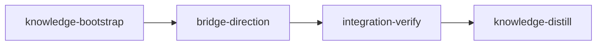

# Plan: Per-glyph bridge direction and a complete glyph grid

## Overview

The GUI gains a per-glyph bridge direction picker (Auto / Vertical / Horizontal) that drives the
preview and the saved font. The glyph grid is fixed so it lists every glyph that comes out
bridged: composite glyphs (Aacute, Aring, eacute, ...) are missing today. Glyphs where no bridge
can be placed are reported truthfully and marked. A short knowledge-bootstrap records the durable
findings, one implementation stage does the work in waves of codex units (gpt-6-luna and
gpt-5.6-terra) plus one sonnet test worker, then integration-verify and knowledge-distill.

## Goals

- Per glyph: Auto (today's choice), Vertical (an O loses its top and bottom strokes), Horizontal
  (an O loses its left and right strokes). An explicit choice falls back to the other axis when
  it cannot be built. Choices live for the session and apply to preview and save.
- The grid shows island glyphs plus every composite that draws one; a composite follows its base
  glyph's direction (its picker is disabled and names the base).
- Glyphs with no bridge placed show "no bridge could be placed" in the preview and a red mark in
  the grid; `bridges_added` counts islands actually bridged (the CLI's statistics too).
- Non-goals: persisting choices to a file, a CLI `--direction` option, decomposing composites,
  per-island directions, fixing `Glyph.is_composite()`, changing where Auto puts bridges
  (`tests/regression` pins Auto bit for bit).

## Findings the plan rests on (measured at 111d115, 2026-09-24)

- **Bug root cause.** `fonttools_glyph_to_domain` records only outline segments, so a composite
  glyph has zero contours and `FontProcessor.classify_glyphs` files it under "empty glyph". The
  `skip_composite` branch never fires: the converter reads `fonttools_glyph._glyph`, which
  fontTools' `_TTGlyphGlyf` glyph-set objects do not have, so `Glyph.is_composite()` is False
  (Roboto `Aacute`). The grid shows `classification.glyphs_to_process`, so composites never
  appear, yet the saved font bridges them through the referenced glyph. Roboto: 562 island
  glyphs plus 465 such composites (1027 display glyphs); Lato 447 + 370; CommitMono 467 + 0.
  Every glyph whose decomposed outline changes in a saved fixture font is an island glyph or one
  of those composites (checked on all three fixtures).
- **Direction seams.** `ContourMerger.merge_contours_with_bridges` already takes
  `force_horizontal`/`force_vertical` (`MergeDispatch.forced_*` falls back to the other axis).
  Single islands and nested children reach it through `SurgeryContext.merge`; island groups (B,
  8) go through `process_groups` in `core/surgery_groups.py`, whose spanning/sequential choice
  decides the axis. Simulating the planned mapping over every island glyph of the three fixtures
  gave 0 errors under either explicit direction.
- **Truthful counts.** `process_glyph` reports the analyzer's island count as `bridges_added`,
  so Roboto `four`, `AE` and 7 more (Lato: 7) read "1 island(s) bridged" with nothing bridged.
  Counting the islands that no longer appear verbatim in the output gives 0 for exactly those
  (and 1 for O, A, D; 2 for B and eight).
- **Composite geometry.** Composing leaf outlines with fontTools `Transform` (child first, then
  parent) reproduced fontTools' `DecomposingRecordingPen` output for all 1433 Roboto composites.
  No fixture composite nests another or mirrors.
- **Cost.** One `unbridged()` pass over a fixture font takes about 0.3 s, and the width slider
  emits a parameter change per tick, so the survey runs on the pool behind a 250 ms debounce.
- **Gate baseline.** `uv run pytest` at HEAD: 279 passed, 42 warnings, 264 s (coverage on). The
  42 warnings are `DeprecationWarning: This process ... is multi-threaded, use of fork() may lead
  to deadlocks`: Qt threads from `tests/gui` are alive when later tests fork their pools. Split
  into two processes, both clean: non-GUI (`tests/regression tests/unit tests/integration
  tests/test_domain_models.py`, `-W error::DeprecationWarning`) 168 passed in 36 s; `tests/gui`
  111 passed in 83 s. Every gate below splits that way. `uv run ruff check src tests`,
  `uv run ruff format --check src tests`, `uv run mypy`: clean. The implementation stage's scoped
  test set (existing part) runs in 101 s.

## Execution Diagram



## Stages

### 1. knowledge-bootstrap (knowledge, sonnet override)

The knowledge base is current (`loom knowledge check` clean; `architecture/gui.md` and
`patterns/bridge-algorithm.md` describe this code), so this stage is small and single-agent:
`loom knowledge sync`, audit the two topic sections this plan touches, and record two durable
concerns found while planning (composites read without contours and the dead `skip_composite`;
the fork warnings when GUI and pool tests share a process). Sonnet is a deliberate override:
the work is a short audit and two concern entries.

### 2. bridge-direction (standard, codex lane first)

One implementation stage (Stage Necessity: Q1-Q4 all NO). The core changes are a compile-order
dependency of the GUI changes, handled by a FOUNDATION step and waves inside one stage; no other
stage writes these files; the per-wave test runs give the checkpoint; the orchestrator holds the
shared brief, 9 worker reports and per-wave test output, well under 500,000 tokens.

The shared contract `doc/plans/briefs/gui-bridge-direction/bridge-direction/_shared.md` pins
every signature, the direction semantics table, the repo rules and the measured facts; each
worker's brief sits beside it. Codex units write a module together with its own tests. The
session, controller and main window form a serial chain (each imports the previous one's new
API), so they are single-module codex units in waves 2-4, and their three GUI test files go to
one sonnet worker in wave 5.

| Wave | Workers |
| --- | --- |
| 0 | FOUNDATION (orchestrator): `BridgeDirection`, `BridgeConfig.direction`, `SurgeryContext.direction` |
| 1 | U1 surgery direction + core tests, U2 processor + tests, U3 composites + tests, U4 grid/view + tests, U5 direction picker + tests |
| 2 | U6 session |
| 3 | U7 controller |
| 4 | U8 main window, then the orchestrator updates two grid-count asserts |
| 5 | TG session/controller/main-window tests (sonnet) |

### 3. integration-verify

Full suite in two processes, lint, types, three parallel reviews, a functional run through the
real window (screenshots of O under each direction, Aacute following A, `four` marked, a save
read back) on all three fixtures.

### 4. knowledge-distill

Curate memories: `architecture/gui.md` (composites in the grid, direction state, survey
threading), `patterns/bridge-algorithm.md` (direction mapping, truthful count), concerns; README
Usage.

---

<!-- loom METADATA -->

```yaml
loom:
  version: 1
  sandbox:
    enabled: true
    auto_allow: true
    filesystem:
      deny_read: ["~/.ssh/**", "~/.aws/**", "~/.config/gcloud/**", "~/.gnupg/**"]
      allow_write:
        - "src/**"
        - "tests/**"
        - "README.md"
        - ".venv/**"
        - ".mypy_cache/**"
        - ".ruff_cache/**"
        - ".pytest_cache/**"
        - ".coverage"
        - "htmlcov/**"
        - "stencilizer_*.log"
    network:
      allowed_domains: ["pypi.org", "files.pythonhosted.org"]
      allow_local_binding: false
      allow_unix_sockets: []
  stages:
    - id: knowledge-bootstrap
      name: "Bootstrap Knowledge Base"
      stage_type: knowledge
      model: "sonnet"
      description: |
        The knowledge base already describes this codebase (loom knowledge check is clean at
        111d115); this stage audits the two topics the plan touches and records two durable
        concerns found while planning. Model override to sonnet: a short audit plus two concern
        entries needs no opus.
        Use parallel subagents and skills to maximize performance. SINGLE-AGENT here: the audit
        covers two topic files, so do not spawn subagents.
        1. Run loom knowledge sync from the repository root.
        2. Audit doc/loom/knowledge/architecture/gui.md ("GUI package layout", "Threading model")
           and doc/loom/knowledge/patterns/bridge-algorithm.md ("Contour surgery", "Multi-island
           cases") against src/stencilizer/gui/ and src/stencilizer/core/surgery*.py. Correct any
           claim the tree contradicts with loom knowledge replace-section <file> "<heading>"
           "<body>", naming the wrong claim.
        3. Add to concerns.md with loom knowledge update concerns "<entry>":
           (a) "## Composite glyphs read without contours": fonttools_glyph_to_domain records only
           outline segments, so a composite glyph (Roboto Aacute = A + acute) has zero contours and
           classify_glyphs files it as "empty glyph"; the converter reads fonttools_glyph._glyph,
           which fontTools' _TTGlyphGlyf glyph-set objects lack, so Glyph.is_composite() is always
           False and ProcessingConfig.skip_composite never fires. The saved font still bridges
           composites through the glyph they reference.
           (b) "## Fork warnings when GUI and pool tests share a process": a single uv run pytest
           prints 42 DeprecationWarning "multi-threaded, use of fork()" (111d115): Qt threads
           started by tests/gui are alive when later tests fork ProcessPoolExecutor workers.
           tests/gui run alone, or the other directories run alone, print none.
        Use the loom knowledge CLI, NOT Write/Edit. NEVER Claude Code auto-memory. Run every
        loom knowledge command from the repository root.
      dependencies: []
      acceptance:
        - "loom knowledge check --strict --baseline doc/loom/knowledge/check-baseline.txt"
      files: ["doc/loom/knowledge/**"]
      working_dir: "."
      artifacts:
        - "doc/loom/knowledge/concerns.md"

    - id: bridge-direction
      name: "Per-glyph bridge direction and complete glyph grid"
      stage_type: standard
      implementers: ["codex", "claude"]
      subagent_timeout_secs: 900
      skills: ["loom-python", "loom-testing"]
      description: |
        Add a per-glyph bridge direction (Auto / Vertical / Horizontal) to the GUI preview and
        save, list composite glyphs that draw a bridged island glyph in the grid, and report
        glyphs where no bridge could be placed.
        Use parallel subagents and skills to maximize performance.

        CONTRACT: doc/plans/briefs/gui-bridge-direction/bridge-direction/_shared.md pins every
        signature, the direction semantics table, the repo rules (mypy strict, ruff, 400/50/300
        size limits, frozen tests/regression, Qt-free session and composites, queued
        connections) and the measured facts the tests use. Read it before spawning; do not
        re-derive it.

        FOUNDATION (you, before any spawn; two files, under 20 lines):
        1. src/stencilizer/config/settings.py: add the BridgeDirection StrEnum (AUTO "auto",
           VERTICAL "vertical", HORIZONTAL "horizontal") above BridgeConfig and the field
           BridgeConfig.direction: BridgeDirection = Field(default=BridgeDirection.AUTO, ...),
           exactly as _shared.md shows.
        2. src/stencilizer/core/surgery_context.py: SurgeryContext gains
           direction: BridgeDirection = BridgeDirection.AUTO directly after use_spanning;
           SurgeryContext.merge sets force_horizontal/force_vertical from it only when the
           caller forced neither (the snippet in _shared.md).
        3. Prove it: uv run pytest --no-cov -q -p no:cacheprovider tests/regression
           tests/unit/test_surgery.py tests/unit/test_glyph_transformer.py (Auto output
           unchanged; this also creates the worktree .venv the codex units call through
           .venv/bin/). Read stderr: a blocked PyPI download is a blocker to report.

        WAVES (each starts only after the previous wave's files exist and its tests passed;
        later workers read earlier workers' files with cat, since loom map shows only the base):
          wave 1: U1, U2, U3, U4, U5
          wave 2: U6
          wave 3: U7
          wave 4: U8, then your edit E below
          wave 5: TG
        Territories are DISJOINT. Workers NEVER spawn subagents. Codex rows: spawn every codex
        unit of a wave BY AGENT TYPE, ALL in ONE message: loom-codex-forwarder, in the
        FOREGROUND, with --model <Tier column> --effort xhigh, --unit-id <worker id>, an
        explicit Bash timeout of 600000 ms, and the prompt "Your brief: <Brief path>. Read it
        and doc/plans/briefs/gui-bridge-direction/bridge-direction/_shared.md in full before
        anything else. Do not run git." Codex units must not run git: after EACH codex run,
        check git status --short yourself and confirm only the unit's owned files changed.
        Codex units cannot run uv run (no network, read-only uv cache and /tmp in codex's
        sandbox): their one check is the brief's static proof through .venv/bin/, run once;
        you run the real tests after each wave. Codex cannot record loom memory: record its
        reported assumptions yourself. TG row: spawn one loom-software-engineer (sonnet) with
        the same prompt minus the git line (the subagent preamble covers git); it runs its
        brief's check once and reports.

        | Worker | Role | Tier | Files owned | Shared context | Brief path |
        | ------ | ---- | ---- | ----------- | -------------- | ---------- |
        | F | Foundation (you, not spawned) | orchestrator | src/stencilizer/config/settings.py, src/stencilizer/core/surgery_context.py | none | FOUNDATION section above |
        | U1 | Surgery direction mapping and core tests | gpt-5.6-terra | src/stencilizer/core/surgery.py, src/stencilizer/core/surgery_groups.py, tests/integration/test_bridge_direction.py | core/surgery_context.py (read-only) | doc/plans/briefs/gui-bridge-direction/bridge-direction/u1-surgery-direction.md |
        | U2 | Processor directions, bridge count, tests | gpt-5.6-terra | src/stencilizer/core/processor.py, tests/integration/test_processor_directions.py | core/analyzer.py (read-only) | doc/plans/briefs/gui-bridge-direction/bridge-direction/u2-processor.md |
        | U3 | Composite resolution and tests | gpt-5.6-terra | src/stencilizer/gui/composites.py, tests/gui/test_composites.py | io/reader.py, io/converter.py (read-only) | doc/plans/briefs/gui-bridge-direction/bridge-direction/u3-composites.md |
        | U4 | Grid markers, preview label, tests | gpt-6-luna | src/stencilizer/gui/glyph_grid.py, src/stencilizer/gui/glyph_view.py, tests/gui/test_grid_marks.py | gui/session.py (read-only) | doc/plans/briefs/gui-bridge-direction/bridge-direction/u4-grid-and-view.md |
        | U5 | Direction picker widget and tests | gpt-6-luna | src/stencilizer/gui/direction_picker.py, tests/gui/test_direction_picker.py | gui/controls.py (read-only) | doc/plans/briefs/gui-bridge-direction/bridge-direction/u5-direction-picker.md |
        | U6 | Session composites, directions, survey | gpt-5.6-terra | src/stencilizer/gui/session.py | gui/composites.py, core/processor.py (read-only) | doc/plans/briefs/gui-bridge-direction/bridge-direction/u6-session.md |
        | U7 | Controller directions and survey | gpt-5.6-terra | src/stencilizer/gui/controller.py | gui/session.py, gui/tasks.py (read-only) | doc/plans/briefs/gui-bridge-direction/bridge-direction/u7-controller.md |
        | U8 | Main window wiring | gpt-5.6-terra | src/stencilizer/gui/main_window.py | all gui modules (read-only) | doc/plans/briefs/gui-bridge-direction/bridge-direction/u8-main-window.md |
        | E | Grid-count asserts (you, wave 4) | orchestrator | tests/gui/test_main_window.py, tests/gui/test_app.py | none | wave 4 edit below |
        | TG | Session, controller, main-window tests | sonnet | tests/gui/test_session_directions.py, tests/gui/test_controller_directions.py, tests/gui/test_main_window_directions.py | all gui modules (read-only) | doc/plans/briefs/gui-bridge-direction/bridge-direction/tg-gui-tests.md |

        WAVE 4 EDIT E (you, after U8 lands, before the wave's tests): the grid now lists
        composites, so in tests/gui/test_main_window.py
        (test_load_font_populates_window_and_selects_first_glyph) and tests/gui/test_app.py
        (test_create_window_loads_font) change "assert window.grid.count() == 562" to 1027
        (562 island glyphs + 465 composites, measured in _shared.md). Nothing else in those
        files changes.

        AFTER EACH WAVE (you): uv run ruff format <wave files> && uv run ruff check <wave
        files> && uv run mypy <wave files>, then the wave's tests, with tests/gui paths in a
        pytest process of their own, separate from tests/regression, tests/unit and
        tests/integration (a pool forked after Qt threads start warns and can deadlock):
          wave 0: uv run pytest --no-cov -q -p no:cacheprovider tests/regression
                  tests/unit/test_surgery.py tests/unit/test_glyph_transformer.py
          wave 1: uv run pytest --no-cov -q -p no:cacheprovider tests/regression
                  tests/unit/test_surgery.py tests/unit/test_glyph_transformer.py
                  tests/unit/test_processor.py tests/unit/test_processor_more.py
                  tests/integration/test_bridge_direction.py
                  tests/integration/test_processor_directions.py
                  tests/integration/test_winding_preservation.py tests/integration/test_diagnostic.py
                  and uv run pytest --no-cov -q -p no:cacheprovider tests/gui/test_composites.py
                  tests/gui/test_grid_marks.py tests/gui/test_direction_picker.py
                  tests/gui/test_glyph_grid.py tests/gui/test_glyph_view.py
          wave 2: uv run pytest --no-cov -q -p no:cacheprovider tests/gui/test_session.py
                  tests/gui/test_session_open.py tests/gui/test_session_save.py
                  tests/regression/test_code_structure.py
          wave 3: uv run pytest --no-cov -q -p no:cacheprovider tests/gui/test_controller.py
                  tests/gui/test_controller_errors.py tests/regression/test_code_structure.py
          wave 4: uv run pytest --no-cov -q -p no:cacheprovider tests/gui
                  tests/regression/test_code_structure.py
          wave 5: every acceptance command below.
        Check wc -l on the new test files (tests/regression/test_code_structure.py covers src/
        only).

        FAILURES: a unit exiting 124 timed_out is re-split against the partial tree, never
        re-forwarded as is: U1-U5 as module then tests; U6 as its step 1 then steps 2-3; U7 as
        its step 1 then steps 2-3. A unit whose proof or wave tests still fail after one fix
        attempt (a fresh codex unit briefed with the failure output) moves one tier up to a
        Claude subagent with the brief, the failed diff and the error output: loom-software-
        engineer (sonnet) for luna and terra work, loom-senior-software-engineer (opus) when the
        failure is in the direction mapping (U1) or the survey lifecycle (U7). TG failing once
        goes to loom-senior-software-engineer. The same worker failing twice gets a loom-advisor
        diagnosis before any further attempt. If the codex CLI is unavailable at run time, the
        luna and terra rows run on loom-software-engineer.

        ERROR HANDLING: the existing hierarchy only (FontLoadError, FontSaveError,
        GlyphNotFoundError under StencilizerError); the controller turns failures into its error
        signal and the window shows them in a QMessageBox. No new exception types.

        DO NOT TOUCH: src/stencilizer/cli/, src/stencilizer/io/, the bridge geometry modules
        (merger*.py, bridge_*.py, multi_island*.py, horizontal_*.py, vertical_*.py,
        surgery_nested.py, analyzer.py), tests/regression/, tests/unit/test_refactor_contracts.py.
        Auto output must stay bit-identical (tests/regression/test_behavior_golden.py).

        MEMORY: record mistakes, decisions and surprises with loom memory immediately
        (subagents report theirs to you; you record them, codex units cannot). NEVER loom
        knowledge in this stage; NEVER Claude Code auto-memory. A knowledge file contradicted by
        the tree gets loom memory note "stale-knowledge: <file>#<heading> claims X; the tree
        does Y". Record for knowledge-distill: the direction mapping table from _shared.md;
        bridges_added now counts islands that left the output; composites reach the grid through
        gui/composites.py because the domain reader drops components. Before loom stage
        complete, record loom memory note "wiring: stencilizer.gui modules are imported by
        dotted path (from stencilizer.gui.<module> import ...), which loom's unwired-file scan
        does not match; composites.py is imported by session.py, direction_picker.py by
        main_window.py; tests/gui and tests/integration are collected by pytest". Without a
        memory mentioning wiring, the completion's unwired-file check fails.
      dependencies: ["knowledge-bootstrap"]
      before_stage:
        - command: 'uv run python -c "import stencilizer.config.settings as s; print(''present'' if hasattr(s, ''BridgeDirection'') else ''absent'')"'
          exit_code: 0
          stdout_contains: ["absent"]
          description: "No BridgeDirection at the base commit"
      after_stage:
        - command: 'uv run python -c "from stencilizer.config.settings import BridgeConfig, BridgeDirection; print(BridgeConfig(direction=''horizontal'').direction is BridgeDirection.HORIZONTAL)"'
          exit_code: 0
          stdout_contains: ["True"]
          description: "BridgeConfig accepts and validates a direction"
      acceptance:
        - "uv run pytest --no-cov -q -p no:cacheprovider -W error::DeprecationWarning tests/regression tests/unit/test_surgery.py tests/unit/test_glyph_transformer.py tests/unit/test_processor.py tests/unit/test_processor_more.py tests/integration/test_bridge_direction.py tests/integration/test_processor_directions.py tests/integration/test_winding_preservation.py tests/integration/test_diagnostic.py"
        - "uv run pytest --no-cov -q -p no:cacheprovider tests/gui"
        - "uv run pytest --no-cov -q -p no:cacheprovider --collect-only tests/integration/test_bridge_direction.py::test_explicit_direction_splits_o_along_axis tests/integration/test_bridge_direction.py::test_stacked_islands_follow_direction tests/integration/test_processor_directions.py::test_unbridgeable_glyph_reports_zero_bridges tests/integration/test_processor_directions.py::test_process_applies_per_glyph_directions tests/gui/test_composites.py::test_composed_outlines_match_fonttools_decomposition tests/gui/test_session_directions.py::test_saved_font_changes_only_displayed_glyphs tests/gui/test_session_directions.py::test_composite_preview_follows_base_direction tests/gui/test_controller_directions.py::test_survey_reports_unbridged_glyphs tests/gui/test_controller_directions.py::test_stale_survey_result_is_dropped tests/gui/test_main_window_directions.py::test_choosing_direction_updates_preview_and_marker tests/gui/test_main_window_directions.py::test_saved_font_uses_chosen_direction"
        - '! rg -q "pytest\.(mark\.)?(skip|xfail|importorskip)" tests/gui tests/integration/test_bridge_direction.py tests/integration/test_processor_directions.py'
        - "uv run ruff check src tests"
        - "uv run ruff format --check src tests"
        - "uv run mypy"
        - 'uv run python -c "import sys, stencilizer.gui.session; sys.exit(''PySide6'' in sys.modules)"'
        - 'uv run python -c "import sys, stencilizer.cli.app; sys.exit(''PySide6'' in sys.modules)"'
        - 'D=$(mktemp -d "${TMPDIR:-/tmp}/sgui-launch.XXXXXX") && [ -n "$D" ] && { timeout -k 5 15 env QT_QPA_PLATFORM=offscreen uv run stencilizer-gui tests/fixtures/Roboto-Regular.ttf 2>"$D/err"; s=$?; } ; [ "$s" -eq 124 ] && ! rg -q Traceback "$D/err"'
      files:
        - "src/stencilizer/config/settings.py"
        - "src/stencilizer/core/surgery_context.py"
        - "src/stencilizer/core/surgery.py"
        - "src/stencilizer/core/surgery_groups.py"
        - "src/stencilizer/core/processor.py"
        - "src/stencilizer/gui/**"
        - "tests/gui/**"
        - "tests/integration/test_bridge_direction.py"
        - "tests/integration/test_processor_directions.py"
      working_dir: "."
      artifacts:
        - "src/stencilizer/gui/composites.py"
        - "src/stencilizer/gui/direction_picker.py"
        - "tests/integration/test_bridge_direction.py"
        - "tests/integration/test_processor_directions.py"
        - "tests/gui/test_composites.py"
        - "tests/gui/test_grid_marks.py"
        - "tests/gui/test_direction_picker.py"
        - "tests/gui/test_session_directions.py"
        - "tests/gui/test_controller_directions.py"
        - "tests/gui/test_main_window_directions.py"
      wiring:
        - source: "src/stencilizer/core/surgery.py"
          pattern: 'direction=self\.bridge_config\.direction'
          description: "The transformer hands the glyph's direction to the surgery context"
        - source: "src/stencilizer/core/surgery_groups.py"
          pattern: '_spanning_allowed\(ctx, axis\) and _spanning'
          description: "Island groups choose spanning from the glyph's direction"
        - source: "src/stencilizer/core/processor.py"
          pattern: '"direction": directions\['
          description: "Per-glyph directions reach each worker's config"
        - source: "src/stencilizer/gui/session.py"
          pattern: 'find_bridged_composites\('
          description: "Opening a font collects the composites that draw island glyphs"
        - source: "src/stencilizer/gui/session.py"
          pattern: 'directions=directions'
          description: "Saving passes the per-glyph directions to the processor"
        - source: "src/stencilizer/gui/controller.py"
          pattern: '\.unbridged\('
          description: "The controller's survey computes the unbridged glyphs"
        - source: "src/stencilizer/gui/controller.py"
          pattern: 'directions=dict\(self\._directions\)'
          description: "The controller saves with a copy of its directions"
        - source: "src/stencilizer/gui/main_window.py"
          pattern: 'set_glyphs\(\s*session\.display_glyphs'
          description: "The grid shows display glyphs, composites included"
        - source: "src/stencilizer/gui/main_window.py"
          pattern: 'direction_chosen\.connect\('
          description: "The picker drives the controller"
        - source: "src/stencilizer/gui/main_window.py"
          pattern: 'unbridged_changed\.connect\('
          description: "Survey results mark the grid"

    - id: integration-verify
      name: "Integration Verification"
      stage_type: integration-verify
      skills: ["loom-python", "loom-security-audit"]
      description: |
        Final verification of the per-glyph direction feature and the complete glyph grid.
        Verify FUNCTIONAL INTEGRATION, not only green tests. NEVER Claude Code auto-memory.
        CONTEXT: read the plan (doc/plans/), the shared brief
        doc/plans/briefs/gui-bridge-direction/bridge-direction/_shared.md, loom memory show
        --all, and doc/loom/knowledge/architecture/gui.md plus
        doc/loom/knowledge/patterns/bridge-algorithm.md.
        BUILD & TEST (zero tolerance, fix every warning and failure): the two pytest commands
        below (non-GUI and GUI suites in separate processes: at the base commit a single
        coverage run took 264 s, close to the 300 s acceptance limit, and mixing tests/gui with
        pool-forking tests printed 42 fork DeprecationWarnings; split, both halves were clean),
        uv run ruff check src tests, uv run ruff format --check src tests, uv run mypy.
        CODE REVIEW: spawn parallel loom-code-reviewer subagents: (1) concurrency: the survey's
        BackgroundTask is referenced until its handler runs, its signals reach bound controller
        methods through queued connections, a stale generation is dropped, a font load or a
        parameter change invalidates in-flight results, shutdown stops the debounce timer before
        waiting on the pool, the save and survey receive copies of the directions; (2) algorithm:
        Auto takes exactly the old branches in process_groups and SurgeryContext.merge, explicit
        directions follow the table in _shared.md, bridges_added counts islands that left the
        output, composite transforms compose child-then-parent and mirrored parts keep TrueType
        winding; (3) test coverage of the new code against the briefs' test lists. Fix every
        finding with an engineer subagent (the reviewers are read-only).
        FUNCTIONAL (prove it is wired in and usable):
        - The offscreen launch of the real console script is an acceptance command below.
        - Write a short throwaway script under the session scratchpad directory named in your
          system prompt (not the tree, not another temp dir: the Read tool is blocked outside
          the scratchpad). All code sits in def main(); the only top-level code is
          if __name__ == "__main__": multiprocessing.set_start_method("spawn"); main(). It builds
          the window with app.create_window for Roboto, waits for font_loaded and then
          unbridged_changed, selects O and grabs the window as a PNG under Auto, Vertical and
          Horizontal (set through window.direction_picker.combo), selects Aacute with A set to
          Horizontal and grabs again, and saves the font into the scratchpad. Open every PNG:
          the Stencilized pane must show O cut top-and-bottom for Auto/Vertical and
          left-and-right for Horizontal, Aacute cut like its A, the picker disabled for Aacute and
          reading "Follows A", and the grid item "four" in red. Reload the saved font:
          error_count 0, saved O split along the horizontal axis, saved Aacute still a composite
          referencing A. Repeat the load, the unbridged survey and one save for Lato-Black.ttf and
          CommitMono-Cosmix-700-Regular.otf.
        If this stage adds files, record the same wiring memory note as bridge-direction before
        completing.
        Record discoveries with loom memory for knowledge-distill, including whether the fork
        warnings concern still holds and any knowledge file contradicted by the tree:
        loom memory note "stale-knowledge: ...".
      dependencies: ["bridge-direction"]
      acceptance:
        - "uv run pytest --no-cov -q -p no:cacheprovider -W error::DeprecationWarning tests/regression tests/unit tests/integration tests/test_domain_models.py"
        - "uv run pytest --no-cov -q -p no:cacheprovider tests/gui"
        - "uv run ruff check src tests"
        - "uv run ruff format --check src tests"
        - "uv run mypy"
        - "uv run stencilizer --version"
        - "uv run stencilizer-gui --help | rg -qF 'usage: stencilizer-gui'"
        - 'uv run python -c "import sys, stencilizer.cli.app; sys.exit(''PySide6'' in sys.modules)"'
        - 'D=$(mktemp -d "${TMPDIR:-/tmp}/sgui-launch.XXXXXX") && [ -n "$D" ] && { timeout -k 5 15 env QT_QPA_PLATFORM=offscreen uv run stencilizer-gui tests/fixtures/Roboto-Regular.ttf 2>"$D/err"; s=$?; } ; [ "$s" -eq 124 ] && ! rg -q Traceback "$D/err"'
      working_dir: "."
      wiring_tests:
        - name: "GUI console script resolves and parses arguments"
          command: "uv run stencilizer-gui --help"
          success_criteria:
            exit_code: 0

    - id: knowledge-distill
      name: "Knowledge Distillation"
      stage_type: knowledge-distill
      description: |
        Curate all stage memories into permanent knowledge; update user docs.
        NEVER Claude Code auto-memory.
        SINGLE-AGENT: do NOT spawn subagents; memories are compact summaries, so lean on them and
        keep code spot-reads narrow.
        START with loom memory pending --group (corrections, mistakes, decisions, other); read the
        plan and the knowledge sections it touches.
        CORRECTIONS FIRST: apply every stale-knowledge: memory in place with
        loom knowledge replace-section <file> "<heading>" "<body>", never with
        loom knowledge update, which appends the fix below the stale text.
        Then curate mistakes (prevention rules), patterns, decisions, conventions via
        loom knowledge update. Expected material: architecture/gui.md (composites in the grid via
        gui/composites.py, per-glyph directions held by the controller, the debounced unbridged
        survey on the pool and its generation guard); patterns/bridge-algorithm.md (the direction
        mapping table: single islands and nested children forced through SurgeryContext.merge,
        spanning forced for an arrangement matching the direction, sequential otherwise;
        bridges_added counts islands that left the output); concerns.md: update "Composite glyphs
        read without contours" (the GUI now resolves composites itself; skip_composite is still
        dead) and delete "Fork warnings when GUI and pool tests share a process" only if
        integration-verify recorded it fixed. TIER ROUTING: findings of about 40 lines or fewer go
        inline in the tier-1 file or the existing tier-2 topic; larger findings go via
        loom knowledge update <category>/<slug> with a 2-4 line tier-1 summary and link.
        INDEX.md regenerates on every knowledge write; then loom review prunes stale entries.
        Run loom knowledge commands from the repository root (mistakes.md "loom knowledge update
        run from the knowledge directory").
        README.md, "Graphical Interface" under "## Usage": say that the grid also lists composite
        glyphs (accented letters) that inherit bridges from their base glyph, that the direction
        picker sets Auto / Vertical / Horizontal per glyph (composites follow their base), and
        that glyphs where no bridge can be placed are marked. The README acceptance command
        checks "direction" and "composite" in the Usage section.
        RECEIPTS: every Note/Decision/Question taken into knowledge gets
        loom memory resolve <id> --outcome promoted|merged|discarded|deferred right after the
        write that used it (--target/--reason as appropriate); finish with
        loom memory pending --strict and resolve whatever it lists.
        LAST, if this stage removed structural issues, ratchet the baseline:
        loom knowledge check --write-baseline doc/loom/knowledge/check-baseline.txt
      dependencies: ["integration-verify"]
      acceptance:
        - "loom knowledge check --strict --baseline doc/loom/knowledge/check-baseline.txt"
        - "loom memory pending --strict"
        - 'uv run python -c "import re, sys; t = open(''README.md'').read(); s = {m[1]: m[2] for m in re.finditer(r''^## ([^\n]+)\n(.*?)(?=^## |\Z)'', t, re.S | re.M)}; u = s.get(''Usage'', '''').lower(); sys.exit(not (''direction'' in u and ''composite'' in u))"'
      files: ["doc/loom/knowledge/**", "README.md"]
      working_dir: "."
      artifacts:
        - "README.md"
```

<!-- END loom METADATA -->
