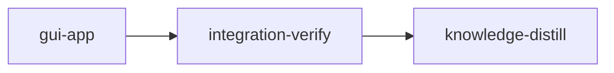

# Plan: Stencilizer desktop GUI

## Overview

Add a PySide6 desktop GUI, launched as `stencilizer-gui [font]`, that opens a TTF/OTF font,
exposes the processing parameters, shows the font's island glyphs as a thumbnail grid, and shows
the selected glyph before and after stencilization side by side, recomputed live as parameters
change. "Stencilize & Save..." writes the full font through the existing `FontProcessor`. One
implementation stage builds the `stencilizer.gui` package in five codex waves; integration-verify
proves it is reachable through the console script; knowledge-distill records what was learned.

## Goals

- Open a font through a native file dialog (or as the command-line argument).
- Parameters: bridge width (30-110 %), worker count (Auto or N), and
  `BridgeConfig.use_spanning_bridges`, which exists in settings but has no CLI flag.
- Grid of island glyphs; the selected glyph shown as Original | Stencilized at one shared scale,
  refreshed on every parameter change.
- Save the stenciled font with progress, refusing to overwrite the input font and refusing a
  source file that changed on disk since it was opened (reopen it instead).
- A saved font carries the transformed outlines the preview showed: zero transform errors on the
  fixtures, verified by reading the output back.
- Non-goals now: editing glyphs, before/after thumbnails in the grid, exposing `GeometryConfig`,
  variable fonts or CFF2 (unsupported by the core, see `stack.md`). Opening one fails with a
  `FontLoadError` naming the reason; it never becomes a session, so it cannot be saved.

## Decisions (answered by the user)

| Question | Answer |
| --- | --- |
| Toolkit | PySide6 (`pyside6-essentials`), optional extra `gui`, plus the dev group |
| Parameters | Bridge width, workers, spanning-bridges toggle |
| Preview | Grid of island glyphs + live before/after detail of the selected glyph |
| Implementers | Codex preferred: gpt-6-luna, gpt-5.6-terra, gpt-6-sol for the hard part |

## Grounding (measured at commit 389557c, 2026-09-23)

Gate baseline, run from the main checkout (NOT from a loom worktree under the stage sandbox):

| Command | Result |
| --- | --- |
| `uv run pytest --no-cov -q -p no:cacheprovider` | 168 passed in 34.10 s |
| `uv run ruff check src tests` | All checks passed |
| `uv run ruff format --check src tests` | 68 files already formatted |
| `uv run mypy` | Success: no issues found in 68 source files |
| `uv run pytest` (with coverage, the canonical gate) | 168 passed in 79.6 s |

The full suite writes about a dozen `stencilizer_<timestamp>.log` files into the working
directory: several tests build `FontProcessor` without a `log_file`. The sandbox therefore allows
`stencilizer_*.log` at the worktree root.

Dependency and runtime probe (scratch copy of the project, uv 0.9.22, CPython 3.13.1):

- `uv add --optional gui 'pyside6-essentials>=6.11.2'` and
  `uv add --dev 'pyside6-essentials>=6.11.2' 'pytest-qt>=4.5.0'` resolve (PyPI:
  pyside6-essentials 6.11.2 requires Python `>=3.10,<3.15`, abi3 wheels for Linux, macOS,
  Windows; pytest-qt 4.5.0 ships `py.typed`).
- With `QT_QPA_PLATFORM=offscreen`, a qtbot test that draws a Roboto glyph through
  `fontTools.pens.qtPen.QtPen` into a `QPainterPath` and paints it onto a `QImage` passed.
- `fontTools/pens/qtPen.py` imports PyQt5 when constructed without `path=`, so the GUI always
  passes a PySide6 `QPainterPath`.
- mypy strict accepts `QObject`/`QRunnable`/`QWidget` subclasses (PySide6 ships `.pyi` stubs).
  Ruff flags `paintEvent` with N802 and its unused `event` with ARG002: Qt overrides carry
  `# noqa: N802` (plus `ARG002` when unused).

Behavior the design leans on (`FontProcessor.classify_glyphs` + `process_glyph`, in-process):

| Font | Glyphs | Island glyphs | Classify | Max per-glyph transform | All island glyphs |
| --- | --- | --- | --- | --- | --- |
| Roboto-Regular.ttf | 3387 | 562 | 0.65 s | 2.8 ms | 0.17 s |
| Lato-Black.ttf | 3023 | 447 | 0.62 s | 1.7 ms | 0.15 s |
| CommitMono-Cosmix-700-Regular.otf | 1932 | 467 | 0.37 s | 8.3 ms | 0.16 s |

So previews run synchronously on the GUI thread (no debounce, no preview thread), while loading
and saving run on a worker thread. Roboto: UPM 2048, hhea ascent 2146, descent -555. `O`:
`bridges_added == 1`, 2 contours before and 4 after; widths 30 and 110 differ; the spanning
toggle changes `B` and `eight` (93 of Roboto's 562 island glyphs). `update_font_names` turns
Roboto's family name into `Roboto Stenciled`.

Outline rendering dry run (walk mirroring `_update_truetype_glyph`/`_update_cff_glyph`):

- TrueType: `draw_glyph` into a `RecordingPen` equals fontTools' own recording for `O`, `B`,
  `eight`, `a`, `g`, `at`. The composite `Aring` differs (fontTools records `addComponent`);
  composites are skipped by classification, so the grid never shows them.
- CFF: path bounds equal `BoundsPen` bounds for CommitMono `O` (30, -10, 570, 710) and `B`
  (85, 0, 546, 700).
- Fill rule: a clockwise outer square with a same-direction inner square renders a filled centre
  under `WindingFill` and an empty one under `OddEvenFill`, so the winding test tells the two
  apart. The GUI uses `WindingFill`, matching font rasterizers and exposing broken hole winding
  (mistakes.md "Holes filled on nested-contour glyphs").
- `font_to_widget_transform` landmarks: frame centre maps to target centre; the highest font y
  maps to widget y 0.

Criterion dry runs:

- Entry point registered (`importlib.metadata.entry_points(group="console_scripts",
  name="stencilizer-gui")`, value `stencilizer.gui.app:main`): exit 1 without the
  `[project.scripts]` line, exit 0 with it. It lives in `tests/gui/test_app.py`.
- `uv run stencilizer-gui --help | rg -qF 'usage: stencilizer-gui'`: exit 1 with no `app`
  module, exit 0 with an argparse `main`.
- `before_stage` probe (`importlib.util.find_spec("stencilizer.gui")`): prints `gui-absent`,
  exit 0, at 389557c.
- knowledge-distill's README check (a Python one-liner splitting `README.md` on `## ` headings):
  exit 1 on the current CLI-only README, exit 0 once Installation holds `uv pip install -e
  ".[gui]"` and Usage holds `stencilizer-gui`, exit 1 when `stencilizer-gui` appears only under
  another heading.
- Save correctness (spawn start method, `max_workers=1`): Roboto 562 processed / 0 errors in
  0.6 s, CommitMono 467 / 0 in 0.7 s; the saved `O` and `B` read back with the preview's contour
  and point counts, coordinates within 0.06 units (Roboto) and 0.0 (CommitMono).
- Unsupported fonts: `convertCFFToCFF2` on CommitMono gives a `CFF2`-only font that
  `FontReader` labels `OpenType`; `classify_glyphs` finds 26 island glyphs and
  `domain_glyph_to_fonttools` raises `NotImplementedError: Unsupported font format`, which
  `FontProcessor._save_font` only logs before saving and renaming the font. Roboto with an added
  one-axis `fvar` table loads as TrueType.

Seams read to the bottom: `core/processor.py`, `config/settings.py`, `io/reader.py`,
`io/writer.py`, `io/converter.py`, `cli/app.py` (lines 1-270), `domain/glyph.py` (1-40),
`domain/contour.py` (40-156), `utils/logging.py` (13-110), `exceptions.py` (16-62),
`tests/regression/test_code_structure.py` (limits 400/50/300 and the `_font` access rule apply
to everything under `src/`, so to `src/stencilizer/gui/` too).

Design consequences settled in the briefs:

- `FontProcessor.__init__` calls `configure_logging`, which adds root-logger handlers on every
  call: the GUI builds ONE processor per controller and swaps `processor.config` per save.
- Never replace the user's original font: `FontSession.save` refuses an output that is the
  input file (same resolved path, or an existing path for which `Path.samefile` is true, so
  symlinks and hard links count) before touching anything. This is a product rule, not a
  corruption guard: `TTFont.save` serializes into a `BytesIO` before opening the destination
  (fontTools `ttLib/ttFont.py:366-395`), and a probe saving Roboto onto itself produced a valid
  font.
- The session pins the source revision: `FontSession.open` stores the SHA-256 of the font's
  bytes (`source_sha256`); `save` recomputes it before and after `FontProcessor.process` and
  raises `FontSaveError` ("changed on disk since it was opened; reopen it") on a mismatch,
  deleting the output in the after case. Needed because `process` reopens the path and writes
  the classification's outlines (read at open) into whatever file is there now: an edited or
  replaced source would mix old outlines with new tables, metrics and glyph order.
- `FontSession.open` rejects `fvar`, `CFF2`, and fonts with neither `glyf` nor `CFF ` before
  classifying (`unsupported_reason`), as `FontLoadError`. The core writer supports only `glyf`
  and `CFF `, and `_save_font` swallows per-glyph write failures (not counted in
  `ProcessingStats.error_count`) and still saves a renamed "Stenciled" font.
- Save tests therefore never trust the stats alone: each asserts `error_count == 0` and the
  exact processed count, then reopens the output and compares the saved `O` (and `B` for the
  spanning toggle) with the preview (`outlines_match`, 1-unit tolerance). A renamed copy or an
  all-failure save keeps the 2-contour `O` and fails.
- `process_glyph` reports the island count as `bridges_added`: the UI says "island(s) bridged".
- The save runs a `ProcessPoolExecutor` from a worker thread. `app.main()` switches the start
  method to `spawn` (when none is set) so no child is forked from a multi-threaded Qt process.
  Tests never call `set_start_method` (process-global: it would change how every existing
  integration test starts its pool). Instead an autouse fixture in `tests/gui/conftest.py`
  patches `stencilizer.core.processor.ProcessPoolExecutor` with `functools.partial(
  ProcessPoolExecutor, mp_context=multiprocessing.get_context("spawn"))`, so GUI save tests
  exercise the spawn path production uses and never fork from a threaded process (CPython 3.13
  on Linux defaults to `fork` and warns `DeprecationWarning: This process ... is multi-threaded,
  use of fork() may lead to deadlocks in the child`). Measured under pytest: Roboto save 562
  processed, 0 errors, no warnings, global start method still `fork` afterwards. The real
  `app.main` path (start-method switch, event loop, a save through the window, clean exit) runs
  in a fresh interpreter in `test_app.py::test_main_subprocess_saves_with_spawn`, which the
  fixture does not reach.
- Closing the window while an open or save runs: `closeEvent` ignores the close and shows `Wait
  for the current operation to finish` in the status bar; only when idle does it call
  `controller.shutdown()` and accept. `shutdown()` is `QThreadPool.waitForDone()` with no
  deadline: called mid-save it would freeze the GUI thread for the rest of the save (queued
  progress is not delivered while it blocks), and the core offers no cancellation.
  `test_controller.py::test_shutdown_waits_for_active_save` proves a mid-save `shutdown()`
  returns only once the output is complete and the queued `save_finished` still arrives.
- Logging: `default_log_file()` is per user (`stencilizer-gui-<user>.log` in the temp dir):
  `configure_logging` opens it with an appending `FileHandler`, and another user's file would
  raise `PermissionError` at launch. The controller logs with `file_log_level="INFO"`; the
  DEBUG default writes about 11,000 fontTools lines per Roboto save.
- Codex units cannot run `uv run`: the companion runs `--write` jobs in codex's
  `workspace-write` sandbox, which has no network, a read-only `~/.cache/uv`, and
  `exclude_slash_tmp = true` (so pytest's `tmp_path` is unwritable), and the codex preamble
  forbids verification. Each codex unit runs one static proof through `.venv/bin/` (mypy, ruff
  check, pytest `--collect-only`); the orchestrator runs the real tests with `uv run` after each
  wave.
- `loom stage complete` flags new files whose stem no `import <stem>` / `from <stem> ` line
  references; dotted imports (`from stencilizer.gui.session import ...`) and the top-level
  `tests/` tree do not match, so every new file is reported unwired. gui-app has a downstream
  stage, so the check passes when the stage's memory journal explains the wiring (a
  `loom memory note` containing "wiring").

- Adding a second Typer command would turn `stencilizer <font>` into `stencilizer stencilize
  <font>`; the GUI therefore gets its own console script and the CLI is untouched.

Risk: the offscreen Qt probe ran outside the loom sandbox. The foundation step therefore starts
a `QApplication` inside the stage sandbox before any worker is spawned; a failure there is a
blocker to report, not something to work around.

## Execution Diagram



## Stages

### Knowledge bootstrap: skipped

`doc/loom/knowledge/` holds curated content for this codebase (tier-1 files plus
`patterns/bridge-algorithm`), `loom knowledge sync` reports the catalog current, and
`loom knowledge check --strict` reports the tree clean. Plain `loom plan verify` reports 0
errors and two expected warnings, so `--strict` exits 1: the knowledge-bootstrap heuristic (any
root stage when the plan has no knowledge-bootstrap stage), and "4 rows that each own exactly one
path" for W7/W7T/W8/W8T, split on purpose for the codex deadline (stage 1 below).

### 1. gui-app: the `stencilizer.gui` package

The only implementation stage. Stage Necessity: nothing needs another stage's code merged
first (Q1: no), no other stage writes these files (Q2: no), no intermediate checkpoint is needed
(Q3: no), and the orchestrator's context (briefs are read by workers; twelve reports; test output)
stays well under 500,000 tokens (Q4: no). The layered order (session before controller before
window) is a compile-order dependency, handled as waves inside the stage.

Foundation (orchestrator, before any spawn): the two `uv add` commands, then two hand-added lines
in `pyproject.toml` (the console script and `qt_api`). Then five codex waves; each wave waits for
the previous one because its modules import the previous wave's files:

| Wave | Workers |
| --- | --- |
| 0 | W0 test scaffold |
| 1 | W1 session, W2 outline, W3 tasks, W4 controls |
| 2 | W5 glyph view, W6 glyph grid, W7 controller module |
| 3 | W7T controller tests, W8 main window module |
| 4 | W8T main window tests, W9 app entry point |

W7 and W8 are split into a module unit and a test unit up front: loom's codex guidance measures
a module-plus-test pair at xhigh at 24-30 minutes against the forwarding wrapper's 540 s
deadline, and these two carry the longest test lists. Codex units run only a static proof (see
Design consequences); the orchestrator runs each wave's tests.

Every interface is pinned in `doc/plans/briefs/stencilizer-gui/gui-app/_shared.md`; each worker
brief names its files, anchors, at most three steps, its tests and one proof command. The worker
table in the YAML is authoritative for ownership.

### 2. Integration verification

Full suite, lint, format, typecheck; reviewers for architecture (thread lifecycle, signal
connections), security (paths from dialogs, overwrite guard) and test coverage; an offscreen
launch of the real console script with a font argument (an acceptance command); a rendered
screenshot of the window inspected for a sane before/after pair on all three fixture fonts.

### 3. Knowledge distillation

Curates the stage memories; adds the GUI to `README.md`: Installation gets
`uv pip install -e ".[gui]"`, Usage gets `stencilizer-gui [font]`. `README.md` is this stage's
artifact, and an acceptance command checks each string under its own `## ` heading.

## Sandbox

The stage sandbox allows PyPI (`uv add` and first-time `uv sync` in each worktree); on a stage
listing codex in `implementers`, loom also admits the codex service domains (chatgpt.com,
api.openai.com, auth.openai.com). Codex's own sandbox has no network (see Design consequences).
Writes are the project tree the stages touch plus the tool caches the gates create; the uv cache
is pre-granted by loom.

<!-- loom METADATA -->

```yaml
loom:
  version: 1
  sandbox:
    enabled: true
    auto_allow: true
    filesystem:
      deny_read: ["~/.ssh/**", "~/.aws/**", "~/.config/gcloud/**", "~/.gnupg/**"]
      allow_write:
        - "src/**"
        - "tests/**"
        - "pyproject.toml"
        - "uv.lock"
        - "README.md"
        - ".venv/**"
        - ".mypy_cache/**"
        - ".ruff_cache/**"
        - ".pytest_cache/**"
        - ".coverage"
        - "htmlcov/**"
        - "stencilizer_*.log"
    network:
      allowed_domains: ["pypi.org", "files.pythonhosted.org"]
      allow_local_binding: false
      allow_unix_sockets: []
  stages:
    - id: gui-app
      name: "PySide6 GUI package"
      stage_type: standard
      implementers: ["codex", "claude"]
      subagent_timeout_secs: 900
      skills: ["loom-python", "loom-testing"]
      description: |
        Build src/stencilizer/gui/ (PySide6): open a font, set parameters, browse island
        glyphs, preview one glyph before/after stencilization, save the stenciled font.
        Use parallel subagents and skills to maximize performance.

        CONTRACT: doc/plans/briefs/stencilizer-gui/gui-app/_shared.md pins every module's
        signatures, the repo rules (mypy strict, ruff, 400/50/300 size limits, Qt noqa codes,
        QtPen path=, queued connections) and the measured facts the tests use. Read it before
        spawning; do not re-derive it.

        FOUNDATION (you, before any spawn; commands plus two hand-edited lines):
        1. uv add --optional gui 'pyside6-essentials>=6.11.2'
        2. uv add --dev 'pyside6-essentials>=6.11.2' 'pytest-qt>=4.5.0'
        3. pyproject.toml: under [project.scripts] add
             stencilizer-gui = "stencilizer.gui.app:main"
           and under [tool.pytest.ini_options] add
             qt_api = "pyside6"
        4. Prove it: uv run python -c "import pytestqt" and
           QT_QPA_PLATFORM=offscreen uv run python -c "from PySide6.QtWidgets import
           QApplication; app = QApplication([]); print('qt-ok')" (Qt starts inside this
           stage's sandbox) and uv run pytest --no-cov -q -p no:cacheprovider
           tests/integration/test_stencilization_formats.py tests/unit/test_refactor_contracts.py
           (a real process pool and tmp_path inside this sandbox with pytest-qt installed;
           tests/unit/test_processor.py mocks the pool and proves neither). This also creates
           the worktree's .venv, which codex units call through .venv/bin/. Read stderr: a
           blocked PyPI download or a Qt platform-plugin failure is a blocker to report, not a
           pass.

        WAVES (each wave starts only after the previous wave's files exist and its proof
        passed; later modules import earlier ones):
          wave 0: W0
          wave 1: W1, W2, W3, W4
          wave 2: W5, W6, W7
          wave 3: W7T, W8
          wave 4: W8T, W9
        Territories below are DISJOINT. Workers NEVER spawn subagents. Spawn every worker of a
        wave BY AGENT TYPE, ALL in ONE message: loom-codex-forwarder, in the FOREGROUND, with
        --model <Tier column> --effort xhigh, --unit-id <worker id>, an explicit Bash timeout
        of 600000 ms, and the prompt "Your brief: <Brief path>. Read it and
        doc/plans/briefs/stencilizer-gui/gui-app/_shared.md in full before anything else. Do
        not run git." Codex units must not run git: after EACH codex run, check
        git status --short yourself and confirm only the unit's owned files changed.

        A T row (W7T, W8T) uses its row's brief; append to its prompt "You are unit <id>:
        write only <file>, from the brief's Tests section, against the module already in the
        tree." Codex units cannot run `uv run` (no network, read-only uv cache and /tmp inside
        codex's sandbox): their one check is the brief's proof command through .venv/bin/,
        run once, and they never run the tests. You run the real tests after each wave.

        | Worker | Role | Tier | Files owned | Shared context | Brief path |
        | ------ | ---- | ---- | ----------- | -------------- | ---------- |
        | F | Foundation (you, not spawned) | orchestrator | pyproject.toml, uv.lock | none | FOUNDATION section above |
        | W0 | Test scaffold | gpt-6-luna | tests/gui/__init__.py, tests/gui/conftest.py | pyproject.toml (read-only) | doc/plans/briefs/stencilizer-gui/gui-app/w0-scaffold.md |
        | W1 | Font session model | gpt-5.6-terra | src/stencilizer/gui/__init__.py, src/stencilizer/gui/session.py, tests/gui/test_session.py | core/processor.py, cli/app.py (read-only) | doc/plans/briefs/stencilizer-gui/gui-app/w1-session.md |
        | W2 | Outline rendering | gpt-5.6-terra | src/stencilizer/gui/outline.py, tests/gui/test_outline.py | io/converter.py (read-only) | doc/plans/briefs/stencilizer-gui/gui-app/w2-outline.md |
        | W3 | Background task | gpt-5.6-terra | src/stencilizer/gui/tasks.py, tests/gui/test_tasks.py | exceptions.py (read-only) | doc/plans/briefs/stencilizer-gui/gui-app/w3-tasks.md |
        | W4 | Control panel | gpt-6-luna | src/stencilizer/gui/controls.py, tests/gui/test_controls.py | config/settings.py (read-only) | doc/plans/briefs/stencilizer-gui/gui-app/w4-controls.md |
        | W5 | Glyph canvas and comparison | gpt-5.6-terra | src/stencilizer/gui/glyph_view.py, tests/gui/test_glyph_view.py | gui/outline.py, gui/session.py (read-only) | doc/plans/briefs/stencilizer-gui/gui-app/w5-glyph-view.md |
        | W6 | Glyph grid | gpt-6-luna | src/stencilizer/gui/glyph_grid.py, tests/gui/test_glyph_grid.py | gui/outline.py (read-only) | doc/plans/briefs/stencilizer-gui/gui-app/w6-glyph-grid.md |
        | W7 | Controller module (threads, busy guard) | gpt-6-sol | src/stencilizer/gui/controller.py | gui/session.py, gui/tasks.py (read-only) | doc/plans/briefs/stencilizer-gui/gui-app/w7-controller.md |
        | W7T | Controller tests | gpt-5.6-terra | tests/gui/test_controller.py | gui/controller.py, gui/session.py, gui/tasks.py (read-only) | doc/plans/briefs/stencilizer-gui/gui-app/w7-controller.md |
        | W8 | Main window module | gpt-5.6-terra | src/stencilizer/gui/main_window.py | all gui modules (read-only) | doc/plans/briefs/stencilizer-gui/gui-app/w8-main-window.md |
        | W8T | Main window tests | gpt-5.6-terra | tests/gui/test_main_window.py | all gui modules (read-only) | doc/plans/briefs/stencilizer-gui/gui-app/w8-main-window.md |
        | W9 | Console entry point | gpt-5.6-terra | src/stencilizer/gui/app.py, tests/gui/test_app.py | gui/main_window.py, gui/controller.py (read-only) | doc/plans/briefs/stencilizer-gui/gui-app/w9-app.md |

        AFTER EACH WAVE (you), one command: uv run ruff format <wave files> && uv run ruff
        check <wave files> && uv run mypy <wave files> && uv run pytest --no-cov -q -p
        no:cacheprovider <wave test files> (wave 0 has no test module: format, lint and mypy,
        then uv run python -c "import tests.gui.conftest"). Only then start the next wave.

        FAILURES: a unit exiting 124 timed_out is re-split against the partial tree (module
        and test as two units), never re-forwarded as is. A unit whose proof or wave tests
        still fail after one fix attempt (a fresh codex unit briefed with the failure output)
        moves one tier up to a Claude subagent with the brief, the failed diff
        and the error output: luna/terra work to loom-software-engineer (sonnet), W7 to
        loom-senior-software-engineer (opus). The same unit failing twice gets a loom-advisor
        diagnosis before any further attempt. If the codex CLI is unavailable at run time,
        every row runs on loom-software-engineer, W7 on loom-senior-software-engineer.

        ERROR HANDLING: the existing hierarchy only (FontLoadError, FontSaveError,
        GlyphNotFoundError under StencilizerError); the controller turns failures into its
        error signal and the window shows them in a QMessageBox. No new exception types.

        DO NOT TOUCH: src/stencilizer/cli/, src/stencilizer/core/, src/stencilizer/io/,
        src/stencilizer/config/, existing tests. The CLI must keep working without the gui
        extra: nothing outside src/stencilizer/gui/ imports PySide6, and gui/__init__.py
        imports nothing.

        MEMORY: record mistakes, decisions and surprises with loom memory immediately
        (subagents report theirs to you; you record them). NEVER loom knowledge in this
        stage; NEVER Claude Code auto-memory. A knowledge file contradicted by the tree gets
        loom memory note "stale-knowledge: <file>#<heading> claims X; the tree does Y".
        Before loom stage complete, record loom memory note "wiring: stencilizer.gui modules
        are imported by dotted path (from stencilizer.gui.<module> import ...), which loom's
        unwired-file scan does not match; app.py is reached through the stencilizer-gui
        console script; tests/gui is collected by pytest". Without a memory mentioning wiring,
        the completion's unwired-file check fails.
      dependencies: []
      before_stage:
        - command: 'uv run python -c "import importlib.util as u; print(''gui-present'' if u.find_spec(''stencilizer.gui'') else ''gui-absent'')"'
          exit_code: 0
          stdout_contains: ["gui-absent"]
          description: "No stencilizer.gui package at the base commit"
      after_stage:
        - command: "uv run stencilizer-gui --help"
          exit_code: 0
          stdout_contains: ["usage: stencilizer-gui"]
          description: "GUI console script installed and parsing arguments"
      acceptance:
        - "uv run pytest"
        - "uv run pytest --no-cov -q -p no:cacheprovider tests/gui/test_session.py::test_save_refuses_input_path tests/gui/test_session.py::test_save_uses_given_settings tests/gui/test_session.py::test_save_writes_stenciled_outlines tests/gui/test_session.py::test_save_refuses_changed_source tests/gui/test_session.py::test_open_rejects_unsupported_fonts tests/gui/test_outline.py::test_winding_fill_shows_broken_hole tests/gui/test_glyph_view.py::test_show_preview_shares_one_frame tests/gui/test_controller.py::test_open_font_busy_guard tests/gui/test_controller.py::test_single_processor_per_controller tests/gui/test_controller.py::test_signals_delivered_on_gui_thread tests/gui/test_controller.py::test_shutdown_waits_for_active_save tests/gui/test_main_window.py::test_close_while_busy_is_refused tests/gui/test_main_window.py::test_saved_font_matches_preview tests/gui/test_main_window.py::test_unsupported_font_is_rejected tests/gui/test_app.py::test_main_sets_spawn_and_shows_window tests/gui/test_app.py::test_main_subprocess_saves_with_spawn"
        - '! rg -q "pytest\.(mark\.)?(skip|xfail|importorskip)" tests/gui'
        - "uv run ruff check src tests"
        - "uv run ruff format --check src tests"
        - "uv run mypy"
        - "uv run stencilizer-gui --help | rg -qF 'usage: stencilizer-gui'"
        - 'uv run python -c "import sys, stencilizer.gui; sys.exit(''PySide6'' in sys.modules)"'
        - 'uv run python -c "import sys, stencilizer.cli.app; sys.exit(''PySide6'' in sys.modules)"'
        - 'D=$(mktemp -d "${TMPDIR:-/tmp}/sgui-launch.XXXXXX") && [ -n "$D" ] && { timeout -k 5 15 env QT_QPA_PLATFORM=offscreen uv run stencilizer-gui tests/fixtures/Roboto-Regular.ttf 2>"$D/err"; s=$?; } ; [ "$s" -eq 124 ] && ! rg -q Traceback "$D/err"'
      files:
        - "src/stencilizer/gui/**"
        - "tests/gui/**"
        - "pyproject.toml"
        - "uv.lock"
      working_dir: "."
      artifacts:
        - "src/stencilizer/gui/__init__.py"
        - "src/stencilizer/gui/session.py"
        - "src/stencilizer/gui/outline.py"
        - "src/stencilizer/gui/tasks.py"
        - "src/stencilizer/gui/controls.py"
        - "src/stencilizer/gui/glyph_view.py"
        - "src/stencilizer/gui/glyph_grid.py"
        - "src/stencilizer/gui/controller.py"
        - "src/stencilizer/gui/main_window.py"
        - "src/stencilizer/gui/app.py"
        - "tests/gui/conftest.py"
        - "tests/gui/test_session.py"
        - "tests/gui/test_outline.py"
        - "tests/gui/test_tasks.py"
        - "tests/gui/test_controls.py"
        - "tests/gui/test_glyph_view.py"
        - "tests/gui/test_glyph_grid.py"
        - "tests/gui/test_controller.py"
        - "tests/gui/test_main_window.py"
        - "tests/gui/test_app.py"
      wiring:
        - source: "pyproject.toml"
          pattern: 'stencilizer-gui = "stencilizer\.gui\.app:main"'
          description: "Console script points at the GUI entry point"
        - source: "src/stencilizer/gui/app.py"
          pattern: 'MainWindow\(GuiController\('
          description: "Entry point builds the window around a controller"
        - source: "src/stencilizer/gui/main_window.py"
          pattern: 'glyph_selected\.connect\(\s*(self\.)?controller\.select_glyph'
          description: "Grid selection drives the controller's preview"
        - source: "src/stencilizer/gui/controller.py"
          pattern: 'FontSession\.open\('
          description: "Controller loads fonts through the session"
        - source: "src/stencilizer/gui/session.py"
          pattern: 'process_glyph\('
          description: "Preview runs the production glyph transform"
        - source: "pyproject.toml"
          pattern: 'gui = \[\s*"pyside6-essentials'
          description: "The gui extra declares PySide6"
        - source: "src/stencilizer/gui/app.py"
          pattern: 'set_start_method\("spawn"\)'
          description: "Entry point switches the pool start method to spawn"
        - source: "src/stencilizer/gui/main_window.py"
          pattern: 'workers_spin\.valueChanged\.connect'
          description: "Worker count reaches the controller"
        - source: "src/stencilizer/gui/main_window.py"
          pattern: 'save_progress\.connect\([^)]*set_progress'
          description: "Save progress drives the progress bar"
        - source: "src/stencilizer/gui/main_window.py"
          pattern: 'busy_changed\.connect\([^)]*set_busy'
          description: "Busy state disables the open and save buttons"

    - id: integration-verify
      name: "Integration Verification"
      stage_type: integration-verify
      skills: ["loom-python", "loom-security-audit"]
      description: |
        Final verification of the GUI. Verify FUNCTIONAL INTEGRATION, not only green tests.
        NEVER Claude Code auto-memory.
        CONTEXT: read the plan (doc/plans/), the shared brief
        doc/plans/briefs/stencilizer-gui/gui-app/_shared.md, loom memory show --all, and the
        knowledge sections the GUI touches (architecture.md "Processing pipeline",
        patterns.md "Winding normalization", mistakes.md).
        BUILD & TEST (zero tolerance, fix every warning and failure): uv run pytest (full
        suite with coverage; 168 tests at the base commit plus the new tests/gui),
        uv run ruff check src tests, uv run ruff format --check src tests, uv run mypy.
        CODE REVIEW: spawn parallel loom-code-reviewer subagents: (1) architecture and
        concurrency: every signal emitted from a QThreadPool thread reaches a bound method of a
        GUI-thread QObject through a queued connection; the controller keeps the running task
        referenced until its handler runs; busy guards sit in open_font/save; one FontProcessor
        per controller; the start method is set in app.main only. (2) security: paths from
        dialogs and argv, the overwrite-the-input guard (resolved path and samefile), the
        source-revision check before and after the save, the unsupported-font rejection at
        open (fvar, CFF2, no glyf/CFF), no PySide6 import reachable from the
        CLI (python -c "import stencilizer.cli.app" must not import PySide6: check
        sys.modules). (3) test coverage of src/stencilizer/gui/, judged against the briefs'
        test lists (no fail_under is configured). Fix every finding with an
        engineer subagent (the reviewers are read-only).
        FUNCTIONAL (prove it is wired in and usable):
        - uv run stencilizer-gui --help exits 0 through the installed console script.
        - The offscreen launch of the real console script with Roboto is an acceptance command
          below (runs 15 s, must end by timeout with exit 124 and no Traceback on stderr).
        - Write a short throwaway script under the session scratchpad directory named in your
          system prompt (not the tree, and not another temp dir: the Read tool is blocked
          outside the scratchpad, so PNGs elsewhere cannot be inspected). All script code sits
          in def main(); the only top-level code is if __name__ == "__main__":
          multiprocessing.set_start_method("spawn"); main() (spawn children re-import
          __main__). The script builds the window with app.create_window for each fixture font
          (Roboto-Regular.ttf, Lato-Black.ttf, CommitMono-Cosmix-700-Regular.otf), waits for the
          load, selects O, and saves window.grab() as a PNG; open each PNG and confirm the
          Original and Stencilized panes show the same glyph at one scale, with the bridge cut
          visible. Save each font through the window into the scratchpad and reload the output
          with FontReader: save_finished must report error_count 0 and processed_count equal
          to the font's island-glyph count, and the saved O must have 4 contours (the input's
          has 2); a reload that only proves readability does not count.
        If this stage adds files, record the same wiring memory note as gui-app before
        completing.
        Record discoveries with loom memory for knowledge-distill, including: the GUI layout
        and threading model, the spawn decision, and that existing tests write
        stencilizer_<timestamp>.log into the working directory (FontProcessor built without
        log_file). A knowledge file contradicted by the tree gets
        loom memory note "stale-knowledge: ...".
      dependencies: ["gui-app"]
      acceptance:
        - "uv run pytest"
        - "uv run ruff check src tests"
        - "uv run ruff format --check src tests"
        - "uv run mypy"
        - "uv run stencilizer --version"
        - "uv run stencilizer-gui --help | rg -qF 'usage: stencilizer-gui'"
        - 'uv run python -c "import sys, stencilizer.cli.app; sys.exit(''PySide6'' in sys.modules)"'
        - 'D=$(mktemp -d "${TMPDIR:-/tmp}/sgui-launch.XXXXXX") && [ -n "$D" ] && { timeout -k 5 15 env QT_QPA_PLATFORM=offscreen uv run stencilizer-gui tests/fixtures/Roboto-Regular.ttf 2>"$D/err"; s=$?; } ; [ "$s" -eq 124 ] && ! rg -q Traceback "$D/err"'
      working_dir: "."
      wiring_tests:
        - name: "GUI console script resolves and parses arguments"
          command: "uv run stencilizer-gui --help"
          success_criteria:
            exit_code: 0

    - id: knowledge-distill
      name: "Knowledge Distillation"
      stage_type: knowledge-distill
      description: |
        Curate all stage memories into permanent knowledge; update user docs.
        NEVER Claude Code auto-memory.
        SINGLE-AGENT: do NOT spawn subagents; memories are compact summaries, so lean on them
        and keep code spot-reads narrow.
        START with loom memory pending --group (corrections, mistakes, decisions, other); read
        the plan and the knowledge sections it touches.
        CORRECTIONS FIRST: apply every stale-knowledge: memory in place with
        loom knowledge replace-section <file> "<heading>" "<body>", never with
        loom knowledge update, which appends the fix below the stale text.
        Then curate mistakes (prevention rules), patterns, decisions, conventions via
        loom knowledge update. Expected new material: a GUI entry in architecture.md and
        entry-points.md (stencilizer-gui, the gui package layout, controller/session split,
        threading model); stack.md (pyside6-essentials in the gui extra and dev group,
        pytest-qt, offscreen tests); conventions.md (Qt noqa codes, QtPen path=, queued
        connections); concerns.md (tests writing log files into the working directory, if
        still true). TIER ROUTING: findings of about 40 lines or fewer go inline in the tier-1
        file; larger findings go via loom knowledge update <category>/<slug> with a 2-4 line
        tier-1 summary and link. INDEX.md regenerates on every knowledge write; then
        loom review prunes stale entries. Run loom knowledge commands from the repository
        root (mistakes.md "loom knowledge update run from the knowledge directory").
        README.md: add the GUI to Installation (uv pip install -e ".[gui]" under the existing
        from-source block) and Usage (stencilizer-gui [font], what the window shows); relevant
        sections only. The README acceptance command checks ".[gui]" under "## Installation"
        and "stencilizer-gui" under "## Usage".
        RECEIPTS: every Note/Decision/Question taken into knowledge gets
        loom memory resolve <id> --outcome promoted|merged|discarded|deferred right after the
        write that used it (--target/--reason as appropriate); finish with
        loom memory pending --strict and resolve whatever it lists.
        LAST, if this stage removed structural issues, ratchet the baseline:
        loom knowledge check --write-baseline doc/loom/knowledge/check-baseline.txt
      dependencies: ["integration-verify"]
      acceptance:
        - "loom knowledge check --strict --baseline doc/loom/knowledge/check-baseline.txt"
        - "loom memory pending --strict"
        - 'uv run python -c "import re, sys; t = open(''README.md'').read(); s = {m[1]: m[2] for m in re.finditer(r''^## ([^\n]+)\n(.*?)(?=^## |\Z)'', t, re.S | re.M)}; sys.exit(not (''.[gui]'' in s.get(''Installation'', '''') and ''stencilizer-gui'' in s.get(''Usage'', '''')))"'
      files: ["doc/loom/knowledge/**", "README.md"]
      working_dir: "."
      artifacts:
        - "README.md"
```

<!-- END loom METADATA -->
