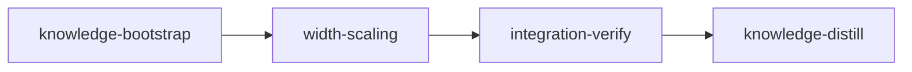

# Plan: Proportional bridge width for variable fonts

## Overview

Variable fonts get a bridge width option with two modes.

- **fixed** (the default) gives every bridge the default master's gap in every master. Today's replay only roughly does this: on Inter `o` the gap drifts from 123 units at Regular to 109 at Black.
- **proportional** sizes each bridge's gap in each master by the thickness of the stroke that bridge cuts. Two controls tune it: a strength (0-100%) and a minimum gap.

The CLI gains `--width-scaling`, `--scaling-strength` and `--min-bridge-width`. In proportional mode, `--instance` on a glyf (gvar) variable font stencils the variable font, pins the instance, then runs the ordinary static stencil over the glyphs the variable run left with islands. On a CFF2 variable font it warns and pins first in fixed mode. The GUI gains a width-scaling group that shows only for variable fonts.

This file is the source of truth. The worker briefs under `doc/plans/briefs/variable-bridge-width/width-scaling/` repeat its rules for each worker; where a brief and this file disagree, this file wins.

## Goals

- For every glyph bridged in both compared runs (fixed against proportional, or either mode against today's output), the default master is byte for byte the same. A glyph that only one run bridges differs from the source in that run alone, and that success is kept: the product rule is "the first step of the chain that bridges wins", with no common eligibility policy across modes. The prototype measured no such glyph on the three fixtures; the synthetic wide-master glyph (Evidence) is one, and contract `proportional-only-success-is-kept` pins the rule.
- No glyph bridges less often than today, checked per glyph, not by totals:
  - every island glyph today's code bridges keeps its `bridge_count` and an `unbridged_count` of 0 in both modes (the per-glyph Baseline below), and every glyph fixed mode bridges is bridged in proportional mode;
  - a fallback chain retries the glyph in fixed mode and then with today's targets;
  - a proportional `--instance` output bridges at least what today's pin-first `--instance` output bridges, through the static second pass.
- Static fonts are unchanged, and the static path ignores the option with a warning.
- Non-goals:
  - per-glyph width overrides;
  - one font-wide stroke ratio per location (each bridge uses its own stroke);
  - reporting fallbacks in the CLI summary (recorded as a concern instead);
  - a per-master fallback. A glyph whose proportional replay fails in one master falls back as a whole. The prototype measured this for 5 of 20 Ubuntu island glyphs (a, e, o, zero, eight), Inter a and Cantarell a and e. Ubuntu `o` fails because its wdth -1 / wght 1 master's gap of 107.9 needs a crossing 16 edges away, past `_SEARCH_EDGES = 12`. Recorded as a concern.

## Prerequisites

1. **Committed (5633ea6):** the triangular-counter fix (Inter `4`). `core/merger_candidates.py` tries further bridge lines when the bounding-box centre probe fails, called from `core/merger.py`. It changed which glyphs bridge, so this plan's baselines are measured on top of it.
2. **Resolved (4cbdea3):** `FontSession` went over the 300-line class limit after the font-info panel commit 1d5980b (302 lines), which failed `tests/regression/test_code_structure.py::test_class_line_limit`. Moving the variable classification to a module function brought it to 280.
3. **Resolved:** the font-info and loader work that owns `gui/controls.py` and `gui/main_window.py` is committed (1d5980b, 252cc94, 11a1318, 847fbce). No tracked file was modified at c058f98.
4. **Before `loom init`:** do not commit `doc/plans/codex-PLAN-variable-bridge-width.md` (an untracked parallel draft at c058f98). Stage descriptions refer to this plan as `doc/plans/IN_PROGRESS-PLAN-variable-bridge-width.md`, the name `loom run` gives it.

## Baseline

Rows marked 847fbce were measured in a detached worktree at 847fbce on 2026-10-09; the rest at c058f98 on the same day.

| Command | Result |
| --- | --- |
| existing engine tests (replay, transform, validate, align, engine contracts), 847fbce | 49 passed |
| existing CLI tests (`test_cli_variable.py`, `test_variable_surface_contracts.py`), 847fbce | 24 passed |
| existing GUI tests (`test_controls.py`, `test_main_window.py`, `test_variable_session.py`, offscreen) | 33 passed, 76 s |
| `uv run pytest tests/regression` | 24 passed |
| `ruff check` / `ruff format --check` on src, tests, packaging | clean |
| `mypy src/stencilizer tests packaging`, 847fbce | clean (181 files) |
| full suite, Python 3.13.1 (the main `.venv`), 16 workers, 847fbce | 679 passed, 1 failed (`test_class_line_limit`, fixed since by prerequisite 2), 90 s |
| full suite, Python 3.11, 16 workers, 847fbce | 679 passed, 1 failed (the same), 113 s |
| `uv lock --check`, `stencilizer --help` | pass |
| `loom knowledge check --strict --baseline doc/loom/knowledge/check-baseline.txt` | clean |
| `loom plan verify` on this file | 0 errors |
| knowledge-bootstrap's concern grep, knowledge-distill's README/CLAUDE.md/knowledge greps | exit 1 (red until the stages write them, as intended) |

Variable fixtures with the default `BridgeConfig()` (the count W1 and integration-verify compare against):

| Fixture | Island glyphs bridged (`bridge_count > 0`) | CLI report: glyphs processed / bridges / unbridged |
| --- | --- | --- |
| Inter (`tests/fixtures/variable/Inter-VF-subset.ttf`) | 20 of 21 | 21 / 28 / 2 |
| Ubuntu (`Ubuntu-VF-subset.ttf`) | 20 of 21 | 21 / 22 / 2 |
| Cantarell (`Cantarell-VF-subset.otf`) | 20 of 21 | 21 / 22 / 2 |

In every fixture `ampersand` gets 2 default-master bridges, then replay or validation fails and the glyph is left unchanged. Cold per-glyph transform time is 12-19 ms on the Inter and Ubuntu subsets.

Per glyph, `transform_variable_glyph(vg, BridgeConfig(), GeometryConfig(), upm)` over `variable_island_counts(FontReader(path))` at c5a0476 (2026-10-09), as `bridge_count/unbridged_count`. W1's `test_fixture_glyphs_keep_baseline_outcome` embeds this table:

| Fixture | Glyphs |
| --- | --- |
| Inter | `.notdef` 7/0, `B` 2/0, `eight` 2/0, `ampersand` 0/2; `A D O P R a b d e g o p q zero four six nine` 1/0 |
| Ubuntu | `B` 2/0, `eight` 2/0, `ampersand` 0/2; `.notdef O A D P R a b d e g o p q zero four six nine` 1/0 |
| Cantarell | `B` 2/0, `eight` 2/0, `ampersand` 0/2; `A Aacute D O P R a b d e g o p q zero four six nine` 1/0 |

The width-scaling acceptance lines that name new test files (`test_width_scaling*.py`, `test_cli_pinning.py`, `test_cli_width_scaling.py`) are red at base because those files do not exist yet, and so is the line naming the four REQUIRED W1 TESTS by node id (none exists at base).

## Design decisions

Settled with the user on 2026-10-09:

| Decision | Value |
| --- | --- |
| What drives proportionality | Measured stroke thickness. Axis values are not used: `wght` 700 does not map to a stroke width, and `opsz` changes thickness in different directions from font to font |
| Ratio scope | Per bridge: ink along the bridge's centre line in the master, divided by the same in the default (rules in "Engine rules" below) |
| Formula | fixed: `gap = base`. proportional: `gap = max(minimum, base * ratio ** (strength / 100))`, with `minimum = min(min_width_percent / 100 * 0.1 * upm, base)` |
| Defaults | mode fixed, strength 100, minimum 30% (the static width floor) |
| Fixed mode | Exact up to integer rounding: every master gets the default's gap, within 1 unit when the base is fractional (Inter `o` gives 123 in every master but the opsz master, which gives 122). This changes today's drifting variable output slightly |
| `--list-islands` and `--dry-run` with `--instance` | Pin first in every mode; they only analyse |
| Static font + proportional | Warn `Width scaling applies only to variable fonts; using fixed width.` and run fixed |

Added by the pressure test on 2026-10-09 (autonomous run, each grounded in a measurement below; not yet reviewed by the user):

| Decision | Value |
| --- | --- |
| `--instance` + proportional, glyf variable font | Stencil the variable font, pin the instance with the source font's `name` table swapped in (so the instancer and the writer produce today's names, for example `Inter Variable Text Black Stenciled`), then run the ordinary static stencil over the pinned font. That second pass touches only glyphs the variable run left with islands: on Inter wght=900 and Ubuntu wght=600 it rewrites `ampersand` alone (2 bridges) and leaves every other glyph identical, and it adds about 0.3 s on the subsets |
| `--instance` + proportional, CFF2 variable font | Print `Proportional width scaling with --instance is not supported for CFF2 fonts; pinning first with fixed width.` (unless `--quiet`), switch the settings to fixed and run today's pin-first flow. The fontTools CFF2 instancer moves bridge-line points between masters (knowledge `patterns/variable-replay.md` "Checking output"): stencil then pin left 17 of 21 Cantarell island glyphs with closed counters at wght 170, 250 and 600 (18 at 700), against 1-2 for pin first, and a static second pass still left 13 |
| Static font + proportional, mechanics | Before pinning, the check reads the input file (`is_variable_font(input_font)`, never the pinned temporary file). It warns, then switches `settings.bridge.width_scaling` to fixed, so the dry-run line says fixed and a static `--instance` run fails at once with today's "--instance requires a variable font" |
| Bridge pairing | Disjoint pairs, rule 1 below. `validate._facing_pairs` returns every same-axis pair whose cross spans overlap (6 pairs for the 4 lines of B, eight and ampersand with horizontal bridges; 91 for the 14 lines of Inter `.notdef`), so it stays the validation rule only |
| Default master | `align_to_lines` keeps today's per-line mean targets. The rounded default came out identical either way on 3 fixtures × auto/vertical/horizontal, and `align.py` stays untouched |
| GUI, static font after a variable one | `set_variable(False)` hides the group and, when Proportional is selected, selects Fixed (one `parameters_changed`). Strength and minimum keep their values |
| Fallback granularity | Per glyph (see Non-goals) |
| Fallback acceptance | The first chain step that bridges wins, so a glyph only proportional mode can bridge is bridged in proportional mode and left unchanged in fixed mode (Goals; contract `proportional-only-success-is-kept`). Default-master equality is promised only for glyphs both compared runs bridge |

### Engine rules

Measured with a prototype built only from HEAD modules (scratch, not committed). W1 implements these exactly.

1. **Pairing.** Sort the same-axis lines of a surgery map by default coordinate. Walking upward from the lowest, pair each unpaired line with the nearest unpaired line above it that has the same set of input contours (`{spans[m.edges[0]][0] for m in line.members}`, where `spans` comes from `replay._contour_spans`) and an overlapping cross span. Leftover lines keep today's mean target. On every fixture this matches every true pair: Inter B horizontal gives `{0,108}`/`{0,108}` and `{0,73}`/`{0,73}`, and the spanning `eight` gives `{0,143,216}` on both lines. Pairing by nearest distance fails: Inter `.notdef` lines 941.44 and 946.56 are 5.12 apart and belong to different bridges.
2. **Centre and extent.** In a master, each member of the pair's two lines has a fixed-parameter position (the `_place` output that `_realign` averages today). The master centre is the mean of the two lines' fixed-parameter targets. The extent is the min..max cross-axis coordinate of those positions. In the default, the centre is the mean of the two line coordinates and the extent comes from the default positions. A default extent applied to a wider master under-measures it: Inter `o` horizontal at Black gives a ratio of 1.884 with the default's extent against 2.261 with its own.
3. **Ink.** Take every crossing of the centre line with the merged (flattened, overlap-removed) polygon. An edge counts when its two ends straddle the line, half-open; an edge lying on the line is skipped. Sort the crossings and pair them even-odd from the first one to get the ink intervals. Clip each interval to the extent, then sum. Filtering the crossings to the extent before pairing measures the counter on round glyphs: Inter `o`'s centre line crosses at y -23.9, 137.1, 970.9 and 1131.9 inside a cut extent of -20.7..1128.7, which gives 833.9 (the counter) instead of about 316.
4. **Ratio.** `ratio = master ink / default ink`. A default ink of 0 or less gives ratio 1. A master ink of 0 gives ratio 0; `0.0 ** 0.0 == 1`, so strength 0 gives `base` and any other strength gives the minimum.
5. **Placement.** The pair's line with the lower default coordinate goes to `centre - gap / 2`, the other to `centre + gap / 2`. That keeps the sign `validate._bridges_intact` checks (validate.py:113-115). The existing crossing search and projection then run against those targets.
6. **Fallback chain.** Configured mode, then fixed, then today's per-line mean targets with no pairing. Only when all three fail is the glyph left unchanged with its islands counted. Fixed mode starts at the second step. The loop lives in `transform.py` outside `_bridged`, which stays one attempt.

Prototype results with these rules (auto direction, `bridge_count > 0` counted as bridged):

| Fixture | HEAD | fixed | proportional |
| --- | --- | --- | --- |
| Inter | 20 | 20 (19 at step fixed, `e` at step mean) | 20 (18 proportional, `a` fixed, `e` mean) |
| Ubuntu | 20 | 20 (all fixed) | 20 (15 proportional, 5 fixed) |
| Cantarell | 20 | 20 (all fixed) | 20 (18 proportional, 2 fixed) |

- `ampersand` fails every step, as at HEAD.
- With horizontal bridges: Inter bridges 21 (fixed: 19 at step fixed, 2 at step mean), Ubuntu 19 and Cantarell 21, all at step fixed.
- No glyph is lost or gained against HEAD in any mode or direction.
- Inter `o` vertical: ratios 0.27 (Thin) and 1.88 (Black). Gaps at Thin/default/Black: HEAD 117/123/109, fixed 123/123/123, proportional 61/123/231 (opsz+Black 241).
- Fixed and proportional defaults are identical to each other and to HEAD on 3 fixtures × 3 directions.
- Three attempts add at most 15% per glyph to the cold GUI preview, because failures happen in replay, which is cheap: Inter `e` goes from 15.6 to 17.3 ms, Ubuntu `o` from 10.8 to 12.6 ms. A validation failure adds a full validate run, about 7 ms.

## Evidence

- **Gap drift today.** Inter `o` (2048 UPM, nominal 122.88): Thin 117, default 123, Black 109. The stroke the vertical bridge cuts is 46, 161 and 300 thick. Measured at 57969fe with a per-master dump of bridge-line x values from `transform_variable_glyph` output, and reproduced at c058f98.
- **Synthetic ring** (the contract geometry): outer (0,0)-(1000,1000), counter 200..800, UPM 1000, vertical, width 60%. A bold master with the counter at 300..700 replays today with a gap of 50, a thin master at 50..950 with 75, and wght 0.5 with 55.
  - A narrow master with the counter at x 465..535, y 300..700 replays today with a gap of 34.
  - A mean-only master with the counter at x 475..525, y 300..700 replays today with a gap of 32 (lines at x 484/516). The fixed gap of 60 cannot fit it, so only the third fallback step bridges it.
  - Every contract below is therefore red at HEAD.
  - Expected under the new rules (prototype): fixed 60 everywhere. Proportional at strength 100 gives bold 90 (ink 600 / 400) and thin `max(30, 15) = 30`, or 40 with `min_width_percent=40`. Proportional at strength 50 gives bold `60 * 1.5 ** 0.5 = 73.48` (74 after rounding). The narrow glyph falls back to fixed, gap 60, `bridge_count` 1; its 5-unit slivers pass validation.
  - The 0.5-exclusive x measurement in the contract geometry catches only the two line x values in every case.
- **Two bridges with different ratios** (measured at c5a0476 with `transform_variable_glyph`). Two-counter glyph: outer (0,0)-(1600,1000), counters (200,200)-(600,800) and (1000,200)-(1400,800), vertical, width 60%; the bold master moves only the first counter to y 300..700. Surgery gives 2 bridges with lines at x 370/430 and 1170/1230; `_facing_pairs` returns all 6 pairs of those 4 lines, and rule 1 pairs 370/430 and 1170/1230 (different contour sets). Today the bold gaps are 60 and 60. Under the rules: ink along x=400 is 600 against 400 (ratio 1.5, gap 90) and along x=1200 400 against 400 (gap 60). The stacked horizontal variant (outer (0,0)-(1000,1600), counters (200,200)-(800,600) and (200,1000)-(800,1400), the bold master moving the first counter to x 300..700) measures the same today (60/60) and expects 90/60.
- **Proportional-only success** (from the 2026-10-09 review, re-measured at c5a0476). The ring's default with one master whose outer is (0,0)-(6000,1000) and counter (2980,50)-(3020,950): today `transform_variable_glyph` returns the input unchanged (`bridge_count` 0, `unbridged_count` 1). The fixed gap 60 cannot fit the 40-unit counter. Proportional: master centre 3000 (fixed-parameter cuts 2820/2998 and 3002/3180), ink 100 against 400, ratio 0.25, gap `max(30, 15) = 30`; with those targets the review's in-memory replay confirmed 1 bridge.
- **glyf stencil-then-pin keeps counters open.** Stenciling Inter and Ubuntu at c5a0476 and pinning with `instantiate_static` at off-master weights (Inter 150, 550, 750; Ubuntu 350, 550) leaves `stencilizer.variable.holes.enclosed_counters` at 0 for every glyph except `ampersand` (2, the glyph the variable run leaves unbridged and the static second pass then bridges). The CFF2 drift does not occur on gvar fonts, so only CFF2 pins first.
- **Pairing.** Today it exists only as a heuristic, `validate._facing_pairs` (validate.py:81-97). The two lines of a bridge sit exactly one bridge width apart in the default output (`core/bridge_contours.py:130-131`): Ubuntu o 262.5/322.5, Ubuntu 8 252/312, Inter B 615.56/738.44. With the default config most bridged fixture glyphs have one bridge (2 lines, one pair); `B` and `eight` have 2 bridges in every fixture and Inter `.notdef` has 7 (the per-glyph Baseline), so several same-axis pairs per glyph are routine.
- **Tests pinned to today's replay.**
  - `tests/unit/test_variable_transform.py:74-92` (`test_replay_failing_in_the_last_master_writes_no_replayed_master`) fails only the 5th `replay` call. Under any retrying chain the retry bridges the glyph, and `assert len(results) == len(vg.masters)` fails with `10 == 5`.
  - `tests/unit/test_variable_validate.py:59-78` calls `transform._bridged(vg, merged, bridge, geometry, upm)` directly with a 4-argument spy and asserts one replay per master.
  - Spies with exactly four positional parameters sit at `test_variable_validate.py:70` and `test_variable_transform.py:81-83`. `transform.py:94` catches only `VariationDataError`, so a fifth argument would escape as a `TypeError`.
  - `tests/unit/test_variable_replay.py:90-102` asserts that the 4-argument `replay` returns today's mean target.
  - `align.py:37` calls `replay` with four arguments.
  - Tests patch `transform.replay`, `validate`, `map_surgery`, `round_variable_glyph`, `flatten_compatible` and `remove_overlaps_compatible` (`test_variable_transform.py:59,95`; `test_variable_replay.py:166,176`).
  - With a prototype fixed-then-mean chain patched into every process, the full suite gave 673 passed and 7 failed. All 7 were in those two files: the two tests above plus artefacts of the prototype's patching. No integration, GUI, CLI or engine/writer contract test pins today's drift.
- **Room under the size limits.**
  - Files (limit 400): `variable/replay.py` 397, `variable/transform.py` 125, `cli/app.py` 340, `cli/handlers.py` 110, `gui/controls.py` 173, `gui/main_window.py` 297, `gui/session.py` 393 (untouched).
  - Functions (limit 50 effective lines, `tests/regression/test_code_structure.py::_effective_lines`): `stencilize` 48 (`app.py:86`), `_run_command` 45 (`app.py:137`), `ControlPanel._build_widgets` 29 (`controls.py:48-77`). The three new parameters alone put `stencilize` at 51.
  - Classes (limit 300): `ControlPanel` 141, `MainWindow` about 261.
- **GUI vertical budget.** At the default 1280x800 with Inter loaded, the sidebar's minimum height is 660 against an actual 721 (61 px of slack). The sidebar is a plain layout with no scroll area (`main_window.py:75-77`), and the window minimum is 960x600 (`main_window.py:53`). A stacked width-scaling group raises the minimum to 833 and one-line rows to 773, so the rows render crushed and overlapping at 800 px.
- **Names.** `update_font_names` (`io/writer.py:30-76`) is not idempotent. A second write appends " Stenciled" again to IDs 1 and 16, inserts it again into the PostScript names (`writer.py:94-98, 115-120`) and adds a second version note to ID 5. It edits existing records only, so swapping in the source's `name` table before pinning is safe. Without that swap, stencil then pin names Inter wght=900 `Inter Variable Stenciled Text Black` where today's pin first gives `Inter Variable Text Black Stenciled` (`tests/unit/test_instance.py:93-109` pins today's order).
- **CLI facts.** `instantiate_static(font_path, spec, workdir)` writes `workdir / f"{stem}-instance{suffix}"`, parses the spec first, updates names when STAT is present, removes overlaps and downgrades CFF2 (`io/instance.py:65-103`). `parse_instance_spec(spec, font)` is public (`instance.py:25`). `/tmp` is a separate tmpfs on the host, so `shutil.move` to an output under home copies and unlinks; `FontProcessor._save_font` writes a temporary file in `output_path.parent` and calls `Path.replace` (`core/processor.py:357-381`). Typer 0.27.2 renders the choice as `<fixed|proportional>` and float ranges as `[0.0<=x<=100.0]`; out-of-range floats and unknown choices exit 2; a `StrEnum` option arrives as the enum member. `CliRunner` output captures both a stdout `Console` and a `Console(stderr=True)`; a structlog warning does not show, because logging is set up only in `FontProcessor` (`processor.py:117`).
- **GUI facts.** `session.axes` is a `tuple[AxisInfo, ...]`, empty for static fonts (`session.py:196-198`). Every path from the controls to the engine copies the config with `model_copy` or a dict merge (`session.py:245`, `variable_session.py:194`, `core/pool.py:28`), so the new fields reach previews, the survey and saves. The variable preview cache keys on `bridge.model_dump_json()` (`variable_session.py:182-185`); static fonts have no preview cache. A `StrEnum` stored as `QComboBox` item data comes back as a plain `str` (PySide6 6.11.2), so `==` holds and `is` does not. No GUI test asserts the control panel's layout, widget count or tab order, and there are no golden screenshots.

## Sandbox and environment inventory

| Need | Resolution |
| --- | --- |
| Python dependencies per worktree | Provisioned: `uv sync --frozen --no-install-project` in `.` writes the git-ignored `.venv/` before any worker starts |
| `uv run` | `pypi.org` and `files.pythonhosted.org` allowed; the uv cache is pre-granted. No dependency is added |
| Python 3.11 suite run (integration-verify) | CPython 3.11.10 is installed by uv under `~/.local/share/uv/python` (nothing to download); the environment is created at `.venv/py311` inside the git-ignored `.venv/` |
| Qt GUI tests | Every acceptance command sets `QT_QPA_PLATFORM=offscreen` explicitly, because the host desktop session exports `QT_QPA_PLATFORM=wayland;xcb` |
| Process pools in GUI save tests | Spawn context via the autouse `spawn_process_pool` fixture |
| Codex unit U1 | Codex runs in its own workspace-write sandbox: no network, a read-only `~/.cache/uv`, no writable `/tmp`. Its proof command calls `.venv/bin/` tools directly and stays static (knowledge `mistakes.md` "Codex worker briefs told to verify with uv run"); the orchestrator runs its pytest file with `uv run` afterwards |
| Scratch renders (W2 step 4) | Written to and read from the session scratchpad directory named in the worker's system prompt. The Read tool cannot open files under `$TMPDIR` (knowledge `mistakes/review-and-completion-gates.md`), and the worktree must not get them |
| Contract freeze and stage completion | Sandbox dotfile mounts can make `loom stage contracts freeze width-scaling` refuse and shift the review fingerprint inside the sandbox (knowledge `mistakes/review-and-completion-gates.md` "Review fingerprint differs inside and outside the Bash sandbox"; concerns.md "Sandbox fingerprint and reviewer hand-back need loom fixes"). When an in-sandbox freeze or `loom stage complete <id>` refuses for that reason, the operator runs it from `.worktrees/<id>` outside the sandbox: up to three manual commands (the freeze, then completing width-scaling and integration-verify) |
| Plan path | `loom run` renames this file to `IN_PROGRESS-PLAN-variable-bridge-width.md`, then `DONE-…`; stage descriptions use the `IN_PROGRESS-` name |
| Credentials, host daemons, git hooks | None |

Implementation lanes: the codex CLI and plugin are installed. `width-scaling` lists `["claude", "codex"]`; only U1 uses codex.

## Execution Diagram



### 0. knowledge-bootstrap (knowledge, sonnet)

A short audit. `loom knowledge check --strict --baseline doc/loom/knowledge/check-baseline.txt` is clean at c058f98. The stage audits the sections this plan touches (`patterns/variable-replay.md`, `architecture.md`, `patterns/bridge-algorithm.md`) and records the measured gap drift as a concern, which knowledge-distill deletes once the drift is gone.

## Stages

### 1. width-scaling (standard)

This is one stage, not an engine/surfaces split. The CLI and GUI need the engine only through `BridgeConfig` fields, a compile-order dependency that a foundation step settles. The four territories write disjoint files, and the combined work fits one session. So Stage Necessity Q1-Q4 all answer no, and nothing forces a second stage.

Workers (briefs under `doc/plans/briefs/variable-bridge-width/width-scaling/`, shared context in `_shared.md`):

| Worker | Role | Tier | Files owned | Shared context | Brief path |
| ------ | ---- | ---- | ----------- | -------------- | ---------- |
| F0 | Settings foundation (runs alone, first) | haiku | src/stencilizer/config/settings.py, src/stencilizer/config/__init__.py | _shared.md | doc/plans/briefs/variable-bridge-width/width-scaling/f0-settings.md |
| W1 | Replay engine: pairing, stroke ratio, gap targets, fallback | opus/xhigh | src/stencilizer/variable/bridge_width.py, src/stencilizer/variable/realign.py, src/stencilizer/variable/replay.py, src/stencilizer/variable/transform.py, src/stencilizer/variable/validate.py, tests/unit/test_width_scaling.py, tests/unit/test_variable_replay.py, tests/unit/test_variable_transform.py, tests/unit/test_variable_validate.py | _shared.md | doc/plans/briefs/variable-bridge-width/width-scaling/w1-engine.md |
| W2 | GUI width-scaling controls | sonnet | src/stencilizer/gui/controls.py, src/stencilizer/gui/main_window.py, tests/gui/test_width_scaling_controls.py, tests/gui/test_controls.py | _shared.md | doc/plans/briefs/variable-bridge-width/width-scaling/w2-gui.md |
| W3 | CLI options, warnings, stencil-first `--instance` flow with the static second pass, dry-run line | sonnet | src/stencilizer/cli/app.py, src/stencilizer/cli/handlers.py, tests/unit/test_cli_width_scaling.py, tests/unit/test_cli_variable.py | _shared.md | doc/plans/briefs/variable-bridge-width/width-scaling/w3-cli.md |
| U1 | cli/pinning.py (codex unit) | codex terra | src/stencilizer/cli/pinning.py, tests/unit/test_cli_pinning.py | _shared.md | doc/plans/briefs/variable-bridge-width/width-scaling/u1-pinning.md |

Order of work:

1. F0 writes the settings.
2. W1, W2, W3 and U1 run together in one message. U1 runs as a foreground codex forward.
3. The orchestrator runs U1's pytest file, then one `loom-verifier` round, a review, and the commit.

Expected test-integrity event: W1 changes the assertions of `test_replay_failing_in_the_last_master_writes_no_replayed_master` (`tests/unit/test_variable_transform.py`), because a retrying chain calls `replay` once per master per attempt. The change is sanctioned (exact text in the stage description); the orchestrator files `loom stage dispute-integrity` for that event with that reason and for no other.

Risk checklist walk:

| Area | Applies? | Covered by |
| --- | --- | --- |
| Untrusted input | CLI numbers only | Typer `min`/`max` and pydantic bounds; W3's out-of-range test; W1's `ValidationError` tests |
| Filesystem | Temp directories, written output | `pinned_input` and the stencil-first flow use `TemporaryDirectory`; `publish_pinned` stages in `output_path.parent` and calls `Path.replace` on the exact path (a directory output raises `FontSaveError` and stays untouched; a failed replace keeps the previous output and leaves no staged file); the success report prints only after publication; U1's tests |
| Process I/O | No | — |
| Configuration propagation | Yes | `scaling-strength-softens-gap`, `minimum-width-clamps-thin-master`, `cli-proportional-changes-masters-only`, `cli-scaling-options-reach-config`, `gui-controls-reach-bridge-config`; W2's recorder test |
| Lifecycle | GUI cache invalidation; static font after a variable one; temp-dir cleanup | Cache: automatic (`bridge.model_dump_json()` key); reset: `gui-scaling-shown-for-variable-only`; cleanup: `TemporaryDirectory`, with Ctrl-C mapped to exit 130 inside it |
| Reachability | Yes | `cli-instance-proportional-stencils-first`, `cli-instance-cff2-pins-first`, `gui-scaling-shown-for-variable-only`, `reachable` checks |
| External data | Font fixtures | Real fixture fonts throughout |

### 2. integration-verify

The full suite on Python 3.13 and 3.11, lint, format, mypy and the lock check. Code review covers three areas:

- replay correctness against the gap formula, the pairing rule, the ink rule and the fallback chain;
- CLI/GUI wiring, the warnings and the `--instance` branches;
- architecture, size limits and tests.

Functional smoke: fixed and proportional runs on all three variable fixtures, compared with the Baseline counts (a summary; the per-glyph guarantee is gated by W1's `test_fixture_glyphs_keep_baseline_outcome`, which the full suite runs); proportional `--instance` on Inter and Cantarell; a HEAD-vs-new render of the glyphs whose masters changed.

### 3. knowledge-distill

- README: the Variable Fonts section, the Desktop App section's bridge controls, Bridge Placement, the dry-run sample and troubleshooting.
- `CLAUDE.md` Conventions: the bridge-width line.
- Knowledge: rewrite `patterns/variable-replay.md` (pairing, gap targets, ink rule, fallback), `architecture.md`'s width formula, `patterns/bridge-algorithm.md` "Candidate placement" and `architecture/gui.md`'s controls and main-window rows. Replace the drift concern with the current truth. Add a concern for unreported and whole-glyph fallbacks.

---

<!-- loom METADATA -->

```yaml
loom:
  version: 2
  sandbox:
    enabled: true
    auto_allow: true
    allow_unsandboxed_escape: false
    excluded_commands: []
    filesystem:
      deny_read:
      - ~/.ssh/**
      - ~/.aws/**
      - ~/.config/gcloud/**
      - ~/.gnupg/**
      deny_write: []
      allow_write: []
    network:
      allowed_domains:
      - pypi.org
      - files.pythonhosted.org
      additional_domains: []
      allow_local_binding: false
      allow_unix_sockets: []
      allow_all_unix_sockets: false
    linux:
      enable_weaker_nested: false
    command_confinement: confined
  ratchet_files:
  - doc/loom/knowledge/check-baseline.txt
  - tests/regression/golden/commitmono.json.gz
  - tests/regression/golden/commitmono_pipeline.json.gz
  - tests/regression/golden/lato.json.gz
  - tests/regression/golden/roboto.json.gz
  provision:
  - working_dir: .
    command: uv sync --frozen --no-install-project
  stages:
  - id: knowledge-bootstrap
    name: Knowledge audit
    summary: 'Checks the knowledge sections this plan will change and records the bridge gap drift measured while planning.'
    stage_type: knowledge
    model: sonnet
    description: |
      The knowledge base already describes this codebase (loom knowledge check is clean at
      c058f98). This stage audits the sections the plan touches and records one planning fact.
      Model override to sonnet: a short audit needs no opus.
      Use parallel subagents and skills to maximize performance. SINGLE-AGENT here: the audit
      covers four sections, so do not spawn subagents.
      1. Run loom knowledge sync from the repository root.
      2. Audit against the tree, correcting with loom knowledge replace-section where wrong:
         patterns/variable-replay.md "Bridge-line grouping and realignment" and "Validation"
         (src/stencilizer/variable/replay.py, align.py, validate.py), architecture.md (the bridge
         width formula line; src/stencilizer/core/surgery.py:56-57), patterns/bridge-algorithm.md
         "Candidate placement" and "Contour surgery" (the triangular-counter fix committed before
         this plan added core/merger_candidates.py, called from core/merger.py when the
         bounding-box centre probe fails; confirm those sections describe it).
      3. Record in concerns.md, under a heading "Variable bridge gaps drift across masters"
         (current truth, no history): replay places each bridge line at the mean of its cut points
         at their default edge parameters (variable/replay.py _realign), so a bridge gap is not
         held at the default width in other masters. Measured: Inter o (2048 UPM, nominal gap
         122.88) has gaps of 117 at Thin, 123 at default and 109 at Black; a synthetic ring with a
         60-unit default gap replays at 50 (bold) and 75 (thin). Source: the plan's Evidence
         section (doc/plans/IN_PROGRESS-PLAN-variable-bridge-width.md). The width-scaling stage
         removes the drift; knowledge-distill replaces this concern.
      Use the loom knowledge CLI, never Write/Edit. NEVER Claude Code auto-memory.
    dependencies: []
    acceptance:
    - loom knowledge check --strict --baseline doc/loom/knowledge/check-baseline.txt
    - 'rg -qF "Variable bridge gaps drift across masters" doc/loom/knowledge/concerns.md'
    files:
    - doc/loom/knowledge/**
    working_dir: .
    artifacts:
    - doc/loom/knowledge/concerns.md
  - id: width-scaling
    name: Variable bridge width scaling
    summary: 'Adds fixed and proportional bridge width modes for variable fonts, with CLI options, GUI controls and a stencil-first --instance flow.'
    stage_type: standard
    implementers:
    - claude
    - codex
    subagent_timeout_secs: 900
    skills:
    - loom-python
    description: |
      Add width scaling for variable-font bridges. Plan: doc/plans/IN_PROGRESS-PLAN-variable-bridge-width.md
      (Goals, Design decisions, Engine rules, Evidence, Sandbox and environment inventory). Shared
      worker context: doc/plans/briefs/variable-bridge-width/width-scaling/_shared.md. Where a brief
      and the plan disagree, the plan wins. Ignore any doc/plans/codex-PLAN-* file.
      Use parallel subagents and skills to maximize performance.

      PUBLIC SURFACE (the contract session writes the contracts from this; implement it exactly):
        stencilizer.config.BridgeWidthScaling(StrEnum): FIXED = "fixed", PROPORTIONAL = "proportional".
        BridgeConfig new fields: width_scaling: BridgeWidthScaling = FIXED;
          scaling_strength: float = 100.0 (ge 0, le 100); min_width_percent: float = 30.0 (ge 10, le 110).
        stencilizer.variable.transform.transform_variable_glyph(vg, bridge, geometry, upm) keeps its
          signature. Per master, each bridge (a DISJOINT pair of bridge lines, pairing rule 1 of the
          plan's Engine rules) gets gap = base in fixed mode and
          gap = max(minimum, base * ratio ** (scaling_strength / 100)) in proportional mode, where
          base is the distance between the pair's two default line coordinates, ratio is the
          master's ink along the pair's centre line through the merged master polygon over the same
          in the default (Engine rules 2-4), and minimum = min(min_width_percent / 100 * 0.1 * upm, base).
          The lower line goes to centre - gap / 2 and the upper to centre + gap / 2, centre being the
          mean of the two lines' fixed-parameter targets. Lines in no pair keep today's mean target.
          align_to_lines keeps today's mean targets, so the default master is unchanged.
          Fallback, per glyph: configured mode, then fixed, then today's per-line mean targets with
          no pairing; only when all fail is the glyph left unchanged. Fixed mode starts at step 2.
        stencilizer.variable.bridge_width.scaled_gap(base: float, ratio: float, bridge: BridgeConfig, upm: int) -> float.
        stencilizer.variable.replay.replay(smap, input_default, output_default, master_input) keeps four
          positional parameters and returns today's mean-target result when smap carries no width
          rule; the pairs and gap rule ride on a new optional SurgeryMap field (default None).
        CLI (stencilizer.cli.app.app): --width-scaling (fixed|proportional, default fixed),
          --scaling-strength FLOAT (0-100, default 100), --min-bridge-width FLOAT (10-110, default 30);
          all three reach BridgeConfig(width_scaling=..., scaling_strength=..., min_width_percent=...).
          With --width-scaling proportional, before anything is pinned or processed:
            a static input (is_variable_font(input_font) is False) prints exactly
            "Width scaling applies only to variable fonts; using fixed width." (unless --quiet) and
            the settings switch to fixed;
            a CFF2 variable input with --instance prints exactly
            "Proportional width scaling with --instance is not supported for CFF2 fonts; pinning first with fixed width."
            (unless --quiet) and the settings switch to fixed.
          The checks read input_font, never the pinned temporary file; a glyf variable input with
          --instance and --dry-run or --list-islands prints neither line.
          Write path for proportional + --instance + a glyf variable input: validate_instance first;
          stencil the variable input into tempfile.TemporaryDirectory(prefix="stencilizer-instance-");
          pinned = pin_stenciled(stenciled, input_font, instance, tmp); then the static second pass:
          classify pinned with fixed settings; when any glyph has islands, FontProcessor processes
          them from pinned into output_path; when none has, publish_pinned(pinned, output_path).
          One success report names output_path, with bridges = the sum of both passes and unbridged
          = the second pass's count (the islands left in the written font). --list-islands and
          --dry-run pin first in every mode; fixed mode keeps today's flow for every command.
          Dry run prints after the bridge-width line "  Width scaling         fixed" or
          "  Width scaling         proportional (strength {s}%, minimum {m}% of a reference stroke)",
          s and m being settings.bridge's floats (e.g. "strength 40.0%, minimum 45.0%").
        stencilizer.cli.pinning (U1): pinned_input(input_font, instance) (today's app._instance_font,
          moved); validate_instance(input_font, instance) -> None;
          pin_stenciled(stenciled, source, instance, workdir) -> Path; publish_pinned(pinned, output_path) -> Path;
          is_variable_font(path) -> bool; is_cff2_font(path) -> bool.
          publish_pinned stages in tempfile.TemporaryDirectory(dir=output_path.parent) and replaces
          the exact output_path with Path.replace (never shutil.move): an existing file is replaced;
          a directory output_path raises FontSaveError and is left untouched; an OSError from the
          replace raises FontSaveError, keeps the previous output byte for byte and leaves no staged
          file. The CLI prints its success report only after publish_pinned or FontProcessor returns.
        GUI (stencilizer.gui.controls.ControlPanel): scaling_box (QWidget holding every width-scaling
          widget, hidden until set_variable(True)), scaling_combo (QComboBox, items "Fixed",
          "Proportional" with item data BridgeWidthScaling.FIXED / PROPORTIONAL), strength_slider +
          strength_spin (0-100, default 100), min_width_slider + min_width_spin (10-110, default 30),
          set_variable(variable: bool): shows or hides scaling_box; set_variable(False) also selects
          Fixed when Proportional is selected (one parameters_changed). bridge_config() returns the
          three new fields, the mode as BridgeWidthScaling(scaling_combo.currentData()).
          MainWindow._on_font_loaded calls self.controls.set_variable(bool(session.axes)) before the
          glyph selection. At 1280x800 with Inter loaded no control is squeezed below its minimum
          height (a QScrollArea around the controls, or rows that fit).

      CONTRACT GEOMETRY (tests/unit/test_width_scaling_contracts.py): build glyphs with
      tests.unit._variable_cases.glyph_from_outlines (it returns a Glyph) and wrap them in
      stencilizer.variable.model.VariableGlyph(default, supports, masters, ("wght",)). Outer square (0,0)-(1000,1000) clockwise,
      as _variable_cases.STEM winds; counter square counter-clockwise; UPM 1000; supports
      Support((("wght", 0.0, 1.0, 1.0),)) for bold and Support((("wght", -1.0, -1.0, 0.0),)) for thin;
      BridgeConfig(direction=BridgeDirection.VERTICAL, width_percent=60) plus the scaling fields under
      test; GeometryConfig(). Import BridgeDirection from stencilizer.config.settings: the
      stencilizer.config package does not export it (and this plan does not add it).
      Measure the gap in out.glyph.instance(location): the distinct point x
      values strictly inside the counter's x range at that location (exclusive by 0.5 unit);
      gap = max - min of those. Tolerance 1.0 unit (integer rounding).
      Ring: default counter 200..800 on both axes, bold master counter 300..700, thin master counter
      50..950. Narrow: default counter 200..800, one bold master with the counter at x 465..535 and
      y 300..700. Mean-only: the same with the bold counter at x 475..525, y 300..700.
      Two-counter (vertical): outer (0,0)-(1600,1000), counters (200,200)-(600,800) and
      (1000,200)-(1400,800); the bold master keeps the outer and the second counter and moves the
      first counter to (200,300)-(600,700); gaps are measured inside x 200..600 and 1000..1400.
      Two-counter (horizontal): direction HORIZONTAL, outer (0,0)-(1000,1600), counters
      (200,200)-(800,600) and (200,1000)-(800,1400); the bold master moves the first counter to
      (300,200)-(700,600); gaps are the distinct point y values strictly inside y 200..600 and
      1000..1400. Wide-master: the ring's default with one bold master whose outer is
      (0,0)-(6000,1000) and counter (2980,50)-(3020,950); its gap is measured inside x 2980..3020.
      CLI contracts use typer.testing.CliRunner on stencilizer.cli.app.app with -o and --log-file
      under tmp_path (pattern: tests/unit/test_variable_surface_contracts.py _cli), on
      tests.font_helpers.INTER, CANTARELL and ROBOTO; outlines are compared with
      tests.font_helpers.glyph_at(...).to_dict() at a normalized location ({} for default,
      {"wght": 1.0} for Black, {"wght": -1.0} for Thin); island counts use tests.font_helpers.island_count.
      GUI contracts (tests/gui/test_width_scaling_gui_contracts.py) copy the window fixture and
      _load_window helper from tests/gui/test_variable_gui_contracts.py (file-local there) and use
      pytest-qt qtbot.

      EXECUTION. Territories below are DISJOINT. Workers NEVER spawn subagents. First spawn F0
      alone and wait for it. Then spawn W1, W2, W3 BY AGENT TYPE in the background and U1 as a
      loom-codex-forwarder in the FOREGROUND (--model gpt-5.6-terra --effort xhigh, Bash timeout
      600000 ms), ALL in ONE message, each with the fixed prompt plus
      "Your brief: <path>. Read it in full before anything else." Codex units never run git and
      never touch .loom/; check git status --short after the forward, then run
      uv run pytest tests/unit/test_cli_pinning.py --no-cov -q -p no:cacheprovider yourself.
      W1 is opus at effort xhigh (loom-senior-software-engineer): core algorithmic work.
      Every worker runs uv run pytest tests/regression/test_code_structure.py --no-cov -q
      -p no:cacheprovider before reporting (functions over 50 effective lines fail it; stencilize
      has 2 lines to spare and _run_command 5).

      | Worker | Role | Tier | Files owned | Shared context | Brief path |
      | ------ | ---- | ---- | ----------- | -------------- | ---------- |
      | F0 | Settings foundation | haiku | src/stencilizer/config/settings.py, src/stencilizer/config/__init__.py | _shared.md | doc/plans/briefs/variable-bridge-width/width-scaling/f0-settings.md |
      | W1 | Replay engine | opus/xhigh | src/stencilizer/variable/bridge_width.py, src/stencilizer/variable/realign.py, src/stencilizer/variable/replay.py, src/stencilizer/variable/transform.py, src/stencilizer/variable/validate.py, tests/unit/test_width_scaling.py, tests/unit/test_variable_replay.py, tests/unit/test_variable_transform.py, tests/unit/test_variable_validate.py | _shared.md | doc/plans/briefs/variable-bridge-width/width-scaling/w1-engine.md |
      | W2 | GUI controls | sonnet | src/stencilizer/gui/controls.py, src/stencilizer/gui/main_window.py, tests/gui/test_width_scaling_controls.py, tests/gui/test_controls.py | _shared.md | doc/plans/briefs/variable-bridge-width/width-scaling/w2-gui.md |
      | W3 | CLI wiring | sonnet | src/stencilizer/cli/app.py, src/stencilizer/cli/handlers.py, tests/unit/test_cli_width_scaling.py, tests/unit/test_cli_variable.py | _shared.md | doc/plans/briefs/variable-bridge-width/width-scaling/w3-cli.md |
      | U1 | cli/pinning.py | codex terra | src/stencilizer/cli/pinning.py, tests/unit/test_cli_pinning.py | _shared.md | doc/plans/briefs/variable-bridge-width/width-scaling/u1-pinning.md |

      SANCTIONED TEST CHANGE (the one expected test-integrity event): in
      tests/unit/test_variable_transform.py test_replay_failing_in_the_last_master_writes_no_replayed_master,
      the stub fails the last master on every attempt
      (last = len(results) % len(vg.masters) == len(vg.masters) - 1), and the assertions become
      len(results) == 2 * len(vg.masters) and all results except each attempt's last are not None;
      _assert_unchanged stays. BridgeConfig() runs two attempts (fixed, then mean). File
      loom stage dispute-integrity for that event with this reason; any other test-integrity event
      is reverted. tests/unit/test_variable_validate.py stays unchanged because _bridged stays one
      attempt with its 5-argument signature and calls transform.replay with 4 positional arguments.

      REQUIRED W1 TESTS (new tests only; the acceptance list runs each by node id, so a missing
      one fails the gate):
        tests/unit/test_variable_transform.py::test_replay_failing_once_retries_next_step: the
          sanctioned test's glyph and stub, failing the last master on the FIRST attempt only;
          the outcome has bridge_count >= 1, outcome.glyph is not the input, and
          len(results) == 2 * len(vg.masters) (the retry succeeded).
        tests/unit/test_variable_transform.py::test_validation_failure_retries_next_step: wraps
          transform.validate so its first call returns False and later calls delegate to the real
          one; transform_variable_glyph on the same glyph bridges it and validate ran twice.
        tests/unit/test_width_scaling.py::test_fixture_glyphs_keep_baseline_outcome: parametrized
          over the three fixtures and both modes (BridgeConfig() and
          BridgeConfig(width_scaling=PROPORTIONAL)); embeds the plan's per-glyph Baseline table and
          asserts, per island glyph of variable_island_counts, the same bridge_count and
          unbridged_count as the table, and that every glyph bridged in fixed mode is bridged in
          proportional mode.
        tests/unit/test_width_scaling.py::test_spanning_pairs_share_contour_set: Inter eight with
          BridgeConfig(use_spanning_bridges=True, direction=BridgeDirection.HORIZONTAL): pairing
          returns disjoint pairs whose two lines have the same input-contour set, and in fixed
          mode each pair's gap equals its default gap +/- 1 in every master. If the default
          surgery of that glyph yields no spanning bridge, W1 records the measured line count with
          loom memory note and keeps the assertion on whatever pairs it yields.

      GATE INTERPRETER: the provisioned .venv (CPython 3.13, CI's newer matrix entry); the 3.11
      run is integration-verify's. Gates run pytest with --numprocesses=16 --no-cov, a deliberate
      deviation from CI's coverage run (coverage has no threshold and triples the xdist time); the
      test set is the full configured tree, never a subset.

      GATE: one loom-verifier round after every worker returned, with the acceptance list below.
      W1 reports, per fixture (Inter, Ubuntu, Cantarell) and mode, the glyphs bridged and how many
      went down each fallback step, against the plan's Baseline counts (20 of 21 per fixture), plus
      the Inter o gap at Thin, default and Black and the worst cold preview time that
      tests/gui/test_variable_session.py::test_cold_preview_time_per_island_glyph measures. Record
      those numbers with loom memory note. If that timing test fails under xdist only, rerun it
      serially once and record both results (concerns.md records it as flaky under load).
      The static path (core/, io/) and tests/regression goldens must stay unchanged.
      MEMORY: record mistakes/decisions/surprises via loom memory immediately; NEVER loom
      knowledge (implementation stage); NEVER Claude Code auto-memory.
    dependencies:
    - knowledge-bootstrap
    before_stage:
    - command: test -e src/stencilizer/variable/bridge_width.py
      exit_code: 1
      description: No width-scaling module at the base commit
    after_stage:
    - command: uv run python -c "import stencilizer.variable.bridge_width, stencilizer.variable.realign, stencilizer.cli.pinning"
      exit_code: 0
      description: Width-scaling, realign and pinning modules import
    acceptance:
    - uv run pytest tests/unit/test_width_scaling_contracts.py tests/unit/test_width_scaling.py tests/unit/test_cli_width_scaling.py tests/unit/test_cli_pinning.py --numprocesses=8 --no-cov -q -p no:cacheprovider
    - env QT_QPA_PLATFORM=offscreen uv run pytest tests/gui/test_width_scaling_gui_contracts.py tests/gui/test_width_scaling_controls.py --numprocesses=8 --no-cov -q -p no:cacheprovider
    - uv run pytest tests/unit/test_variable_transform.py::test_replay_failing_once_retries_next_step tests/unit/test_variable_transform.py::test_validation_failure_retries_next_step tests/unit/test_width_scaling.py::test_fixture_glyphs_keep_baseline_outcome tests/unit/test_width_scaling.py::test_spanning_pairs_share_contour_set --no-cov -q -p no:cacheprovider
    - env QT_QPA_PLATFORM=offscreen uv run pytest --numprocesses=16 --no-cov -q -p no:cacheprovider
    - uv run ruff check src tests packaging
    - uv run ruff format --check src tests packaging
    - uv run mypy src/stencilizer tests packaging
    - uv lock --check
    - env NO_COLOR=1 COLUMNS=200 uv run stencilizer --help
    files:
    - src/stencilizer/config/**
    - src/stencilizer/variable/**
    - src/stencilizer/cli/**
    - src/stencilizer/gui/controls.py
    - src/stencilizer/gui/main_window.py
    - tests/unit/**
    - tests/gui/test_controls.py
    - tests/gui/test_width_scaling_controls.py
    - tests/gui/test_width_scaling_gui_contracts.py
    working_dir: .
    artifacts:
    - src/stencilizer/config/settings.py
    - src/stencilizer/config/__init__.py
    - src/stencilizer/variable/bridge_width.py
    - src/stencilizer/variable/realign.py
    - src/stencilizer/variable/replay.py
    - src/stencilizer/variable/transform.py
    - src/stencilizer/cli/pinning.py
    - src/stencilizer/cli/app.py
    - src/stencilizer/cli/handlers.py
    - src/stencilizer/gui/controls.py
    - src/stencilizer/gui/main_window.py
    wiring:
    - source: src/stencilizer/config/__init__.py
      pattern: '"BridgeWidthScaling"'
      literal: true
      description: stencilizer.config exports BridgeWidthScaling
    - source: src/stencilizer/config/settings.py
      pattern: 'width_scaling: BridgeWidthScaling'
      literal: true
      description: BridgeConfig carries the width-scaling mode
    - source: src/stencilizer/cli/handlers.py
      pattern: Width scaling
      literal: true
      description: the dry run prints the width-scaling line
    - source: src/stencilizer/gui/controls.py
      pattern: width_scaling=
      literal: true
      description: ControlPanel.bridge_config() passes the selected mode
    - source: src/stencilizer/cli/app.py
      pattern: width_scaling=
      description: CLI passes the --width-scaling choice into BridgeConfig
    - source: src/stencilizer/cli/app.py
      pattern: scaling_strength=
      description: CLI passes --scaling-strength into BridgeConfig
    - source: src/stencilizer/cli/app.py
      pattern: min_width_percent=
      description: CLI passes --min-bridge-width into BridgeConfig
    - source: src/stencilizer/gui/main_window.py
      pattern: controls.set_variable(
      literal: true
      description: font load toggles the width-scaling controls
    wiring_tests:
    - name: CLI help lists the width-scaling options
      command: env NO_COLOR=1 COLUMNS=200 uv run stencilizer --help
      success_criteria:
        exit_code: 0
        stdout_contains:
        - --width-scaling
        - --scaling-strength
        - --min-bridge-width
    reachable:
    - symbol: scaled_gap
      from: transform_variable_glyph
      description: the gap formula is used by the variable transform
    - symbol: pin_stenciled
      from: stencilize
      description: proportional --instance pins after stenciling from the CLI command
    - symbol: publish_pinned
      from: stencilize
      description: the stencil-first flow writes the pinned font when the second pass has nothing to bridge
    - symbol: is_variable_font
      from: stencilize
      description: the static-font warning reads the input font
    - symbol: is_cff2_font
      from: stencilize
      description: CFF2 inputs keep the pin-first flow
    contracts:
    - id: proportional-gap-follows-bold-stroke
      file: tests/unit/test_width_scaling_contracts.py
      test: test_proportional_gap_follows_bold_stroke
      scenario: 'transforms the ring glyph (default counter 200..800, bold master counter 300..700, thin 50..950) with width_scaling=PROPORTIONAL, strength 100, and measures the gap at {} (60) and {"wght": 1.0} (90)'
      rejects: 'a replay that keeps the per-line mean of fixed-parameter cuts, giving a bold gap of 50 instead of 90 (60 at the default)'
    - id: fixed-mode-keeps-default-gap
      file: tests/unit/test_width_scaling_contracts.py
      test: test_fixed_mode_keeps_default_gap
      scenario: 'transforms the ring glyph with width_scaling=FIXED and measures the gap at {"wght": 1.0} and {"wght": -1.0} (60 in both)'
      rejects: 'the current drifting replay, which gives 50 at bold and 75 at thin instead of 60 in both'
    - id: minimum-width-clamps-thin-master
      file: tests/unit/test_width_scaling_contracts.py
      test: test_minimum_width_clamps_thin_master
      scenario: 'transforms the ring glyph with width_scaling=PROPORTIONAL, strength 100, min_width_percent=40, and measures the gap at {"wght": -1.0} (40)'
      rejects: 'a clamp that ignores min_width_percent (gap 30 from the default minimum, or 15 unclamped) instead of 40'
    - id: scaling-strength-softens-gap
      file: tests/unit/test_width_scaling_contracts.py
      test: test_scaling_strength_softens_gap
      scenario: 'transforms the ring glyph with width_scaling=PROPORTIONAL, scaling_strength=50, and measures the gap at {"wght": 1.0} (73.48)'
      rejects: 'an engine that never reads scaling_strength and gives the full-strength 90 instead of 73.48'
    - id: proportional-falls-back-to-fixed
      file: tests/unit/test_width_scaling_contracts.py
      test: test_proportional_falls_back_to_fixed
      scenario: 'transforms the narrow glyph (bold master counter x 465..535, y 300..700) with width_scaling=PROPORTIONAL; the proportional gap 90 cannot fit the 70-unit counter; asserts bridge_count >= 1 and the bold gap is 60'
      rejects: 'an engine that leaves the glyph unbridged when proportional replay fails, or falls straight back to the per-line mean targets (gap 34)'
    - id: fixed-falls-back-to-mean-targets
      file: tests/unit/test_width_scaling_contracts.py
      test: test_fixed_falls_back_to_mean_targets
      scenario: 'transforms the mean-only glyph (bold master counter x 475..525, y 300..700) with width_scaling=FIXED; the fixed gap 60 cannot fit the 50-unit counter; asserts bridge_count >= 1 and a bold gap below 50 (32 measured)'
      rejects: 'a fallback chain that stops after fixed mode and leaves the glyph unbridged'
    - id: scaled-steps-fall-back-to-mean-targets
      file: tests/unit/test_width_scaling_contracts.py
      test: test_scaled_steps_fall_back_to_mean_targets
      scenario: 'transforms the mean-only glyph with width_scaling=PROPORTIONAL; the proportional gap 90 and the fixed gap 60 both exceed the 50-unit counter; asserts bridge_count >= 1 and a bold gap below 50 (32 measured)'
      rejects: 'a proportional chain that skips the fixed or mean-target step, or stops after the fixed step and leaves the glyph unbridged'
    - id: per-bridge-ratios-are-independent
      file: tests/unit/test_width_scaling_contracts.py
      test: test_per_bridge_ratios_are_independent
      scenario: 'transforms the vertical and the horizontal two-counter glyphs with width_scaling=PROPORTIONAL, strength 100; each has bridge_count 2; the gaps at {} are 60 and 60; at {"wght": 1.0} the first counter''s gap is 90 and the second''s 60'
      rejects: 'pairing taken from validate._facing_pairs (all 6 overlapping pairs give lines conflicting targets), one ratio per glyph or per location (both gaps 90 or both 75), or today''s replay (60 and 60)'
    - id: proportional-only-success-is-kept
      file: tests/unit/test_width_scaling_contracts.py
      test: test_proportional_only_success_is_kept
      scenario: 'transforms the wide-master glyph twice: width_scaling=PROPORTIONAL gives bridge_count 1 and a gap of 30 at {"wght": 1.0}; width_scaling=FIXED returns the input glyph unchanged (out.glyph is the input, bridge_count 0, unbridged_count 1)'
      rejects: 'a common success policy that discards a proportional bridge because fixed mode cannot bridge the glyph, or a fixed mode that falls through to proportional targets'
    - id: cli-proportional-changes-masters-only
      file: tests/unit/test_width_scaling_contracts.py
      test: test_cli_proportional_changes_masters_only
      scenario: 'runs the CLI on INTER twice (default options, and --width-scaling proportional); for every glyph, the two outputs are identical at {} unless one of them equals the source font at {}; at least one glyph differs at {"wght": 1.0}'
      rejects: 'a CLI that parses --width-scaling but never puts it into BridgeConfig (outputs identical), or a proportional mode that rescales the default master'
    - id: cli-scaling-options-reach-config
      file: tests/unit/test_width_scaling_contracts.py
      test: test_cli_scaling_options_reach_config
      scenario: 'runs the CLI on INTER with default options (F), with --width-scaling proportional --scaling-strength 0 (S) and with --width-scaling proportional --min-bridge-width 110 (M); S equals F for every glyph at {}, {"wght": 1.0} and {"wght": -1.0}; M equals F for every glyph at {"wght": -1.0} and differs from F in at least one glyph at {"wght": 1.0}'
      rejects: 'a CLI that drops --scaling-strength (S then differs from F at Black) or drops --min-bridge-width (M then differs from F at Thin)'
    - id: cli-instance-proportional-stencils-first
      file: tests/unit/test_width_scaling_contracts.py
      test: test_cli_instance_proportional_stencils_first
      scenario: 'runs the CLI on INTER with --instance wght=900 twice (F: fixed; P: --width-scaling proportional); both outputs lack fvar; every glyph''s advance width in P equals F''s; glyph o differs between P and F at {}; ampersand has island_count 0 in P; the name ID 1 of P equals that of F'
      rejects: 'a proportional --instance run that still pins first (o identical), pins at the wrong location (advances differ), skips the static second pass (ampersand keeps its islands) or names the output differently from today'
    - id: cli-instance-proportional-open-off-master
      file: tests/unit/test_width_scaling_contracts.py
      test: test_cli_instance_proportional_open_off_master
      scenario: 'runs the CLI on INTER with --instance wght=550 --width-scaling proportional; reopens the written static output with FontReader and asserts stencilizer.variable.holes.enclosed_counters(glyph, upm) == 0 for every glyph except ampersand, and island_count 0 for ampersand'
      rejects: 'a stencil-then-pin path whose instancing rounds a bridge''s two cut edges apart and closes counters at an off-master weight (the CFF2 failure mode), checked on the saved file rather than on the variable glyph'
    - id: cli-instance-cff2-pins-first
      file: tests/unit/test_width_scaling_contracts.py
      test: test_cli_instance_cff2_pins_first
      scenario: 'runs the CLI on CANTARELL with --instance wght=250 twice (fixed, and --width-scaling proportional, no --quiet); the proportional run exits 0 and its output contains "Proportional width scaling with --instance is not supported for CFF2 fonts; pinning first with fixed width."; every glyph of the two outputs is identical at {}'
      rejects: 'a CFF2 proportional --instance run that stencils first, which leaves 17 of 21 island glyphs with closed counters at wght 250'
    - id: cli-static-font-warns
      file: tests/unit/test_width_scaling_contracts.py
      test: test_cli_static_font_warns
      scenario: 'runs the CLI on ROBOTO with --width-scaling proportional (no --quiet): exit 0 and the output contains "Width scaling applies only to variable fonts; using fixed width."; ROBOTO with --dry-run --width-scaling proportional prints the warning and "Width scaling         fixed"; INTER with --width-scaling proportional, and INTER with --instance wght=900 --dry-run --width-scaling proportional, do not print the warning'
      rejects: 'a CLI that silently ignores proportional mode for a static font, keeps proportional in the settings after warning, or reads the pinned temporary file and warns for a variable font'
    - id: gui-controls-reach-bridge-config
      file: tests/gui/test_width_scaling_gui_contracts.py
      test: test_gui_controls_reach_bridge_config
      scenario: 'builds a ControlPanel, selects Proportional in scaling_combo, sets strength_spin to 50 and min_width_spin to 40, then reads bridge_config() (PROPORTIONAL, 50.0, 40.0)'
      rejects: 'width-scaling widgets that bridge_config() never reads, leaving the defaults (fixed, 100, 30)'
    - id: gui-scaling-shown-for-variable-only
      file: tests/gui/test_width_scaling_gui_contracts.py
      test: test_gui_scaling_shown_for_variable_only
      scenario: 'loads INTER into a MainWindow (scaling_box.isVisibleTo(window) is True), selects Proportional, then loads ROBOTO (isVisibleTo False and controls.bridge_config().width_scaling is BridgeWidthScaling.FIXED)'
      rejects: 'a scaling box that font loading never toggles (always visible or always hidden), or a hidden box that keeps Proportional for a static font'
  - id: integration-verify
    name: Integration Verification
    summary: 'Confirms width scaling works through the real CLI and GUI, the full suite passes, and reviewers'' findings are fixed.'
    stage_type: integration-verify
    description: |
      Final verification after all stages. Verify FUNCTIONAL INTEGRATION, not just tests
      passing. NEVER Claude Code auto-memory.
      CONTEXT: read doc/plans/IN_PROGRESS-PLAN-variable-bridge-width.md (Goals, Design decisions,
      Engine rules, Baseline, Sandbox and environment inventory), loom memory show --all, and the
      knowledge sections patterns/variable-replay.md "Bridge-line grouping and realignment" and
      "Validation".
      BUILD & TEST (zero tolerance; fix ALL warnings/errors): the acceptance list below. The full
      suite runs under pytest-xdist with 16 workers.
      CODE REVIEW: spawn parallel loom-code-reviewer subagents: (1) correctness of
      src/stencilizer/variable/bridge_width.py, realign.py, replay.py and transform.py against the
      gap formula, the pairing rule (disjoint, same contour set), the ink rule (even-odd from the
      first crossing, clipped to the master's extent), the zero-ink rule and the fallback order in
      the plan; (2) CLI/GUI wiring, the two warnings, the stencil-first --instance branch (spec
      validated first, source names swapped in, static second pass, publish_pinned staging in the
      output directory, temp directory cleanup on error and Ctrl-C, one report naming the output
      path) and set_variable(False) resetting to Fixed; (3) architecture, size limits and test
      coverage. Fix every finding with an engineer agent or dispute it; never defer one.
      SUGGESTIONS: weigh every pending reviewer suggestion the signal lists; resolve each one
      implemented with loom memory resolve <id> --outcome implemented --reason <what changed>.
      FUNCTIONAL (scratch files under the session scratchpad directory; never the worktree):
      1. Run the CLI on each of tests/fixtures/variable/Inter-VF-subset.ttf, Ubuntu-VF-subset.ttf
         and Cantarell-VF-subset.otf in fixed and in proportional mode. Reopen each output with
         fontTools: fvar kept, and each run's report shows at least the Baseline bridges (Inter 28,
         Ubuntu 22, Cantarell 22) with no more unbridged islands (2 each). These totals are a
         summary: confirm tests/unit/test_width_scaling.py::test_fixture_glyphs_keep_baseline_outcome
         ran and passed in the suite (it holds the per-glyph guarantee).
      2. Run --instance wght=900 --width-scaling proportional on Inter: a static output, no island
         in o or ampersand (tests.font_helpers.island_count), name ID 1 "Inter Variable Text Black
         Stenciled". Run --instance wght=250 --width-scaling proportional on Cantarell: the CFF2
         warning prints and the output matches the fixed --instance wght=250 run glyph for glyph.
      3. Render HEAD-vs-new outlines (matplotlib or QPainter, scratchpad PNGs, Read them) for every
         glyph whose non-default masters changed in fixed mode on the three fixtures, at the default
         and at every master peak: bridges keep the default width, nothing folds or closes.
      The GUI path is covered by tests/gui/test_width_scaling_controls.py (W2's save test), which
      the full suite runs. Record the per-fixture counts with loom memory note.
      Record discoveries to loom memory for knowledge-distill, including any knowledge file
      contradicted by the tree: loom memory note "stale-knowledge: ...".
      If loom stage complete refuses from the sandbox for the fingerprint reason in the plan's
      Sandbox and environment inventory, block the stage with that reason for the operator.
    dependencies:
    - width-scaling
    acceptance:
    - env QT_QPA_PLATFORM=offscreen uv run pytest --numprocesses=16 --no-cov -q -p no:cacheprovider
    - env UV_PROJECT_ENVIRONMENT=.venv/py311 QT_QPA_PLATFORM=offscreen uv run --python 3.11 --frozen --all-extras pytest --numprocesses=16 --no-cov -q -p no:cacheprovider
    - uv run ruff check src tests packaging
    - uv run ruff format --check src tests packaging
    - uv run mypy src/stencilizer tests packaging
    - uv lock --check
    - env NO_COLOR=1 COLUMNS=200 uv run stencilizer --help
    files: []
    working_dir: .
    wiring_tests:
    - name: CLI help lists --width-scaling
      command: env NO_COLOR=1 COLUMNS=200 uv run stencilizer --help
      success_criteria:
        exit_code: 0
        stdout_contains:
        - --width-scaling
  - id: knowledge-distill
    name: Knowledge Distillation
    summary: 'Records the width-scaling design in the knowledge base and documents the new options in the README and CLAUDE.md.'
    stage_type: knowledge-distill
    description: |
      Curate all stage memories into permanent knowledge; update user docs.
      NEVER Claude Code auto-memory.
      SINGLE-AGENT: do NOT spawn subagents; memories are compact summaries; keep code
      spot-reads narrow.
      START with loom memory pending --group (corrections, mistakes, decisions, other); read
      doc/plans/IN_PROGRESS-PLAN-variable-bridge-width.md and the knowledge sections it touches.
      CORRECTIONS FIRST: apply every stale-knowledge memory in place with
      loom knowledge replace-section <file> "<heading>" "<body>", never with update.
      Known sections to rewrite to the new truth: patterns/variable-replay.md "Bridge-line
      grouping and realignment" (disjoint pairs, per-pair gap targets, fixed mode exact within one
      unit, the default master still on mean targets) and "Measured outcomes" (add the per-fixture
      counts in both modes and per fallback step from memory); architecture.md, the bridge width
      formula line; patterns/bridge-algorithm.md "Candidate placement" (width_percent is the
      default-master gap; variable masters follow width_scaling); architecture/gui.md, the
      controls.py and main_window.py rows (the width-scaling group, set_variable and its reset to
      Fixed). Add a section "Width scaling" to patterns/variable-replay.md: the formula, the
      pairing rule, the ink rule and per-master extent, the minimum clamp, the fallback chain, why
      per-bridge ratios were chosen over axis values, the stencil-first --instance flow with its
      static second pass and source names, and why CFF2 --instance pins first.
      CONCERNS: replace the concern "Variable bridge gaps drift across masters" (delete that
      heading) with "Variable bridge gaps drift for mean-target glyphs": glyphs that reach the
      third fallback step still drift, with the step-3 counts from memory. Add a concern
      "Width-scaling fallbacks are unreported": fallbacks to fixed width or mean targets are not
      reported in the CLI summary or the GUI, and a glyph falls back as a whole (the measured
      glyphs from memory and the plan's Non-goals, including Ubuntu o and _SEARCH_EDGES).
      TIER ROUTING: findings ~40 lines or fewer inline in tier-1; larger via
      loom knowledge update <category>/<slug> plus a tier-1 summary and link.
      README.md: document --width-scaling, --scaling-strength and --min-bridge-width under
      "Variable Fonts" (what proportional means, the defaults, the minimum, the fallback, that
      --instance stencils before pinning in proportional mode on glyf fonts and pins first on CFF2
      fonts, that static fonts ignore it); the width-scaling controls in the "Desktop App" section
      beside its bridge-controls paragraph (README has no "Graphical Interface" section); one
      sentence in "2. Bridge Placement"; the dry-run sample output's new Width scaling line; and a
      troubleshooting note. CLAUDE.md "Conventions": extend the bridge width line with the
      variable-font width_scaling modes.
      SUGGESTIONS: record every unimplemented reviewer suggestion in concerns or its topic,
      then resolve it promoted, merged or discarded.
      RECEIPTS: every memory taken into knowledge gets loom memory resolve <id>
      --outcome promoted|merged|discarded|deferred right after the write that used it;
      finish with loom memory pending --strict and resolve whatever it lists.
      LAST, if this stage removed structural issues:
      loom knowledge check --write-baseline doc/loom/knowledge/check-baseline.txt
    dependencies:
    - integration-verify
    acceptance:
    - loom knowledge check --strict --baseline doc/loom/knowledge/check-baseline.txt
    - loom memory pending --strict
    - rg -qF -- "--width-scaling" README.md
    - rg -qF -- "--scaling-strength" README.md
    - rg -qF -- "--min-bridge-width" README.md
    - rg -qF "Width scaling         " README.md
    - rg -qF "width_scaling" CLAUDE.md
    - rg -qF "width_scaling" doc/loom/knowledge/architecture.md
    - rg -qF "width_scaling" doc/loom/knowledge/patterns/bridge-algorithm.md
    - rg -qF "Width scaling" doc/loom/knowledge/patterns/variable-replay.md
    - rg -qF "set_variable" doc/loom/knowledge/architecture/gui.md
    - '! rg -qF "Variable bridge gaps drift across masters" doc/loom/knowledge/concerns.md'
    - rg -qF "Width-scaling fallbacks are unreported" doc/loom/knowledge/concerns.md
    files:
    - doc/loom/knowledge/**
    - README.md
    - CLAUDE.md
    working_dir: .
    artifacts:
    - README.md
    - CLAUDE.md
    - doc/loom/knowledge/patterns/variable-replay.md
    - doc/loom/knowledge/architecture.md
    - doc/loom/knowledge/patterns/bridge-algorithm.md
    - doc/loom/knowledge/architecture/gui.md
    - doc/loom/knowledge/concerns.md
```

<!-- END loom METADATA -->
