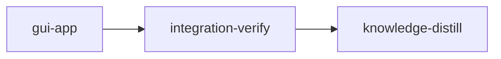

# Plan: Stencilizer desktop GUI

## Overview

Add a PySide6 desktop GUI, launched as `stencilizer-gui [font]`, that opens a TTF/OTF font,
exposes the processing parameters, shows the font's island glyphs as a thumbnail grid, and shows
the selected glyph before and after stencilization side by side, recomputed live as parameters
change. "Stencilize & Save..." writes the full font through the existing `FontProcessor`. One
implementation stage builds the `stencilizer.gui` package in five codex waves; integration-verify
proves it is reachable through the console script; knowledge-distill records what was learned.

## Goals

- Open a font through a native file dialog (or as the command-line argument).
- Parameters: bridge width (30-110 %), worker count (Auto or N), and
  `BridgeConfig.use_spanning_bridges`, which exists in settings but has no CLI flag.
- Grid of island glyphs; the selected glyph shown as Original | Stencilized at one shared scale,
  refreshed on every parameter change.
- Save the stenciled font with progress, refusing to overwrite the input font.
- Non-goals now: editing glyphs, before/after thumbnails in the grid, exposing `GeometryConfig`,
  variable fonts or CFF2 (unsupported by the core, see `stack.md`).

## Decisions (answered by the user)

| Question | Answer |
| --- | --- |
| Toolkit | PySide6 (`pyside6-essentials`), optional extra `gui`, plus the dev group |
| Parameters | Bridge width, workers, spanning-bridges toggle |
| Preview | Grid of island glyphs + live before/after detail of the selected glyph |
| Implementers | Codex preferred: gpt-6-luna, gpt-5.6-terra, gpt-6-sol for the hard part |

## Grounding (measured at commit 389557c, 2026-09-23)

Gate baseline, run from the main checkout (NOT from a loom worktree under the stage sandbox):

| Command | Result |
| --- | --- |
| `uv run pytest --no-cov -q -p no:cacheprovider` | 168 passed in 34.10 s |
| `uv run ruff check src tests` | All checks passed |
| `uv run ruff format --check src tests` | 68 files already formatted |
| `uv run mypy` | Success: no issues found in 68 source files |

The full suite writes about a dozen `stencilizer_<timestamp>.log` files into the working
directory: several tests build `FontProcessor` without a `log_file`. The sandbox therefore allows
`stencilizer_*.log` at the worktree root.

Dependency and runtime probe (scratch copy of the project, uv 0.9.22, CPython 3.13.1):

- `uv add --optional gui 'pyside6-essentials>=6.11.2'` and
  `uv add --dev 'pyside6-essentials>=6.11.2' 'pytest-qt>=4.5.0'` resolve (PyPI:
  pyside6-essentials 6.11.2 requires Python `>=3.10,<3.15`, abi3 wheels for Linux, macOS,
  Windows; pytest-qt 4.5.0 ships `py.typed`).
- With `QT_QPA_PLATFORM=offscreen`, a qtbot test that draws a Roboto glyph through
  `fontTools.pens.qtPen.QtPen` into a `QPainterPath` and paints it onto a `QImage` passed.
- `fontTools/pens/qtPen.py` imports PyQt5 when constructed without `path=`, so the GUI always
  passes a PySide6 `QPainterPath`.
- mypy strict accepts `QObject`/`QRunnable`/`QWidget` subclasses (PySide6 ships `.pyi` stubs).
  Ruff flags `paintEvent` with N802 and its unused `event` with ARG002: Qt overrides carry
  `# noqa: N802` (plus `ARG002` when unused).

Behavior the design leans on (`FontProcessor.classify_glyphs` + `process_glyph`, in-process):

| Font | Glyphs | Island glyphs | Classify | Max per-glyph transform | All island glyphs |
| --- | --- | --- | --- | --- | --- |
| Roboto-Regular.ttf | 3387 | 562 | 0.65 s | 2.8 ms | 0.17 s |
| Lato-Black.ttf | 3023 | 447 | 0.62 s | 1.7 ms | 0.15 s |
| CommitMono-Cosmix-700-Regular.otf | 1932 | 467 | 0.37 s | 8.3 ms | 0.16 s |

So previews run synchronously on the GUI thread (no debounce, no preview thread), while loading
and saving run on a worker thread. Roboto: UPM 2048, hhea ascent 2146, descent -555. `O`:
`bridges_added == 1`, 2 contours before and 4 after; widths 30 and 110 differ; the spanning
toggle changes `B` and `eight` (93 of Roboto's 562 island glyphs). `update_font_names` turns
Roboto's family name into `Roboto Stenciled`.

Outline rendering dry run (walk mirroring `_update_truetype_glyph`/`_update_cff_glyph`):

- TrueType: `draw_glyph` into a `RecordingPen` equals fontTools' own recording for `O`, `B`,
  `eight`, `a`, `g`, `at`. The composite `Aring` differs (fontTools records `addComponent`);
  composites are skipped by classification, so the grid never shows them.
- CFF: path bounds equal `BoundsPen` bounds for CommitMono `O` (30, -10, 570, 710) and `B`
  (85, 0, 546, 700).
- Fill rule: a clockwise outer square with a same-direction inner square renders a filled centre
  under `WindingFill` and an empty one under `OddEvenFill`, so the winding test tells the two
  apart. The GUI uses `WindingFill`, matching font rasterizers and exposing broken hole winding
  (mistakes.md "Holes filled on nested-contour glyphs").
- `font_to_widget_transform` landmarks: frame centre maps to target centre; the highest font y
  maps to widget y 0.

Criterion dry runs:

- Entry point registered (`importlib.metadata.entry_points(group="console_scripts",
  name="stencilizer-gui")`, value `stencilizer.gui.app:main`): exit 1 without the
  `[project.scripts]` line, exit 0 with it. It lives in `tests/gui/test_app.py`.
- `uv run stencilizer-gui --help | rg -qF 'usage: stencilizer-gui'`: exit 1 with no `app`
  module, exit 0 with an argparse `main`.
- `before_stage` probe (`importlib.util.find_spec("stencilizer.gui")`): prints `gui-absent`,
  exit 0, at 389557c.

Seams read to the bottom: `core/processor.py`, `config/settings.py`, `io/reader.py`,
`io/writer.py`, `io/converter.py`, `cli/app.py` (lines 1-270), `domain/glyph.py` (1-40),
`domain/contour.py` (40-156), `utils/logging.py` (13-110), `exceptions.py` (16-62),
`tests/regression/test_code_structure.py` (limits 400/50/300 and the `_font` access rule apply
to everything under `src/`, so to `src/stencilizer/gui/` too).

Design consequences settled in the briefs:

- `FontProcessor.__init__` calls `configure_logging`, which adds root-logger handlers on every
  call: the GUI builds ONE processor per controller and swaps `processor.config` per save.
- Saving onto the input path would corrupt it (fontTools reads the input lazily while writing):
  `FontSession.save` refuses it before touching anything.
- `process_glyph` reports the island count as `bridges_added`: the UI says "island(s) bridged".
- The save runs a `ProcessPoolExecutor` from a worker thread. `app.main()` switches the start
  method to `spawn` so no child is forked from a multi-threaded Qt process. Tests keep the
  interpreter default: `set_start_method` is process-global, so a conftest setting it would
  change how every existing integration test starts its pool.

Risk: the offscreen Qt probe ran outside the loom sandbox. The foundation step therefore starts
a `QApplication` inside the stage sandbox before any worker is spawned; a failure there is a
blocker to report, not something to work around.
- Adding a second Typer command would turn `stencilizer <font>` into `stencilizer stencilize
  <font>`; the GUI therefore gets its own console script and the CLI is untouched.

## Execution Diagram



## Stages

### Knowledge bootstrap: skipped

`doc/loom/knowledge/` holds curated content for this codebase (tier-1 files plus
`patterns/bridge-algorithm`), `loom knowledge sync` reports the catalog current, and
`loom knowledge check --strict` reports the tree clean.

### 1. gui-app: the `stencilizer.gui` package

The only implementation stage. Stage Necessity: nothing needs another stage's code merged
first (Q1: no), no other stage writes these files (Q2: no), no intermediate checkpoint is needed
(Q3: no), and the orchestrator's context (briefs are read by workers; ten reports; test output)
stays well under 500,000 tokens (Q4: no). The layered order (session before controller before
window) is a compile-order dependency, handled as waves inside the stage.

Foundation (orchestrator, before any spawn): the two `uv add` commands, then two hand-added lines
in `pyproject.toml` (the console script and `qt_api`). Then five codex waves; each wave waits for
the previous one because its modules import the previous wave's files:

| Wave | Workers |
| --- | --- |
| 0 | W0 test scaffold |
| 1 | W1 session, W2 outline, W3 tasks, W4 controls |
| 2 | W5 glyph view, W6 glyph grid, W7 controller |
| 3 | W8 main window |
| 4 | W9 app entry point |

Every interface is pinned in `doc/plans/briefs/stencilizer-gui/gui-app/_shared.md`; each worker
brief names its files, anchors, at most three steps, its tests and one proof command. The worker
table in the YAML is authoritative for ownership.

### 2. Integration verification

Full suite, lint, format, typecheck; reviewers for architecture (thread lifecycle, signal
connections), security (paths from dialogs, overwrite guard) and test coverage; an offscreen
launch of the real console script with a font argument; a rendered screenshot of the window
inspected for a sane before/after pair on all three fixture fonts.

### 3. Knowledge distillation

Curates the stage memories; adds the GUI to `README.md` (installation with the `gui` extra,
`stencilizer-gui` usage).

## Sandbox

Network is limited to PyPI (`uv add` and first-time `uv sync` in each worktree). Writes are the
project tree the stages touch plus the tool caches the gates create; the uv cache is pre-granted
by loom.

<!-- loom METADATA -->

```yaml
loom:
  version: 1
  sandbox:
    enabled: true
    auto_allow: true
    filesystem:
      deny_read: ["~/.ssh/**", "~/.aws/**", "~/.config/gcloud/**", "~/.gnupg/**"]
      allow_write:
        - "src/**"
        - "tests/**"
        - "pyproject.toml"
        - "uv.lock"
        - "README.md"
        - ".venv/**"
        - ".mypy_cache/**"
        - ".ruff_cache/**"
        - ".pytest_cache/**"
        - ".coverage"
        - "htmlcov/**"
        - "stencilizer_*.log"
    network:
      allowed_domains: ["pypi.org", "files.pythonhosted.org"]
      allow_local_binding: false
      allow_unix_sockets: []
  stages:
    - id: gui-app
      name: "PySide6 GUI package"
      stage_type: standard
      implementers: ["codex", "claude"]
      subagent_timeout_secs: 900
      skills: ["loom-python", "loom-testing"]
      description: |
        Build src/stencilizer/gui/ (PySide6): open a font, set parameters, browse island
        glyphs, preview one glyph before/after stencilization, save the stenciled font.
        Use parallel subagents and skills to maximize performance.

        CONTRACT: doc/plans/briefs/stencilizer-gui/gui-app/_shared.md pins every module's
        signatures, the repo rules (mypy strict, ruff, 400/50/300 size limits, Qt noqa codes,
        QtPen path=, queued connections) and the measured facts the tests use. Read it before
        spawning; do not re-derive it.

        FOUNDATION (you, before any spawn; commands plus two hand-edited lines):
        1. uv add --optional gui 'pyside6-essentials>=6.11.2'
        2. uv add --dev 'pyside6-essentials>=6.11.2' 'pytest-qt>=4.5.0'
        3. pyproject.toml: under [project.scripts] add
             stencilizer-gui = "stencilizer.gui.app:main"
           and under [tool.pytest.ini_options] add
             qt_api = "pyside6"
        4. Prove it: uv run python -c "import pytestqt" and
           QT_QPA_PLATFORM=offscreen uv run python -c "from PySide6.QtWidgets import
           QApplication; app = QApplication([]); print('qt-ok')" (Qt starts inside this
           stage's sandbox) and uv run pytest --no-cov -q tests/unit/test_processor.py
           (existing tests still load with pytest-qt installed). Read stderr: a blocked PyPI
           download or a Qt platform-plugin failure is a blocker to report, not a pass.

        WAVES (each wave starts only after the previous wave's files exist and its proof
        passed; later modules import earlier ones):
          wave 0: W0
          wave 1: W1, W2, W3, W4
          wave 2: W5, W6, W7
          wave 3: W8
          wave 4: W9
        Territories below are DISJOINT. Workers NEVER spawn subagents. Spawn every worker of a
        wave BY AGENT TYPE, ALL in ONE message: loom-codex-forwarder, in the FOREGROUND, with
        --model <Tier column> --effort xhigh, --unit-id <worker id>, an explicit Bash timeout
        of 600000 ms, and the prompt "Your brief: <Brief path>. Read it and
        doc/plans/briefs/stencilizer-gui/gui-app/_shared.md in full before anything else. Do
        not run git." Codex units must not run git: after EACH codex run, check
        git status --short yourself and confirm only the unit's owned files changed.

        | Worker | Role | Tier | Files owned | Shared context | Brief path |
        | ------ | ---- | ---- | ----------- | -------------- | ---------- |
        | F | Foundation (you, not spawned) | orchestrator | pyproject.toml, uv.lock | none | FOUNDATION section above |
        | W0 | Test scaffold | gpt-6-luna | tests/gui/__init__.py, tests/gui/conftest.py | pyproject.toml (read-only) | doc/plans/briefs/stencilizer-gui/gui-app/w0-scaffold.md |
        | W1 | Font session model | gpt-5.6-terra | src/stencilizer/gui/__init__.py, src/stencilizer/gui/session.py, tests/gui/test_session.py | core/processor.py, cli/app.py (read-only) | doc/plans/briefs/stencilizer-gui/gui-app/w1-session.md |
        | W2 | Outline rendering | gpt-5.6-terra | src/stencilizer/gui/outline.py, tests/gui/test_outline.py | io/converter.py (read-only) | doc/plans/briefs/stencilizer-gui/gui-app/w2-outline.md |
        | W3 | Background task | gpt-5.6-terra | src/stencilizer/gui/tasks.py, tests/gui/test_tasks.py | exceptions.py (read-only) | doc/plans/briefs/stencilizer-gui/gui-app/w3-tasks.md |
        | W4 | Control panel | gpt-6-luna | src/stencilizer/gui/controls.py, tests/gui/test_controls.py | config/settings.py (read-only) | doc/plans/briefs/stencilizer-gui/gui-app/w4-controls.md |
        | W5 | Glyph canvas and comparison | gpt-5.6-terra | src/stencilizer/gui/glyph_view.py, tests/gui/test_glyph_view.py | gui/outline.py, gui/session.py (read-only) | doc/plans/briefs/stencilizer-gui/gui-app/w5-glyph-view.md |
        | W6 | Glyph grid | gpt-6-luna | src/stencilizer/gui/glyph_grid.py, tests/gui/test_glyph_grid.py | gui/outline.py (read-only) | doc/plans/briefs/stencilizer-gui/gui-app/w6-glyph-grid.md |
        | W7 | Controller (threads, busy guard) | gpt-6-sol | src/stencilizer/gui/controller.py, tests/gui/test_controller.py | gui/session.py, gui/tasks.py (read-only) | doc/plans/briefs/stencilizer-gui/gui-app/w7-controller.md |
        | W8 | Main window wiring | gpt-5.6-terra | src/stencilizer/gui/main_window.py, tests/gui/test_main_window.py | all gui modules (read-only) | doc/plans/briefs/stencilizer-gui/gui-app/w8-main-window.md |
        | W9 | Console entry point | gpt-6-luna | src/stencilizer/gui/app.py, tests/gui/test_app.py | gui/main_window.py, gui/controller.py (read-only) | doc/plans/briefs/stencilizer-gui/gui-app/w9-app.md |

        AFTER EACH WAVE (you): run the wave's test files together with mypy and ruff on the
        wave's files, one command. Only then start the next wave.

        FAILURES: a unit exiting 124 timed_out is re-split against the partial tree (module
        and test as two units), never re-forwarded as is. A unit whose proof still fails after
        one fix attempt moves one tier up to a Claude subagent with the brief, the failed diff
        and the error output: luna/terra work to loom-software-engineer (sonnet), W7 to
        loom-senior-software-engineer (opus). The same unit failing twice gets a loom-advisor
        diagnosis before any further attempt. If the codex CLI is unavailable at run time,
        every row runs on loom-software-engineer, W7 on loom-senior-software-engineer.

        ERROR HANDLING: the existing hierarchy only (FontLoadError, FontSaveError,
        GlyphNotFoundError under StencilizerError); the controller turns failures into its
        error signal and the window shows them in a QMessageBox. No new exception types.

        DO NOT TOUCH: src/stencilizer/cli/, src/stencilizer/core/, src/stencilizer/io/,
        src/stencilizer/config/, existing tests. The CLI must keep working without the gui
        extra: nothing outside src/stencilizer/gui/ imports PySide6, and gui/__init__.py
        imports nothing.

        MEMORY: record mistakes, decisions and surprises with loom memory immediately
        (subagents report theirs to you; you record them). NEVER loom knowledge in this
        stage; NEVER Claude Code auto-memory. A knowledge file contradicted by the tree gets
        loom memory note "stale-knowledge: <file>#<heading> claims X; the tree does Y".
      dependencies: []
      before_stage:
        - command: 'uv run python -c "import importlib.util as u; print(''gui-present'' if u.find_spec(''stencilizer.gui'') else ''gui-absent'')"'
          exit_code: 0
          stdout_contains: ["gui-absent"]
          description: "No stencilizer.gui package at the base commit"
      after_stage:
        - command: "uv run stencilizer-gui --help"
          exit_code: 0
          stdout_contains: ["usage: stencilizer-gui"]
          description: "GUI console script installed and parsing arguments"
      acceptance:
        - "uv run pytest --no-cov -q tests/gui tests/regression/test_code_structure.py"
        - "uv run ruff check src tests"
        - "uv run ruff format --check src tests"
        - "uv run mypy"
        - "uv run stencilizer-gui --help | rg -qF 'usage: stencilizer-gui'"
      files:
        - "src/stencilizer/gui/**"
        - "tests/gui/**"
        - "pyproject.toml"
        - "uv.lock"
      working_dir: "."
      artifacts:
        - "src/stencilizer/gui/session.py"
        - "src/stencilizer/gui/outline.py"
        - "src/stencilizer/gui/tasks.py"
        - "src/stencilizer/gui/controls.py"
        - "src/stencilizer/gui/glyph_view.py"
        - "src/stencilizer/gui/glyph_grid.py"
        - "src/stencilizer/gui/controller.py"
        - "src/stencilizer/gui/main_window.py"
        - "src/stencilizer/gui/app.py"
        - "tests/gui/conftest.py"
      wiring:
        - source: "pyproject.toml"
          pattern: 'stencilizer-gui = "stencilizer\.gui\.app:main"'
          description: "Console script points at the GUI entry point"
        - source: "src/stencilizer/gui/app.py"
          pattern: 'MainWindow\(GuiController\('
          description: "Entry point builds the window around a controller"
        - source: "src/stencilizer/gui/main_window.py"
          pattern: 'glyph_selected\.connect\(.*select_glyph'
          description: "Grid selection drives the controller's preview"
        - source: "src/stencilizer/gui/controller.py"
          pattern: 'FontSession\.open\('
          description: "Controller loads fonts through the session"
        - source: "src/stencilizer/gui/session.py"
          pattern: 'process_glyph\('
          description: "Preview runs the production glyph transform"

    - id: integration-verify
      name: "Integration Verification"
      stage_type: integration-verify
      skills: ["loom-python", "loom-security-audit"]
      description: |
        Final verification of the GUI. Verify FUNCTIONAL INTEGRATION, not only green tests.
        NEVER Claude Code auto-memory.
        CONTEXT: read the plan (doc/plans/), the shared brief
        doc/plans/briefs/stencilizer-gui/gui-app/_shared.md, loom memory show --all, and the
        knowledge sections the GUI touches (architecture.md "Processing pipeline",
        patterns.md "Winding normalization", mistakes.md).
        BUILD & TEST (zero tolerance, fix every warning and failure): uv run pytest (full
        suite with coverage; 168 tests at the base commit plus the new tests/gui),
        uv run ruff check src tests, uv run ruff format --check src tests, uv run mypy.
        CODE REVIEW: spawn parallel loom-code-reviewer subagents: (1) architecture and
        concurrency: every signal emitted from a QThreadPool thread reaches a bound method of a
        GUI-thread QObject through a queued connection; the controller keeps the running task
        referenced until its handler runs; busy guards sit in open_font/save; one FontProcessor
        per controller; the start method is set in app.main only. (2) security: paths from
        dialogs and argv, the overwrite-the-input guard, no PySide6 import reachable from the
        CLI (python -c "import stencilizer.cli.app" must not import PySide6: check
        sys.modules). (3) test coverage of src/stencilizer/gui/. Fix every finding with an
        engineer subagent (the reviewers are read-only).
        FUNCTIONAL (prove it is wired in and usable):
        - uv run stencilizer-gui --help exits 0 through the installed console script.
        - Launch the real console script offscreen with a font argument
          (QT_QPA_PLATFORM=offscreen uv run stencilizer-gui tests/fixtures/Roboto-Regular.ttf,
          stopped after about 10 seconds): no traceback on stderr.
        - Write a short throwaway script (in a mktemp directory, not the tree) that builds the
          window with app.create_window for each fixture font (Roboto-Regular.ttf,
          Lato-Black.ttf, CommitMono-Cosmix-700-Regular.otf), waits for the load, selects O,
          and saves window.grab() as a PNG; open each PNG and confirm the Original and
          Stencilized panes show the same glyph at one scale, with the bridge cut visible.
          Save each font through the window to the temp directory and reload the output with
          FontReader.
        Record discoveries with loom memory for knowledge-distill, including: the GUI layout
        and threading model, the spawn decision, and that existing tests write
        stencilizer_<timestamp>.log into the working directory (FontProcessor built without
        log_file). A knowledge file contradicted by the tree gets
        loom memory note "stale-knowledge: ...".
      dependencies: ["gui-app"]
      acceptance:
        - "uv run pytest"
        - "uv run ruff check src tests"
        - "uv run ruff format --check src tests"
        - "uv run mypy"
        - "uv run stencilizer --version"
        - "uv run stencilizer-gui --help | rg -qF 'usage: stencilizer-gui'"
        - 'uv run python -c "import sys, stencilizer.cli.app; sys.exit(''PySide6'' in sys.modules)"'
      working_dir: "."
      wiring_tests:
        - name: "GUI console script resolves and parses arguments"
          command: "uv run stencilizer-gui --help"
          success_criteria:
            exit_code: 0

    - id: knowledge-distill
      name: "Knowledge Distillation"
      stage_type: knowledge-distill
      description: |
        Curate all stage memories into permanent knowledge; update user docs.
        NEVER Claude Code auto-memory.
        SINGLE-AGENT: do NOT spawn subagents; memories are compact summaries, so lean on them
        and keep code spot-reads narrow.
        START with loom memory pending --group (corrections, mistakes, decisions, other); read
        the plan and the knowledge sections it touches.
        CORRECTIONS FIRST: apply every stale-knowledge: memory in place with
        loom knowledge replace-section <file> "<heading>" "<body>", never with
        loom knowledge update, which appends the fix below the stale text.
        Then curate mistakes (prevention rules), patterns, decisions, conventions via
        loom knowledge update. Expected new material: a GUI entry in architecture.md and
        entry-points.md (stencilizer-gui, the gui package layout, controller/session split,
        threading model); stack.md (pyside6-essentials in the gui extra and dev group,
        pytest-qt, offscreen tests); conventions.md (Qt noqa codes, QtPen path=, queued
        connections); concerns.md (tests writing log files into the working directory, if
        still true). TIER ROUTING: findings of about 40 lines or fewer go inline in the tier-1
        file; larger findings go via loom knowledge update <category>/<slug> with a 2-4 line
        tier-1 summary and link. INDEX.md regenerates on every knowledge write; then
        loom review prunes stale entries. Run loom knowledge commands from the repository
        root (mistakes.md "loom knowledge update run from the knowledge directory").
        README.md: add the GUI to Installation (the gui extra) and Usage (stencilizer-gui
        [font], what the window shows); relevant sections only.
        RECEIPTS: every Note/Decision/Question taken into knowledge gets
        loom memory resolve <id> --outcome promoted|merged|discarded|deferred right after the
        write that used it (--target/--reason as appropriate); finish with
        loom memory pending --strict and resolve whatever it lists.
        LAST, if this stage removed structural issues, ratchet the baseline:
        loom knowledge check --write-baseline doc/loom/knowledge/check-baseline.txt
      dependencies: ["integration-verify"]
      acceptance:
        - "loom knowledge check --strict --baseline doc/loom/knowledge/check-baseline.txt"
        - "loom memory pending --strict"
      files: ["doc/loom/knowledge/**", "README.md"]
      working_dir: "."
```

<!-- END loom METADATA -->
