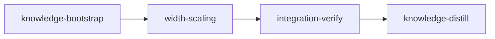

# Plan: Proportional bridge width for variable fonts

## Overview

Variable fonts get a bridge width option with two modes.

- **fixed** (the default) gives every bridge the default master's gap in every master. Today's replay only roughly does this: on Inter `o` the gap drifts from 123 units at Regular to 109 at Black.
- **proportional** sizes each bridge's gap in each master by the thickness of the stroke that bridge cuts. Two controls tune it: a strength (0-100%) and a minimum gap.

The CLI gains `--width-scaling`, `--scaling-strength` and `--min-bridge-width`. In proportional mode, `--instance` stencils the variable font before pinning the instance. The GUI gains a width-scaling group that shows only for variable fonts.

## Goals

- The default master is byte for byte the same in both modes, and the same as today's default.
- No glyph bridges less often than today: a fallback chain retries the glyph in fixed mode and then with today's targets.
- Static fonts are unchanged, and the static path ignores the option with a warning.
- Non-goals:
  - per-glyph width overrides;
  - one font-wide stroke ratio per location (each bridge uses its own stroke);
  - reporting fallbacks in the CLI summary (recorded as a concern instead).

## Prerequisites

1. **Committed (5633ea6):** the triangular-counter fix (Inter `4`). `core/merger_candidates.py` tries further bridge lines when the bounding-box centre probe fails, called from `core/merger.py`. It changed which glyphs bridge, so this plan's baselines are measured on top of it.
2. **Resolved (4cbdea3):** `FontSession` went over the 300-line class limit after the font-info panel commit 1d5980b (302 lines), which failed `tests/regression/test_code_structure.py::test_class_line_limit`. Moving the variable classification to a module function brought it to 280. The baseline table below was measured before that fix, so its single full-suite failure is gone.
3. **Commit the font-info and loader work first:** that work owns `gui/controls.py` and `gui/main_window.py`, which this plan's W2 also edits. Commit any further edits to them before `loom init`, or the width-scaling merge will conflict.

## Baseline (measured at 847fbce, detached worktree, 2026-10-09)

| Command | Result |
| --- | --- |
| existing engine tests in the width-scaling acceptance (replay, transform, validate, align, engine contracts) | 49 passed |
| existing CLI tests (`test_cli_variable.py`, `test_variable_surface_contracts.py`) | 24 passed |
| existing GUI tests (`test_controls.py`, `test_main_window.py`, `test_variable_session.py`, offscreen) | 33 passed |
| `uv run pytest tests/regression` | 23 passed, 1 failed (`test_class_line_limit`, prerequisite 2) |
| `ruff check` / `ruff format --check` on src, tests, packaging | clean |
| `mypy src/stencilizer tests packaging` | clean (181 files) |
| full suite, Python 3.12, 16 workers | 679 passed, 1 failed (prerequisite 2), 90 s |
| full suite, Python 3.11, 16 workers | 679 passed, 1 failed (prerequisite 2), 113 s |
| `uv lock --check`, `stencilizer --help` | pass |
| `loom knowledge check --strict --baseline ...` | clean |
| knowledge-bootstrap's concern grep, knowledge-distill's README/CLAUDE.md/knowledge greps | exit 1 (red until the stages write them, as intended) |

The width-scaling acceptance lines that name new test files (`test_width_scaling*.py`, `test_cli_pinning.py`, `test_cli_width_scaling.py`) are red at base because those files do not exist yet.

## Design decisions (settled with the user, 2026-10-09)

| Decision | Value |
| --- | --- |
| What drives proportionality | Measured stroke thickness. Axis values are not used: `wght` 700 does not map to a stroke width, and `opsz` changes thickness in different directions from font to font |
| Ratio scope | Per bridge: ink along the bridge's centre line in the master, divided by the same in the default |
| Formula | fixed: `gap = base`. proportional: `gap = max(minimum, base * ratio ** (strength / 100))`, with `minimum = min(min_width_percent / 100 * 0.1 * upm, base)` |
| Defaults | mode fixed, strength 100, minimum 30% (the static width floor) |
| Fixed mode | Exact: every master gets the default's gap. This changes today's drifting variable output slightly |
| `--instance` + proportional | Stencil the variable font, then pin. `--list-islands` and `--dry-run` still pin first |
| Static font + proportional | Warn `Width scaling applies only to variable fonts; using fixed width.` and run fixed |

## Evidence (measured at 57969fe)

- Gap drift today. Inter `o` (2048 UPM, nominal 122.88): Thin 117, default 123, Black 109. The stroke the vertical bridge cuts is 46, 161 and 300 thick. The script was a per-master dump of bridge-line x values from `transform_variable_glyph` output.
- Synthetic ring (the contract geometry): outer (0,0)-(1000,1000), counter 200..800, UPM 1000, vertical, width 60%. A bold master with the counter at 300..700 replays today with a gap of 50, a thin master at 50..950 with 75, and wght 0.5 with 55.
  - A narrow master with the counter at x 465..535, y 300..700 replays today with a gap of 34. Every contract below is therefore red at HEAD.
  - Expected under the new rules: fixed 60 everywhere. Proportional at strength 100 gives bold 90 (ink 600 / 400) and thin `max(30, 15) = 30`, or 40 with `min_width_percent=40`. Proportional at strength 50 gives bold `60 * 1.5 ** 0.5 = 73.48`.
- Pairing exists only as a heuristic, `validate._facing_pairs` (validate.py:250-266). The two lines of a bridge sit exactly one bridge width apart in the default output (`core/bridge_contours.py:130-131`): Ubuntu o 262.5/322.5, Inter B 615.56/738.44.
- File room under the 400-line limit: `variable/replay.py` 397, `cli/app.py` 340, `gui/session.py` 389 (untouched), `gui/controls.py` 169.

## Execution Diagram



### 0. knowledge-bootstrap (knowledge, sonnet)

A short audit. `loom knowledge check --strict --baseline doc/loom/knowledge/check-baseline.txt` is clean at 57969fe. The stage audits the sections this plan touches (`patterns/variable-replay.md`, `architecture.md`, `patterns/bridge-algorithm.md`) and records the measured gap drift as a concern, which knowledge-distill deletes once the drift is gone.

## Stages

### 1. width-scaling (standard)

This is one stage, not an engine/surfaces split. The CLI and GUI need the engine only through `BridgeConfig` fields, a compile-order dependency that a foundation step settles. The four territories write disjoint files, and the combined work fits one session. So Stage Necessity Q1-Q4 all answer no, and nothing forces a second stage.

Workers (briefs under `doc/plans/briefs/variable-bridge-width/width-scaling/`, shared context in `_shared.md`):

| Worker | Role | Tier | Files owned | Shared context | Brief path |
| ------ | ---- | ---- | ----------- | -------------- | ---------- |
| F0 | Settings foundation (runs alone, first) | haiku | src/stencilizer/config/settings.py, src/stencilizer/config/__init__.py | _shared.md | doc/plans/briefs/variable-bridge-width/width-scaling/f0-settings.md |
| W1 | Replay engine: pairing, stroke ratio, gap targets, fallback | opus/xhigh | src/stencilizer/variable/bridge_width.py, src/stencilizer/variable/replay.py, src/stencilizer/variable/transform.py, src/stencilizer/variable/validate.py, tests/unit/test_width_scaling.py, tests/unit/test_variable_replay.py | _shared.md | doc/plans/briefs/variable-bridge-width/width-scaling/w1-engine.md |
| W2 | GUI width-scaling controls | sonnet | src/stencilizer/gui/controls.py, src/stencilizer/gui/main_window.py, tests/gui/test_width_scaling_controls.py, tests/gui/test_controls.py | _shared.md | doc/plans/briefs/variable-bridge-width/width-scaling/w2-gui.md |
| W3 | CLI options, static warning, pin-after-stencil wiring, dry-run line | sonnet | src/stencilizer/cli/app.py, src/stencilizer/cli/handlers.py, tests/unit/test_cli_width_scaling.py, tests/unit/test_cli_variable.py | _shared.md | doc/plans/briefs/variable-bridge-width/width-scaling/w3-cli.md |
| U1 | cli/pinning.py (codex unit) | codex terra | src/stencilizer/cli/pinning.py, tests/unit/test_cli_pinning.py | _shared.md | doc/plans/briefs/variable-bridge-width/width-scaling/u1-pinning.md |

Order of work:

1. F0 writes the settings.
2. W1, W2, W3 and U1 run together in one message. U1 runs as a foreground codex forward.
3. The orchestrator runs U1's pytest file, then one `loom-verifier` round, a review, and the commit.

Risk checklist walk:

| Area | Applies? | Covered by |
| --- | --- | --- |
| Untrusted input | CLI numbers only | Typer `min`/`max` and pydantic bounds; W3's out-of-range test |
| Filesystem | Temp directories, written output | `pinned_input`/`pin_stenciled` use `TemporaryDirectory`; U1's tests |
| Process I/O | No | — |
| Configuration propagation | Yes | `scaling-strength-softens-gap`, `minimum-width-clamps-thin-master`, `cli-proportional-changes-masters-only`, `gui-controls-reach-bridge-config` |
| Lifecycle | GUI cache invalidation | Automatic: the cache key is `bridge.model_dump_json()`; W2's tests |
| Reachability | Yes | `cli-instance-proportional-stencils-first`, `gui-scaling-shown-for-variable-only`, `reachable` checks |
| External data | Font fixtures | Real fixture fonts throughout |

### 2. integration-verify

The full suite on Python 3.12 and 3.11, lint, format, mypy and the lock check. Code review covers three areas:

- replay correctness against the gap formula and the fallback chain;
- CLI/GUI wiring and the `--instance` branch;
- architecture, size limits and tests.

Functional smoke: proportional and fixed runs on all three variable fixtures, comparing the number of glyphs bridged in each mode (proportional must not bridge fewer).

### 3. knowledge-distill

- README: the Variable Fonts section, the Graphical Interface controls, Bridge Placement, the dry-run sample and troubleshooting.
- `CLAUDE.md` Conventions: the bridge-width line.
- Knowledge: rewrite `patterns/variable-replay.md` (pairing, gap targets, fallback), `architecture.md`'s width formula and `patterns/bridge-algorithm.md` "Candidate placement". Add a concern for unreported fallbacks.

---

<!-- loom METADATA -->

```yaml
loom:
  version: 2
  sandbox:
    enabled: true
    auto_allow: true
    allow_unsandboxed_escape: false
    excluded_commands: []
    filesystem:
      deny_read:
      - ~/.ssh/**
      - ~/.aws/**
      - ~/.config/gcloud/**
      - ~/.gnupg/**
      deny_write: []
      allow_write: []
    network:
      allowed_domains:
      - pypi.org
      - files.pythonhosted.org
      additional_domains: []
      allow_local_binding: false
      allow_unix_sockets: []
      allow_all_unix_sockets: false
    linux:
      enable_weaker_nested: false
    command_confinement: confined
  ratchet_files:
  - doc/loom/knowledge/check-baseline.txt
  - tests/regression/golden/commitmono.json.gz
  - tests/regression/golden/commitmono_pipeline.json.gz
  - tests/regression/golden/lato.json.gz
  - tests/regression/golden/roboto.json.gz
  provision:
  - working_dir: .
    command: uv sync --frozen --no-install-project
  stages:
  - id: knowledge-bootstrap
    name: Knowledge audit
    summary: 'Checks the knowledge sections this plan will change and records the bridge gap drift measured while planning.'
    stage_type: knowledge
    model: sonnet
    description: |
      The knowledge base already describes this codebase (loom knowledge check is clean at
      57969fe). This stage audits the sections the plan touches and records one planning fact.
      Model override to sonnet: a short audit needs no opus.
      Use parallel subagents and skills to maximize performance. SINGLE-AGENT here: the audit
      covers four sections, so do not spawn subagents.
      1. Run loom knowledge sync from the repository root.
      2. Audit against the tree, correcting with loom knowledge replace-section where wrong:
         patterns/variable-replay.md "Bridge-line grouping and realignment" and "Validation"
         (src/stencilizer/variable/replay.py, align.py, validate.py), architecture.md (the bridge
         width formula line; src/stencilizer/core/surgery.py:56-57), patterns/bridge-algorithm.md
         "Candidate placement" and "Contour surgery" (the triangular-counter fix committed before
         this plan added core/merger_candidates.py, called from core/merger.py when the
         bounding-box centre probe fails; confirm those sections describe it).
      3. Record in concerns.md, under a heading "Variable bridge gaps drift across masters"
         (current truth, no history): replay places each bridge line at the mean of its cut points
         at their default edge parameters (variable/replay.py _realign), so a bridge gap is not
         held at the default width in other masters. Measured: Inter o (2048 UPM, nominal gap
         122.88) has gaps of 117 at Thin, 123 at default and 109 at Black; a synthetic ring with a
         60-unit default gap replays at 50 (bold) and 75 (thin). Source: the plan's Evidence
         section (doc/plans/*PLAN-variable-bridge-width.md). The width-scaling stage removes the
         drift; knowledge-distill deletes this concern.
      Use the loom knowledge CLI, never Write/Edit. NEVER Claude Code auto-memory.
    dependencies: []
    acceptance:
    - loom knowledge check --strict --baseline doc/loom/knowledge/check-baseline.txt
    - 'rg -qF "Variable bridge gaps drift across masters" doc/loom/knowledge/concerns.md'
    files:
    - doc/loom/knowledge/**
    working_dir: .
    artifacts:
    - doc/loom/knowledge/concerns.md
  - id: width-scaling
    name: Variable bridge width scaling
    summary: 'Adds fixed and proportional bridge width modes for variable fonts, with CLI options, GUI controls and pin-after-stencil for --instance.'
    stage_type: standard
    implementers:
    - claude
    - codex
    subagent_timeout_secs: 900
    skills:
    - loom-python
    description: |
      Add width scaling for variable-font bridges. Plan: doc/plans/*PLAN-variable-bridge-width.md
      (Design decisions and Evidence sections). Shared worker context:
      doc/plans/briefs/variable-bridge-width/width-scaling/_shared.md (the gap formula, the
      fallback chain, the HEAD measurements).
      Use parallel subagents and skills to maximize performance.

      PUBLIC SURFACE (the contract session writes the contracts from this; implement it exactly):
        stencilizer.config.BridgeWidthScaling(StrEnum): FIXED = "fixed", PROPORTIONAL = "proportional".
        BridgeConfig new fields: width_scaling: BridgeWidthScaling = FIXED;
          scaling_strength: float = 100.0 (ge 0, le 100); min_width_percent: float = 30.0 (ge 10, le 110).
        stencilizer.variable.transform.transform_variable_glyph(vg, bridge, geometry, upm) keeps its
          signature; per master, each bridge (pair of facing bridge lines) gets
          gap = base in fixed mode, and gap = max(minimum, base * ratio ** (scaling_strength / 100))
          in proportional mode, where base is the pair's gap in the default output, ratio is the ink
          length along the pair's centre line through the merged master outline over the same in the
          default, and minimum = min(min_width_percent / 100 * 0.1 * upm, base). Lines sit at
          centre +- gap / 2, centre being the mean of the two lines' fixed-parameter targets.
          The default master is identical in both modes.
          Fallback: configured mode, then fixed, then today's per-line mean targets; only when all
          fail is the glyph left unchanged.
        stencilizer.variable.bridge_width.scaled_gap(base: float, ratio: float, bridge: BridgeConfig, upm: int) -> float.
        CLI (stencilizer.cli.app.app): --width-scaling [fixed|proportional] (default fixed),
          --scaling-strength FLOAT (0-100, default 100), --min-bridge-width FLOAT (10-110, default 30).
          A static input with --width-scaling proportional prints exactly
          "Width scaling applies only to variable fonts; using fixed width." (unless --quiet) and
          runs fixed. With --width-scaling proportional and --instance, the write path stencils the
          variable input into a temporary directory, then pins it with
          stencilizer.cli.pinning.pin_stenciled(stenciled, instance, output_path) -> Path.
          stencilizer.cli.pinning also defines pinned_input(input_font, instance) (today's
          app._instance_font, moved) and is_variable_font(path) -> bool.
        GUI (stencilizer.gui.controls.ControlPanel): scaling_box (QWidget, hidden until
          set_variable(True)), scaling_combo (QComboBox, items "Fixed", "Proportional" with item data
          BridgeWidthScaling.FIXED / PROPORTIONAL), strength_slider + strength_spin (0-100, default
          100), min_width_slider + min_width_spin (10-110, default 30), set_variable(variable: bool).
          bridge_config() returns the three new fields. MainWindow._on_font_loaded calls
          controls.set_variable(bool(session.axes)).

      CONTRACT GEOMETRY (tests/unit/test_width_scaling_contracts.py): build VariableGlyphs with
      tests.unit._variable_cases.glyph_from_outlines. Outer square (0,0)-(1000,1000) clockwise, as
      _variable_cases.STEM winds; counter square counter-clockwise; UPM 1000; axis_tags ("wght",);
      supports Support((("wght", 0.0, 1.0, 1.0),)) for bold and Support((("wght", -1.0, -1.0, 0.0),))
      for thin; BridgeConfig(direction=BridgeDirection.VERTICAL, width_percent=60) plus the scaling
      fields under test; GeometryConfig(). Measure the gap in out.glyph.instance(location): the
      distinct point x values strictly inside the counter's x range at that location (exclusive by
      0.5 unit); gap = max - min of those. Tolerance 1.0 unit (integer rounding).
      Ring: default counter 200..800 on both axes, bold master counter 300..700, thin master counter
      50..950. Narrow: default counter 200..800, one bold master with the counter at x 465..535 and
      y 300..700.
      CLI contracts use typer.testing.CliRunner on stencilizer.cli.app.app with -o and --log-file
      under tmp_path (pattern: tests/unit/test_variable_surface_contracts.py _cli), on
      tests.font_helpers.INTER and ROBOTO; outlines are compared with tests.font_helpers.glyph_at
      at a normalized location ({} for default, {"wght": 1.0} for the Black master).
      GUI contracts (tests/gui/test_width_scaling_gui_contracts.py) copy the window fixture and
      _load_window helper from tests/gui/test_variable_gui_contracts.py and use pytest-qt qtbot.

      EXECUTION. Territories below are DISJOINT. Workers NEVER spawn subagents. First spawn F0
      alone and wait for it. Then spawn W1, W2, W3 BY AGENT TYPE in the background and U1 as a
      loom-codex-forwarder in the FOREGROUND (--model gpt-5.6-terra --effort xhigh, Bash timeout
      600000 ms), ALL in ONE message, each with the fixed prompt plus
      "Your brief: <path>. Read it in full before anything else." Codex units never run git and
      never touch .loom/; check git status --short after the forward, then run
      uv run pytest tests/unit/test_cli_pinning.py --no-cov -q -p no:cacheprovider yourself.
      W1 is opus at effort xhigh (loom-senior-software-engineer): core algorithmic work.

      | Worker | Role | Tier | Files owned | Shared context | Brief path |
      | ------ | ---- | ---- | ----------- | -------------- | ---------- |
      | F0 | Settings foundation | haiku | src/stencilizer/config/settings.py, src/stencilizer/config/__init__.py | _shared.md | doc/plans/briefs/variable-bridge-width/width-scaling/f0-settings.md |
      | W1 | Replay engine | opus/xhigh | src/stencilizer/variable/bridge_width.py, src/stencilizer/variable/replay.py, src/stencilizer/variable/transform.py, src/stencilizer/variable/validate.py, tests/unit/test_width_scaling.py, tests/unit/test_variable_replay.py | _shared.md | doc/plans/briefs/variable-bridge-width/width-scaling/w1-engine.md |
      | W2 | GUI controls | sonnet | src/stencilizer/gui/controls.py, src/stencilizer/gui/main_window.py, tests/gui/test_width_scaling_controls.py, tests/gui/test_controls.py | _shared.md | doc/plans/briefs/variable-bridge-width/width-scaling/w2-gui.md |
      | W3 | CLI wiring | sonnet | src/stencilizer/cli/app.py, src/stencilizer/cli/handlers.py, tests/unit/test_cli_width_scaling.py, tests/unit/test_cli_variable.py | _shared.md | doc/plans/briefs/variable-bridge-width/width-scaling/w3-cli.md |
      | U1 | cli/pinning.py | codex terra | src/stencilizer/cli/pinning.py, tests/unit/test_cli_pinning.py | _shared.md | doc/plans/briefs/variable-bridge-width/width-scaling/u1-pinning.md |

      GATE: one loom-verifier round after every worker returned, with the acceptance list below.
      W1 reports per-fixture bridged counts in each mode; fixed mode must not bridge fewer glyphs
      than HEAD (the fallback guarantees it). Record those numbers with loom memory note.
      The static path (core/) and tests/regression goldens must stay unchanged.
      MEMORY: record mistakes/decisions/surprises via loom memory immediately; NEVER loom
      knowledge (implementation stage); NEVER Claude Code auto-memory.
    dependencies:
    - knowledge-bootstrap
    before_stage:
    - command: test -e src/stencilizer/variable/bridge_width.py
      exit_code: 1
      description: No width-scaling module at the base commit
    after_stage:
    - command: uv run python -c "import stencilizer.variable.bridge_width, stencilizer.cli.pinning"
      exit_code: 0
      description: Width-scaling and pinning modules import
    acceptance:
    - uv run pytest tests/unit/test_width_scaling_contracts.py tests/unit/test_width_scaling.py tests/unit/test_variable_replay.py tests/unit/test_variable_transform.py tests/unit/test_variable_validate.py tests/unit/test_variable_align.py tests/unit/test_variable_engine_contracts.py --numprocesses=8 --no-cov -q -p no:cacheprovider
    - uv run pytest tests/unit/test_cli_width_scaling.py tests/unit/test_cli_pinning.py tests/unit/test_cli_variable.py tests/unit/test_variable_surface_contracts.py --numprocesses=8 --no-cov -q -p no:cacheprovider
    - env QT_QPA_PLATFORM=offscreen uv run pytest tests/gui/test_width_scaling_gui_contracts.py tests/gui/test_width_scaling_controls.py tests/gui/test_controls.py tests/gui/test_main_window.py tests/gui/test_variable_session.py --numprocesses=8 --no-cov -q -p no:cacheprovider
    - uv run pytest tests/regression --numprocesses=8 --no-cov -q -p no:cacheprovider
    - uv run ruff check src tests packaging
    - uv run ruff format --check src tests packaging
    - uv run mypy src/stencilizer tests packaging
    - env NO_COLOR=1 COLUMNS=200 uv run stencilizer --help
    files:
    - src/stencilizer/config/**
    - src/stencilizer/variable/**
    - src/stencilizer/cli/**
    - src/stencilizer/gui/controls.py
    - src/stencilizer/gui/main_window.py
    - tests/unit/**
    - tests/gui/test_controls.py
    - tests/gui/test_width_scaling_controls.py
    - tests/gui/test_width_scaling_gui_contracts.py
    working_dir: .
    artifacts:
    - src/stencilizer/variable/bridge_width.py
    - src/stencilizer/cli/pinning.py
    wiring:
    - source: src/stencilizer/cli/app.py
      pattern: width_scaling=
      description: CLI passes the --width-scaling choice into BridgeConfig
    - source: src/stencilizer/gui/main_window.py
      pattern: controls.set_variable(
      literal: true
      description: font load toggles the width-scaling controls
    wiring_tests:
    - name: CLI help lists the width-scaling options
      command: env NO_COLOR=1 COLUMNS=200 uv run stencilizer --help
      success_criteria:
        exit_code: 0
        stdout_contains:
        - --width-scaling
        - --scaling-strength
        - --min-bridge-width
    reachable:
    - symbol: scaled_gap
      from: transform_variable_glyph
      description: the gap formula is used by the variable transform
    - symbol: pin_stenciled
      from: stencilize
      description: proportional --instance pins after stenciling from the CLI command
    contracts:
    - id: proportional-gap-follows-bold-stroke
      file: tests/unit/test_width_scaling_contracts.py
      test: test_proportional_gap_follows_bold_stroke
      scenario: 'transforms the ring glyph (default counter 200..800, bold master counter 300..700, thin 50..950) with width_scaling=PROPORTIONAL, strength 100, and measures the gap at {} and {"wght": 1.0}'
      rejects: 'a replay that keeps the per-line mean of fixed-parameter cuts, giving a bold gap of 50 instead of 90 (60 at the default)'
    - id: fixed-mode-keeps-default-gap
      file: tests/unit/test_width_scaling_contracts.py
      test: test_fixed_mode_keeps_default_gap
      scenario: 'transforms the ring glyph with width_scaling=FIXED and measures the gap at {"wght": 1.0} and {"wght": -1.0}'
      rejects: 'the current drifting replay, which gives 50 at bold and 75 at thin instead of 60 in both'
    - id: minimum-width-clamps-thin-master
      file: tests/unit/test_width_scaling_contracts.py
      test: test_minimum_width_clamps_thin_master
      scenario: 'transforms the ring glyph with width_scaling=PROPORTIONAL, strength 100, min_width_percent=40, and measures the gap at {"wght": -1.0}'
      rejects: 'a clamp that ignores min_width_percent (gap 30 from the default minimum, or 15 unclamped) instead of 40'
    - id: scaling-strength-softens-gap
      file: tests/unit/test_width_scaling_contracts.py
      test: test_scaling_strength_softens_gap
      scenario: 'transforms the ring glyph with width_scaling=PROPORTIONAL, scaling_strength=50, and measures the gap at {"wght": 1.0}'
      rejects: 'an engine that never reads scaling_strength and gives the full-strength 90 instead of 73.48'
    - id: proportional-falls-back-to-fixed
      file: tests/unit/test_width_scaling_contracts.py
      test: test_proportional_falls_back_to_fixed
      scenario: 'transforms the narrow glyph (bold master counter x 465..535, y 300..700) with width_scaling=PROPORTIONAL; the proportional gap 90 cannot fit the 70-unit counter; asserts bridge_count >= 1 and the bold gap is 60'
      rejects: 'an engine that leaves the glyph unbridged when proportional replay fails, or falls straight back to the per-line mean targets (gap 34)'
    - id: cli-proportional-changes-masters-only
      file: tests/unit/test_width_scaling_contracts.py
      test: test_cli_proportional_changes_masters_only
      scenario: 'runs the CLI on INTER twice (default options, and --width-scaling proportional); every glyph is identical at {} and at least one glyph differs at {"wght": 1.0}'
      rejects: 'a CLI that parses --width-scaling but never puts it into BridgeConfig (outputs identical), or a proportional mode that rescales the default master'
    - id: cli-instance-proportional-stencils-first
      file: tests/unit/test_width_scaling_contracts.py
      test: test_cli_instance_proportional_stencils_first
      scenario: 'runs the CLI on INTER with --instance wght=900 twice (fixed, and --width-scaling proportional); both outputs lack fvar and at least one glyph with islands in the source differs between them'
      rejects: 'a proportional --instance run that still pins first, so the static path ignores the scaling and the outputs are identical'
    - id: cli-static-font-warns
      file: tests/unit/test_width_scaling_contracts.py
      test: test_cli_static_font_warns
      scenario: 'runs the CLI on ROBOTO with --width-scaling proportional (no --quiet); exit 0 and the output contains "Width scaling applies only to variable fonts; using fixed width."'
      rejects: 'a CLI that silently ignores proportional mode for a static font'
    - id: gui-controls-reach-bridge-config
      file: tests/gui/test_width_scaling_gui_contracts.py
      test: test_gui_controls_reach_bridge_config
      scenario: 'builds a ControlPanel, selects Proportional in scaling_combo, sets strength_spin to 50 and min_width_spin to 40, then reads bridge_config()'
      rejects: 'width-scaling widgets that bridge_config() never reads, leaving the defaults (fixed, 100, 30)'
    - id: gui-scaling-shown-for-variable-only
      file: tests/gui/test_width_scaling_gui_contracts.py
      test: test_gui_scaling_shown_for_variable_only
      scenario: 'loads INTER into a MainWindow (scaling_box.isVisibleTo(window) is True), then loads ROBOTO (False)'
      rejects: 'a scaling box that font loading never toggles (always visible or always hidden)'
  - id: integration-verify
    name: Integration Verification
    summary: 'Confirms width scaling works through the real CLI and GUI, the full suite passes, and reviewers'' findings are fixed.'
    stage_type: integration-verify
    description: |
      Final verification after all stages. Verify FUNCTIONAL INTEGRATION, not just tests
      passing. NEVER Claude Code auto-memory.
      CONTEXT: read doc/plans/*PLAN-variable-bridge-width.md, loom memory show --all, and the
      knowledge sections patterns/variable-replay.md "Bridge-line grouping and realignment" and
      "Validation".
      BUILD & TEST (zero tolerance; fix ALL warnings/errors): the acceptance list below. The full
      suite runs under pytest-xdist with 16 workers.
      CODE REVIEW: spawn parallel loom-code-reviewer subagents: (1) correctness of
      src/stencilizer/variable/bridge_width.py, replay.py and transform.py against the gap
      formula, the pairing rule and the fallback order in the plan; (2) CLI/GUI wiring, the
      static-font warning and the proportional --instance branch (temp directory cleanup, output
      naming); (3) architecture, size limits and test coverage. Fix every finding with an
      engineer agent or dispute it; never defer one.
      SUGGESTIONS: weigh every pending reviewer suggestion the signal lists; resolve each one
      implemented with loom memory resolve <id> --outcome implemented --reason <what changed>.
      FUNCTIONAL: run the CLI on tests/fixtures/variable/*.{ttf,otf} into $TMPDIR in fixed and in
      proportional mode; reopen each output with fontTools, confirm fvar kept and that the
      proportional run bridged at least as many glyphs as the fixed run (the run report's counts).
      Run --instance wght=900 --width-scaling proportional on Inter and confirm a static output
      with no island in o. Open Inter in the GUI with QT_QPA_PLATFORM=offscreen set on the command
      line, select Proportional and save. Record the per-fixture counts with loom memory note.
      Record discoveries to loom memory for knowledge-distill, including any knowledge file
      contradicted by the tree: loom memory note "stale-knowledge: ...".
    dependencies:
    - width-scaling
    acceptance:
    - env QT_QPA_PLATFORM=offscreen uv run pytest --numprocesses=16 --no-cov -q -p no:cacheprovider
    - env UV_PROJECT_ENVIRONMENT=.venv/py311 QT_QPA_PLATFORM=offscreen uv run --python 3.11 --frozen --all-extras pytest --numprocesses=16 --no-cov -q -p no:cacheprovider
    - uv run ruff check src tests packaging
    - uv run ruff format --check src tests packaging
    - uv run mypy src/stencilizer tests packaging
    - uv lock --check
    - env NO_COLOR=1 COLUMNS=200 uv run stencilizer --help
    files: []
    working_dir: .
    wiring:
    - source: src/stencilizer/variable/transform.py
      pattern: scaled_gap|bridge_width
      description: the variable transform uses the width-scaling module
    wiring_tests:
    - name: CLI help lists --width-scaling
      command: env NO_COLOR=1 COLUMNS=200 uv run stencilizer --help
      success_criteria:
        exit_code: 0
        stdout_contains:
        - --width-scaling
  - id: knowledge-distill
    name: Knowledge Distillation
    summary: 'Records the width-scaling design in the knowledge base and documents the new options in the README and CLAUDE.md.'
    stage_type: knowledge-distill
    description: |
      Curate all stage memories into permanent knowledge; update user docs.
      NEVER Claude Code auto-memory.
      SINGLE-AGENT: do NOT spawn subagents; memories are compact summaries; keep code
      spot-reads narrow.
      START with loom memory pending --group (corrections, mistakes, decisions, other); read
      doc/plans/*PLAN-variable-bridge-width.md and the knowledge sections it touches.
      CORRECTIONS FIRST: apply every stale-knowledge memory in place with
      loom knowledge replace-section <file> "<heading>" "<body>", never with update.
      Known sections to rewrite to the new truth: patterns/variable-replay.md "Bridge-line
      grouping and realignment" (pairs, per-pair gap targets, fixed mode now exact) and
      "Measured outcomes" (add the per-fixture counts in both modes from memory);
      architecture.md, the bridge width formula line; patterns/bridge-algorithm.md "Candidate
      placement" (width_percent is the default-master gap; variable masters follow
      width_scaling). Add a section "Width scaling" to patterns/variable-replay.md: the formula,
      the stroke-ratio measurement, the minimum clamp, the fallback chain and why per-bridge
      ratios were chosen over axis values. Add to concerns.md: fallbacks to fixed width are not
      reported in the CLI summary or the GUI.
      TIER ROUTING: findings ~40 lines or fewer inline in tier-1; larger via
      loom knowledge update <category>/<slug> plus a tier-1 summary and link.
      README.md: document --width-scaling, --scaling-strength and --min-bridge-width under
      "Variable Fonts" (what proportional means, the defaults, the minimum, the fallback, that
      --instance stencils before pinning in proportional mode, that static fonts ignore it);
      the width-scaling controls under "Graphical Interface"; one sentence in "2. Bridge
      Placement"; the dry-run sample output's new Width scaling line; and a troubleshooting
      note. CLAUDE.md "Conventions": extend the bridge width line with the variable-font
      width_scaling modes.
      SUGGESTIONS: record every unimplemented reviewer suggestion in concerns or its topic,
      then resolve it promoted, merged or discarded.
      RECEIPTS: every memory taken into knowledge gets loom memory resolve <id>
      --outcome promoted|merged|discarded|deferred right after the write that used it;
      finish with loom memory pending --strict and resolve whatever it lists.
      LAST, if this stage removed structural issues:
      loom knowledge check --write-baseline doc/loom/knowledge/check-baseline.txt
    dependencies:
    - integration-verify
    acceptance:
    - loom knowledge check --strict --baseline doc/loom/knowledge/check-baseline.txt
    - loom memory pending --strict
    - rg -qF -- "--width-scaling" README.md
    - rg -qF -- "--min-bridge-width" README.md
    - rg -qF "width_scaling" CLAUDE.md
    - rg -qF "Width scaling" doc/loom/knowledge/patterns/variable-replay.md
    files:
    - doc/loom/knowledge/**
    - README.md
    - CLAUDE.md
    working_dir: .
    artifacts:
    - README.md
```

<!-- END loom METADATA -->
